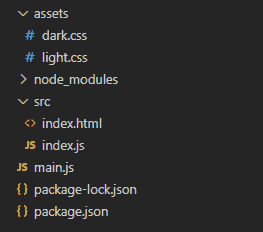
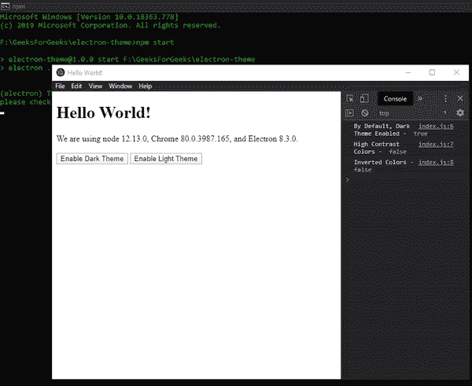
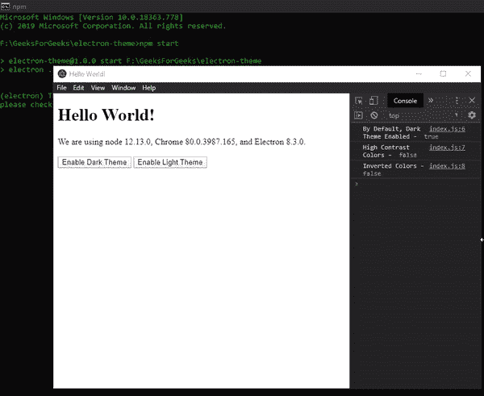

# 管理电子主题

> 原文:[https://www . geesforgeks . org/management-themes-in-electronijs/](https://www.geeksforgeeks.org/managing-themes-in-electronjs/)

[**electronijs**](https://www.geeksforgeeks.org/introduction-to-electronjs/)是一个开源框架，用于使用能够在**Windows****macOS**和 **Linux** 操作系统上运行的 HTML、CSS 和 JavaScript 等 web 技术构建跨平台原生桌面应用。它将 Chromium 引擎和 [**NodeJS**](https://www.geeksforgeeks.org/introduction-to-nodejs/) 结合成一个单一的运行时。

为了使桌面应用程序对用户更有吸引力和吸引力，开发人员除了使用 **CSS** 之外，还应该开发应用程序，使其与本机系统主题兼容。应用程序应该提供一个特性，其中用户可以控制应用程序的外观和感觉，并在运行时动态更改主题。这增强了应用程序的**用户界面**，并使其与系统环境相融合。电子提供了一种方法，通过这种方法，我们可以使用内置的**本地时间**模块的实例属性和事件来实现这一点。本教程将演示如何使用**原生时间**模块。任何额外的 CSS 都应该只应用于本机系统主题，以便为应用程序设计样式。

我们假设您熟悉上述链接中介绍的先决条件。电子要工作， [**节点**](https://www.geeksforgeeks.org/introduction-to-nodejs/) 和 [**npm**](https://www.geeksforgeeks.org/node-js-npm-node-package-manager/) 需要预装在系统中。

*   **项目结构:**



**示例:**按照 [**中给出的步骤，设置基本的电子应用程序。复制文章中提供的 **main.js** 文件和**index.html**文件的样板代码。还要对**包. json** 文件进行必要的更改，以启动电子应用程序。我们将继续使用相同的代码库构建我们的应用程序。**](https://www.geeksforgeeks.org/dynamic-styling-in-electronjs/)

**package.json:**

```html
{
  "name": "electron-theme",
  "version": "1.0.0",
  "description": "Themes in Electron",
  "main": "main.js",
  "scripts": {
    "start": "electron ."
  },
  "keywords": [
    "electron"
  ],
  "author": "Radhesh Khanna",
  "license": "ISC",
  "dependencies": {
    "electron": "^8.3.0"
  }
}
```

根据项目结构创建**资产**文件夹，分别创建 **light.css** 文件和 **dark.css** 文件。我们将在执行过程中将这些 **CSS** 文件动态地注入到应用程序中。

**输出:**此时，我们的基本电子应用程序设置完毕。启动应用程序后，我们应该会看到以下结果。


**电子中的原生主题:****原生时间**模块用于读取、响应和应用铬的原生颜色主题的更改。本地系统主题也适用于铬的本地颜色主题。该模块是**主流程**的一部分。要在**渲染器进程**中导入和使用**原生时间**模块，我们将使用电子**远程**模块。

**注意:****原生时间**模块只支持实例事件和实例属性。它确实有任何与之关联的实例方法。

**index.html:** 启用深色主题和启用浅色主题按钮还没有任何相关功能。要进行更改，请在 **index.js** 文件中添加以下代码。

## 超文本标记语言

```html
<br><br>
   <button id="dark">
     Enable Dark Theme
   </button>
   <button id="light">
     Enable Light Theme
   </button>
```

**index.js** :在该文件中添加以下代码片段。

## java 描述语言

```html
const electron = require("electron");

// Importing the nativeTheme module
// using Electron remote
const nativeTheme = electron.remote.nativeTheme;
const path = require("path");

console.log("By Default, Dark Theme Enabled - ",
            nativeTheme.shouldUseDarkColors);
console.log("High Contrast Colors - ",
            nativeTheme.shouldUseHighContrastColors);
console.log("Inverted Colors - ",
            nativeTheme.shouldUseInvertedColorScheme);

nativeTheme.on("updated", () => {
    console.log("Updated Event has been Emitted");

    if (nativeTheme.shouldUseDarkColors) {
        console.log("Dark Theme Chosen by User");
    } else {
        console.log("Light Theme Chosen by User");
    }
});

var dark = document.getElementById("dark");
dark.addEventListener("click", () => {
    nativeTheme.themeSource = "dark";
});

var light = document.getElementById("light");
light.addEventListener("click", () => {
    nativeTheme.themeSource = "light";
});
```

代码中使用的**原生时间**模块的所有实例属性的详细说明如下:

*   **nativeThEme . should useark colors**此实例属性是只读属性。该属性返回一个**布尔**值，说明系统操作系统或 Chromium 当前是否启用了**深色**模式，或者正在指示其显示一个**深色**主题的**用户界面**。要修改这个属性(改变应用程序的主题)，我们需要使用**nativetheme . them source**Instance 属性。
*   **nativeThEme . HaThuseHighContractColors**此实例属性是只读属性。此实例属性仅在 **Windows** 和 **macOS** 上受支持。该属性返回一个**布尔**值，表示系统操作系统或 Chromium 当前是否启用了**高对比度**模式，或者正在被指示显示一个**高对比度**主题的**用户界面**。不能使用**native me**模块从代码中直接修改该属性。要修改该属性，用户需要从系统设置中启用**高对比度** **UI** 。
*   **nativetheme . should useinverted color scheme**此实例属性是只读属性。此实例属性仅在 **Windows** 和 **macOS** 上受支持。该属性返回一个**布尔**值，说明系统操作系统或铬当前是否启用了**反转颜色**方案，或者是否正在**用户界面**中指示使用**反转颜色**方案。不能使用**native me**模块从代码中直接修改该属性。要修改该属性，用户需要在系统设置中启用**倒色**方案。
*   **nativeTheme.themeSource** 这个 Instance 属性用于更改应用程序的主题。该属性可以在执行过程中动态更改。该**字符串**属性用于覆盖和取代铬根据系统主题选择在内部使用的值(指定主题)。该属性可以采用以下**字符串**值之一:
    *   **系统**将此实例属性设置为**系统**将删除覆盖值，并将所有内容重置为操作系统默认值。这意味着，如果系统主题启用了**黑暗**模式，那么 chromium 将自动将其作为默认主题，并将其应用于电子应用程序。当系统主题启用**灯**模式时，同样的情况也适用。默认情况下，**数据源**属性的值为**系统**。该值与系统的**默认**操作系统模式一致。
    *   **深色**将此实例属性设置为**深色**将对应用程序产生以下影响。该值与系统的**黑暗**模式一致。
        *   **native me . should useark colors**实例属性将设置为 **true** 。
        *   电子应用程序在 *Linux* 和*窗口*上呈现的任何**用户界面**，包括上下文菜单、开发工具等，都将使用**深色**主题的**用户界面**。同样的情况已经在输出中得到证明。系统在 **macOS** 上渲染的任何 **UI** 包括菜单、窗框等都将使用**深色**主题 **UI** 。
        *   **偏好配色** CSS 查询将匹配**深色**模式。
        *   将发出**更新后的**实例事件，如代码所示。输出中演示了同样的情况。
    *   **灯光**将此实例属性设置为**灯光**将对应用程序产生以下影响。该值与系统的**灯**模式一致。
        *   “本地时间应该使用标记颜色”实例属性将被设置为“T2”假“T3”。
        *   电子应用程序在 *Linux* 和*窗口*上呈现的任何**用户界面**，包括上下文菜单、开发工具等，都将使用**灯**主题的**用户界面**。同样的情况已经在输出中得到证明。系统在 **macOS** 上渲染的任何 **UI** 包括菜单、窗框等，都将使用**灯**主题 **UI** 。
        *   **偏好配色** CSS 查询将匹配**灯光**模式。
        *   将发出**更新后的**实例事件，如代码所示。输出中演示了同样的情况。

代码中使用的**原生时间**模块的实例事件的详细说明如下:

*   **更新:事件**当底层原生铬主题中的某些属性发生变化时，会发出此实例事件。这意味着任何**只读**实例属性的值都已更改。如上所述，**nativetheme . should useark colors**属性的值可以通过更改**nativetheme . them source**属性的值来更改。发出此事件后，我们需要手动检查哪个 **Readonly** 属性如上所述发生了变化，因为此实例事件不返回任何承诺/回调。

在这一点上，我们应该能够成功地从上面的代码中确定和更改电子应用程序的原生主题。

**输出:**



**注意:**在上面的输出中，系统操作系统主题默认设置为**黑暗**模式，因此**nativetheme . should useark colors**实例属性返回 **true** 。此外，在重新加载应用程序时，对主题所做的任何更改都将恢复为默认的系统操作系统主题，因为我们不会在应用程序的本地存储中保留**nativetheme . them source**Instance 属性的值。

在我们使应用程序成功地适应本机系统主题之后，我们需要为应用程序动态地应用与该主题兼容的相应 **CSS** 。这很重要，因为样式的某些属性不能同时应用于两个主题。例如，我们不能对**深色**模式和**浅色**模式使用相同的**字体颜色**。下面的教程将演示如何根据应用的主题动态地注入相应的 CSS。

*   **dark.css** :在那个文件中添加下面的片段。

```html
body {
    background-color: darkgray;
    color: white;
}
```

*   **light.css** :在那个文件中添加下面的片段。

```html
body {
    background-color: lightgray;
    color: black;
}
```

**index.js** :对此文件做如下修改。函数**加载 CSS(加载)**根据传递给它的亮或暗字符串值，动态地将 CSS 插入到 **HTML DOM 结构**中。我们只是使用 [**appendChild**](https://www.geeksforgeeks.org/html-dom-appendchild-method/) 方法将另一个带有各自 CSS 文件和属性的链接标签附加到**index.html**文档的头部标签。

## java 描述语言

```html
const electron = require("electron");

// Importing the nativeTheme module
// using Electron remote
const nativeTheme = electron.remote.nativeTheme;
const path = require("path");

console.log("By Default, Dark Theme Enabled - ",
            nativeTheme.shouldUseDarkColors);
console.log("High Contrast Colors - ",
            nativeTheme.shouldUseHighContrastColors);
console.log("Inverted Colors - ",
            nativeTheme.shouldUseInvertedColorScheme);

function loadCSS(load) {
    var head = document.getElementsByTagName("head")[0];
    var link = document.createElement("link");
    link.rel = "stylesheet";
    link.type = "text/css";
    link.href = path.join(__dirname, "../assets/"
                          + load + ".css");
    head.appendChild(link);
}

nativeTheme.on("updated", () => {
    console.log("Updated Event has been Emitted");

    if (nativeTheme.shouldUseDarkColors) {
        console.log("Dark Theme Chosen by User");
        console.log("Dark Theme Enabled - ",
                    nativeTheme.shouldUseDarkColors);

        loadCSS("dark");
    } else {
        console.log("Light Theme Chosen by User");
        console.log("Dark Theme Enabled - ",
                    nativeTheme.shouldUseDarkColors);

        loadCSS("light");
    }
});

var dark = document.getElementById("dark");
dark.addEventListener("click", () => {
    nativeTheme.themeSource = "dark";
});

var light = document.getElementById("light");
light.addEventListener("click", () => {
    nativeTheme.themeSource = "light";
});
```

**输出:**当动态指定 CSS 文件时，我们没有删除以前的 CSS 文件(如果有的话)，因此应用于应用程序的样式包括两个 CSS 文件。万一我们错过了任何一个 CSS 文件中的一个属性，它仍然会在更改主题时应用于应用程序。因此，我们可以先移除链接标签，然后使用 JS 动态地重新添加它，或者通过制作相同的副本并简单地更改值来覆盖先前 CSS 文件的所有属性。

