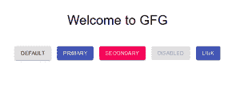
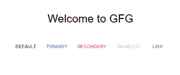
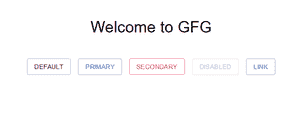

# 物料界面按钮组件

> 原文:[https://www.geeksforgeeks.org/material-ui-button-component/](https://www.geeksforgeeks.org/material-ui-button-component/)

材料用户界面是一个用户界面库，提供预定义和可定制的反应组件，以实现更快和更容易的网络开发，这些材料用户界面组件基于谷歌的材料设计。在本文中，让我们讨论一下材料用户界面库中的排版组件。

按钮是用户在应用程序中进行交流的方式之一。Material UI 提供了一个可定制的<button>组件，通过它的道具可以有多种用途。

**语法**:

```
<Button> This ia a Button </Button> 
```

**安装 React App:**

*   **步骤 1:** 使用以下命令创建一个 React 应用程序。

    ```
    npx create-react-app button-example
    ```

*   **第二步:**现在进入项目目录

    ```
    cd button-example
    ```

**安装 Material-UI:** 通过 npm/yarn 安装 Material-UI 的源文件，它们负责注入需要的 CSS。

```
npm install @material-ui/core
OR
yarn add @material-ui/core
```

**导入应用程序栏和工具栏:**

```
import Button from '@material-ui/core/Button';
```

**包含按钮:**包含按钮使用高度和填充来给用户以高度强调。它们有几种类型

*   默认
*   主要的
*   副手
*   环
*   有缺陷的

**道具列表:**

*   **儿童:**是按钮的内容。
*   **类:**是覆盖或扩展应用于组件的样式。
*   **大小:**用于自定义按钮的大小。
*   **disblelevation:**是布尔值，用于确定按钮的高程。
*   **fullWidth:** 是决定是否覆盖容器整个宽度的布尔值。
*   **禁用:**是启用或禁用按钮的布尔值。
*   **禁用关联:**是启用或禁用按钮提升外观的布尔值。
*   **disableFocusRipple:** 是启用或禁用键盘焦点波纹效果的布尔值。
*   **开始图标:**子元素之前的元素。
*   **endIcon:** 子元素后。
*   **href:** 点击按钮时链接到的网址。
*   **颜色:**是组件的颜色。
*   **disableRipple:** 是禁用或启用波纹效果的布尔值。

**示例:**

## App.js

```
import React from 'react';
import { makeStyles } from '@material-ui/core/styles';
import Button from '@material-ui/core/Button';
import Typography from '@material-ui/core/Typography';

const useStyles = makeStyles((theme) => ({
  root: {
    textAlign: "center",
    marginTop: "50px"
  },
  btns:{
      '& > *': {
      margin: theme.spacing(1),
    },
      marginTop: "40px"
  }
}));

export default function SimpleContainer() {
  const classes = useStyles();

  return (
    <div className={classes.root}>
      <Typography variant="h4" component="h4">
          Welcome to GFG
      </Typography>
      <div className={classes.btns}>
        <Button variant="contained">Default</Button>
        <Button variant="contained" color="primary">
          Primary
        </Button>
        <Button variant="contained" color="secondary">
          Secondary
        </Button>
        <Button variant="contained" disabled>
          Disabled
        </Button>
        <Button variant="contained" color="primary" 
                href="#contained-buttons">
          Link
        </Button>
      </div>
    </div>
  );
}
```

**输出:**



**文字按钮:**文字按钮更强调按钮的内容，而不是按钮的外观。

**示例:**

## App.js

```
import React from 'react';
import { makeStyles } from '@material-ui/core/styles';
import Button from '@material-ui/core/Button';
import Typography from '@material-ui/core/Typography';

const useStyles = makeStyles((theme) => ({
  root: {
    textAlign: "center",
    marginTop: "50px"
  },
  btns:{
      '& > *': {
      margin: theme.spacing(1),
    },
      marginTop: "40px"
  }
}));

export default function SimpleContainer() {
      const classes = useStyles();

  return (
    <div className={classes.root}>
        <Typography variant="h4" component="h4">
              Welcome to GFG
            </Typography>
            <div className={classes.btns}>
      <Button>Default</Button>
      <Button color="primary">Primary</Button>
      <Button color="secondary">Secondary</Button>
      <Button disabled>Disabled</Button>
      <Button href="#text-buttons" color="primary">
        Link
      </Button>
      </div>
    </div>
  );
}
```

**输出:**



**轮廓按钮:**它们是用边框包裹的文本按钮

**示例:**

## App.js

```
import React from 'react';
import { makeStyles } from '@material-ui/core/styles';
import Button from '@material-ui/core/Button';
import Typography from '@material-ui/core/Typography';

const useStyles = makeStyles((theme) => ({
  root: {
    textAlign: "center",
    marginTop: "50px"
  },
  btns:{
      '& > *': {
      margin: theme.spacing(1),
    },
      marginTop: "40px"
  }
}));

export default function SimpleContainer() {
      const classes = useStyles();

  return (
    <div className={classes.root}>
      <Typography variant="h4" component="h4">
          Welcome to GFG
      </Typography>
      <div className={classes.btns}>
        <Button variant="outlined">Default</Button>
        <Button variant="outlined" color="primary">
          Primary
        </Button>
        <Button variant="outlined" color="secondary">
          Secondary
        </Button>
        <Button variant="outlined" disabled>
          Disabled
        </Button>
        <Button variant="outlined" color="primary" 
                href="#outlined-buttons">
          Link
        </Button>
      </div>
    </div>
  );
}
```

**输出:**



**参考:**T2】https://material-ui.com/api/button/</button>