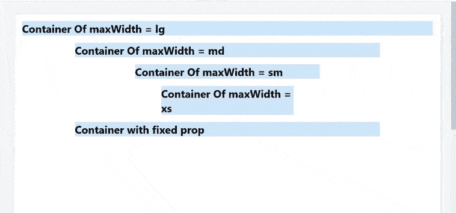

# 物料界面容器

> 原文:[https://www.geeksforgeeks.org/material-ui-container/](https://www.geeksforgeeks.org/material-ui-container/)

Material-UI 是一个用户界面框架，它提供了预定义和可定制的 React 组件，以实现更快、更简单的 web 开发，这些 Material-UI 组件基于 Google 的 Material Design 之上。在本文中，让我们讨论一下材料用户界面库中的排版组件。

**集装箱:**

它是基本的材质用户界面组件，将内容水平居中。它管理其子代的布局。

容器可以使用两种类型的样式和调整属性。

**流体:**流体容器用作为道具提供的**最大宽度**值包裹其中的内容，该值将是容器的默认值。

maxWidth 值定义了我们瞄准的屏幕宽度。

*   xl: 1920px(超大)
*   lg: 1280px(大)
*   md: 960px(中等)
*   sm: 600px(小)
*   xs: 0px(超小)

**固定:**如果您更喜欢为一组固定的尺寸进行设计，而不是试图适应完全流体的视口，则可以设置固定属性。最大宽度与当前断点的最小宽度匹配。

**语法:**

```html
<Container maxwidth="lg">
   <h1>This is Container</h1>
</Container>
```

**安装 React App:**

**步骤 1** :使用以下命令创建一个 React 应用。

```html
npx create-react-app container-example
```

**第二步**:进入项目目录。

```html
cd container-example
```

**安装材料-界面:**

```html
npm install @material-ui/core
// OR
yarn add @material-ui/core
```

**进口集装箱:**

```html
import Container from '@material-ui/core/Container';
```

**示例:**

## App.js

```html
import Container from '@material-ui/core/Container';
import React, { Component }  from 'react';

export default function SimpleContainer() {
  return (
    <>
      <Container maxWidth="lg">
        <h1  style={{ backgroundColor: '#cfe8fc'}}>
          Container Of maxWidth = lg 
         </h1>
      </Container>
      <Container maxWidth="md">
        <h1  style={{ backgroundColor: '#cfe8fc'}}>
          Container Of maxWidth = md 
         </h1>
      </Container>
      <Container maxWidth="sm">
        <h1  style={{ backgroundColor: '#cfe8fc'}}>
          Container Of maxWidth = sm
        </h1>
      </Container>
      <Container maxWidth="xs">
        <h1  style={{ backgroundColor: '#cfe8fc'}}>
          Container Of maxWidth = xs 
        </h1>
      </Container>
      <Container fixed>
        <h1  style={{ backgroundColor: '#cfe8fc'}}>
          Container with fixed prop
         </h1>
      </Container>
    </>
  );
}
```

**输出:**

