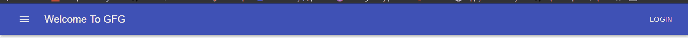
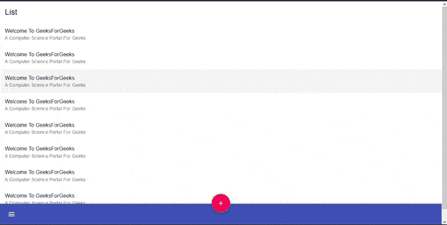

# 材料界面工具栏

> 原文:[https://www.geeksforgeeks.org/material-ui-toolbar/](https://www.geeksforgeeks.org/material-ui-toolbar/)

材料用户界面是一个用户界面库，提供预定义和可定制的反应组件，以实现更快和更容易的网络开发，这些材料用户界面组件基于谷歌的材料设计。在本文中，让我们讨论一下材质用户界面库中的**工具栏**组件。

**工具栏:**

工具栏不像其他材质用户界面组件那样独立工作，它与应用程序栏一起工作。工具栏组件设置子级的属性，使它们水平对齐。工具栏组件只是应用普通的 CSS flex(display: 'flex ')，通过 alignItems ' center '进行垂直居中，一些填充，以及由 theme.mixins.toolbar 提供的 minhAiR:56px。

**语法:**

```html
<AppBar>
<Toolbar>
  <Typography variant="h6">
    This Is ToolBar Example
  </Typography>
</Toolbar>
</AppBar>
```

**安装 React App:**

**步骤 1** :使用以下命令创建一个 React 应用。

```html
npx create-react-app toolbar-example
```

**第二步:**现在进入项目目录

```html
cd toolbar-example
```

**安装材料-界面:**

通过 npm/yarn 安装材料用户界面的源文件，它们负责注入所需的 CSS。

```html
npm install @material-ui/core
// OR
yarn add @material-ui/core
```

**导入应用程序栏和工具栏:**

```html
import AppBar from '@material-ui/core/AppBar';
import Toolbar from '@material-ui/core/Toolbar';
```

**重要道具:**

*   **子级**:是工具栏子级，通常可以是 IconButton、Button、排版等的混合。
*   **组件**:用于根节点的组件。使用 HTML 元素的字符串或组件。例:div。
*   **禁用檐槽**:用于启用或禁用檐槽填充。例子:真或假。
*   **变体**:用于选择工具栏的变体。例如:规则、密集。

**CSS 规则名称:**

*   **根**:这将样式应用于根元素。
*   **檐槽**:如果 disable 檐槽={false}，这将对根元素应用样式。
*   **常规**:如果 variant=“常规”，这将对根元素应用样式。
*   **密集**:如果 variant=“密集”，这将对根元素应用样式。

**示例 1:** 在本例中，我们将工具栏实现为 Top AppBar。

## java 描述语言

```html
import React from 'react';
import {AppBar, Toolbar, IconButton, Typography, Button} from '@material-ui/core';
import { fade, makeStyles } from '@material-ui/core/styles';
import MenuIcon from '@material-ui/icons/Menu';

const useStyles = makeStyles((theme) => ({
  root: {
    flexGrow: 1,
  },
  menuButton: {
    marginRight: theme.spacing(2),
  },
  title: {
    flexGrow: 1,
    display: 'none',
    [
      theme.breakpoints.up('sm')]: {
        display: 'block',
    },
  },
}));

export default function ToolbarExample() {
  const classes = useStyles();

  return (
    <div className={classes.root}>
      <AppBar position="static">
        <Toolbar>
          <IconButton
            className={classes.menuButton}
            color="inherit"
          >
            <MenuIcon />
          </IconButton>
          <Typography className={classes.title} variant="h6" noWrap>
            Welcome To GFG
          </Typography>
              <Button color="inherit">Login</Button>
        </Toolbar>
      </AppBar>
    </div>
  );
}
```

**运行应用程序的步骤:**从项目的根目录使用以下命令运行应用程序:

```html
npm start
```

**输出:**



**示例 2:** 作为底部应用条

## java 描述语言

```html
import React from 'react';
import { makeStyles } from '@material-ui/core/styles';
import {
  AppBar, 
  Toolbar, 
  Typography, 
  IconButton, 
  Paper,
  Fab, 
  List,
  ListItem,
  ListItemText} from '@material-ui/core';
import MenuIcon from '@material-ui/icons/Menu';
import AddIcon from '@material-ui/icons/Add';

const messages = [
  {
    id: 1,
    primary: 'Welcome To GeeksForGeeks',
    secondary: "A Computer Science Portal For Geeks",
  },
  {
    id: 2,
    primary: 'Welcome To GeeksForGeeks',
    secondary: "A Computer Science Portal For Geeks",
  },
  {
    id: 3,
    primary: 'Welcome To GeeksForGeeks',
    secondary: "A Computer Science Portal For Geeks",
  },
  {
    id: 4,
    primary: 'Welcome To GeeksForGeeks',
    secondary: "A Computer Science Portal For Geeks",
  },
  {
    id: 5,
    primary: 'Welcome To GeeksForGeeks',
    secondary: "A Computer Science Portal For Geeks",
  },
  {
    id: 6,
    primary: 'Welcome To GeeksForGeeks',
    secondary: "A Computer Science Portal For Geeks",
  },
  {
    id: 7,
    primary: 'Welcome To GeeksForGeeks',
    secondary: "A Computer Science Portal For Geeks",
  },
  {
    id: 8,
    primary: 'Welcome To GeeksForGeeks',
    secondary: "A Computer Science Portal For Geeks",
  }
];

const useStyles = makeStyles((theme) => ({
  text: {
    padding: theme.spacing(2, 2, 0),
  },
  paper: {
    paddingBottom: 50,
  },
  list: {
    marginBottom: theme.spacing(2),
  },
  appBar: {
    top: 'auto',
    bottom: 0,
  },
  fabButton: {
    position: 'absolute',
    zIndex: 1,
    top: -30,
    left: 0,
    right: 0,
    margin: '0 auto',
  },
}));

export default function BottomAppBar() {
  const classes = useStyles();
  return (
    <React.Fragment>
      <Paper square className={classes.paper}>
        <Typography className={classes.text} 
                    variant="h5" gutterBottom>
          List
        </Typography>
        <List className={classes.list}>
          {messages.map(({ id, primary, 
                           secondary, person }) => (
            <React.Fragment key={id}>
              <ListItem button>
                <ListItemText primary={primary} 
                              secondary={secondary} />
              </ListItem>
            </React.Fragment>
          ))}
        </List>
      </Paper>
      <AppBar position="fixed" color="primary" 
                               className={classes.appBar}>
        <Toolbar>
          <IconButton edge="start" color="inherit" 
                      aria-label="open drawer">
            <MenuIcon />
          </IconButton>
          <Fab color="secondary" aria-label="add" 
               className={classes.fabButton}>
            <AddIcon />
          </Fab>
        </Toolbar>
      </AppBar>
    </React.Fragment>
  );
}
```

**输出:**

