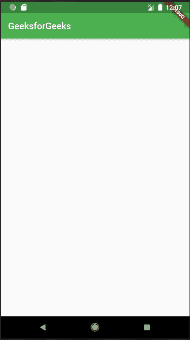

# 颤振中的材料应用类

> 原文:[https://www.geeksforgeeks.org/materialapp-class-in-flutter/](https://www.geeksforgeeks.org/materialapp-class-in-flutter/)

**MaterialApp 类:** MaterialApp 是颤振中的预定义类。它可能是颤振的主要或核心部件。我们可以访问 Flutter SDK 提供的所有其他组件和小部件。文本小部件、下拉按钮小部件、[应用栏](https://www.geeksforgeeks.org/flutter-appbar-widget/)小部件、[脚手架](https://www.geeksforgeeks.org/scaffold-class-in-flutter-with-examples/)小部件、[列表视图](https://www.geeksforgeeks.org/listview-class-in-flutter/)小部件、[状态小部件](https://www.geeksforgeeks.org/flutter-stateful-vs-stateless-widgets/)、[状态小部件](https://www.geeksforgeeks.org/difference-between-stateless-and-stateful-widget-in-flutter/)、图标按钮小部件、文本字段小部件、填充小部件、主题数据小部件等。是可以使用 MaterialApp 类访问的小部件。有更多的小部件可以使用 MaterialApp 类来访问。使用这个小部件，我们可以制作一个有吸引力的应用程序。
这里有一个用 *dart* 语言编写的非常简单的代码，用来制作一个标题为 *GeeksforGeeks* 的 [appBar](https://www.geeksforgeeks.org/flutter-appbar-widget/) 屏幕。

### **material app 类的构造函数:**

```
const MaterialApp(
{Key key,
GlobalKey<NavigatorState> navigatorKey,
Widget home,
Map<String, WidgetBuilder> routes: const <String, WidgetBuilder>{},
String initialRoute,
RouteFactory onGenerateRoute,
InitialRouteListFactory onGenerateInitialRoutes,
RouteFactory onUnknownRoute,
List<NavigatorObserver> navigatorObservers: const <NavigatorObserver>[],
TransitionBuilder builder,
String title: '',
GenerateAppTitle onGenerateTitle,
Color color,
ThemeData theme,
ThemeData darkTheme,
ThemeData highContrastTheme,
ThemeData highContrastDarkTheme,
ThemeMode themeMode: ThemeMode.system,
Locale locale,
Iterable<LocalizationsDelegate> localizationsDelegates,
LocaleListResolutionCallback localeListResolutionCallback,
LocaleResolutionCallback localeResolutionCallback,
Iterable<Locale> supportedLocales: const <Locale>[Locale('en', 'US')],
bool debugShowMaterialGrid: false,
bool showPerformanceOverlay: false,
bool checkerboardRasterCacheImages: false,
bool checkerboardOffscreenLayers: false,
bool showSemanticsDebugger: false,
bool debugShowCheckedModeBanner: true,
Map<LogicalKeySet, Intent> shortcuts,
Map<Type, Action<Intent>> actions}
)

```

### **material app 小部件的属性:**

*   **动作:**该属性取*地图<类型，动作<意图> >* 为对象。它控制意图键。
*   **后退按钮调度器:**决定如何处理后退按钮。
*   **棋盘光栅图像:**该属性接受一个布尔值作为对象。如果设置为 true，它将打开光栅缓存图像的棋盘。
*   **颜色:**控制应用中使用的原色。
*   **黑暗主题:**为应用提供黑暗主题的主题数据。
*   **debughsowcheckedmodeBanner:**这个属性接受一个*布尔*作为对象来决定是否显示调试 banner。
*   **debugshowmaterialGrid:**该属性以布尔值为对象。如果设置为 true，它会绘制一个基线网格材质应用程序。
*   **高对比度主题:**它提供了用于高对比度主题的主题数据。
*   **首页:**该属性取*小工具*为对象，在 app 默认路线上显示。
*   **initialRoute:** 该属性采用一个*字符串*作为对象，给出构建导航器的第一条路线的名称。
*   **区域设置:**它为*材料应用程序提供了一个区域设置。*
*   **localizationdelegate:**这为区域设置提供了一个委托。
*   **navigatorObserver:** 在构建导航器时，它以*全局键<导航状态>* 为对象生成一个键。
*   **navigatorObserver:** 该属性将*列表< NavigatorObserver >* 作为对象，为导航器创建一个观察者列表。
*   **ongenerateininitialilroutes:**该属性采用*initial routelistfactory typedef*作为生成初始路由的对象。
*   **生成路线:***生成路线*以*路线工厂*为对象。当应用程序导航到指定路线时，会用到它。
*   **OnGenerateTitle:** 该属性采用 *RouteFactory typedef* 作为对象，为应用程序生成标题字符串(如果提供的话)。
*   **未知路由:***未知路由*以*路由工厂类型定义*为对象，在其他方式出现故障时提供路由。
*   **routeInformationParse:** 该属性将*RouteInformationParser<T>*作为对象，将路由信息从 routeInformationProvider 转换为通用数据类型。
*   **路由信息提供者:**该属性接受*路由信息提供者*类作为对象。它负责提供路由信息。
*   **routeDelegate:** 该属性将*routeDelegate<T>*作为配置给定小部件的对象。
*   **路线:***路线*属性以 L *类*类为对象，控制应用的最顶层路线。
*   **快捷键:**该属性取 *LogicalKeySet* 类为对象，决定应用程序的键盘快捷键。
*   **显示性能叠加:***显示性能叠加*采用一个*布尔值*作为打开或关闭性能叠加的对象。
*   **showSemantisDefeng:**这个属性接受一个*布尔*作为对象。如果设置为 true，它会显示一些可访问的信息。
*   **supported locales:***supported locales*属性通过将 *Iterable < E >* 类作为对象来保持应用中使用的本地变量。
*   **主题:**该属性将*主题数据*类作为对象来描述 MaterialApp 的主题。
*   **主题模式:**该属性将*主题模式枚举*作为对象来决定素材应用的主题。
*   **标题:***标题*属性采用一个*字符串*作为对象来决定该设备的应用程序的单行描述。

## 镖

```
import 'package:flutter/material.dart';

void main() {
  runApp(MaterialApp(
    title: 'GeeksforGeeks',
    theme: ThemeData(
      primarySwatch: Colors.green
    ),
    home: Scaffold(
      appBar: AppBar(
        title:Text(
          'GeeksforGeeks'
        )
      ),
    ),
  ));
}
```

### **代码解释:**

*   **导入语句:***导入*语句用于导入 flutter SDK 提供的库。这里我们已经导入了“material.dart”文件。我们可以通过导入这个文件来使用所有实现材质设计的 flutter 小部件。
*   **main()函数:**和许多其他编程语言一样，我们也有 main 函数，在这个函数中，我们必须编写应用程序启动时要执行的语句。主功能返回类型为*【虚空】*。
*   **runApp(Widget)功能:**void runApp(Widget)将一个 Widget 作为参数，设置在屏幕上。它为小部件提供了适应屏幕的约束。它使给定的小部件成为应用程序的根小部件，并使其他小部件成为它的子部件。这里我们使用了*材质应用*作为根小部件，在其中我们定义了其他小部件。
*   **MaterialApp()小部件:**我一开始就讨论过 MaterialApp。让我们来看看 MaterialApp 小部件的不同属性。
*   **标题:**该属性用于向用户提供应用程序的简短描述。当用户按下手机上的*近期应用程序*按钮时，将显示*标题*中的文字。
*   **主题:**该属性用于为应用程序提供默认主题，就像应用程序的主题颜色一样。
    为此，我们使用名为*主题数据()*的内置类/小部件。在*主题数据()*小部件中，我们必须编写与主题相关的不同属性。这里我们使用了*primary watch*，用于定义应用程序的默认主题颜色。从素材库中选择我们使用的颜色*颜色*类。在主题数据()中，我们还可以定义一些其他属性，比如文本主题、亮度(可以通过这个来启用暗主题)、应用场景等等。
*   **home:** 用于 app 的默认路由，表示应用正常启动时显示其中定义的 widget。在这里，我们已经定义了房屋内的*脚手架*部件。在脚手架内部，我们定义了各种属性，如应用栏、主体、浮动动作按钮、背景色等。
    例如，在 *appBar* 属性中，我们使用了 appBar()小部件，其中我们传递了*“geeks forgeeks”*作为标题，该标题将显示在 AppBar 中应用程序的顶部。
*   MaterialApp()中的其他属性有*debughsowcheckedmodebanner*(用于移除右上角的调试标签)、*深色主题*(用于在应用程序中请求深色模式)、*颜色*(用于应用程序的原色)、*路由*(用于应用程序的路由表)、*主题模式*(用于确定使用哪个主题)等。

**输出:**



*   这里我们可以看到 appbar 标题中定义的文本显示在顶部。
*   默认的主题颜色是我们定义的绿色。
*   *runApp()* 已经在整个屏幕上安装了小部件。