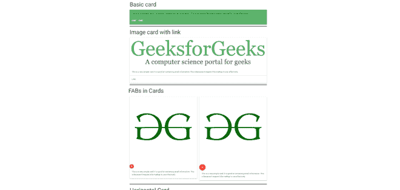
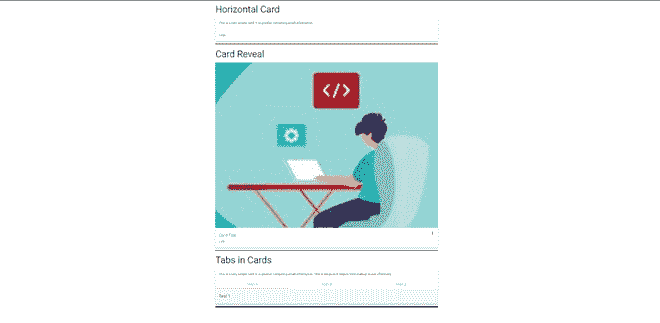
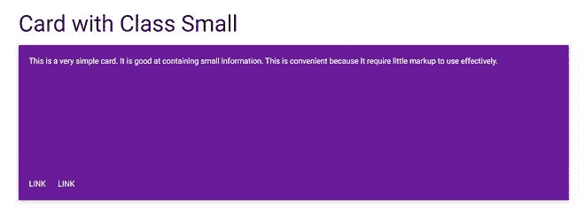
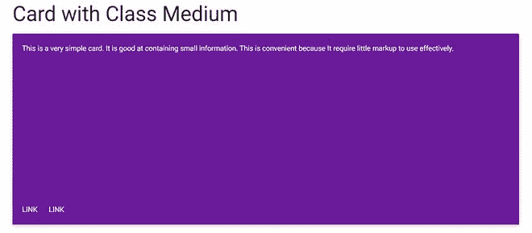
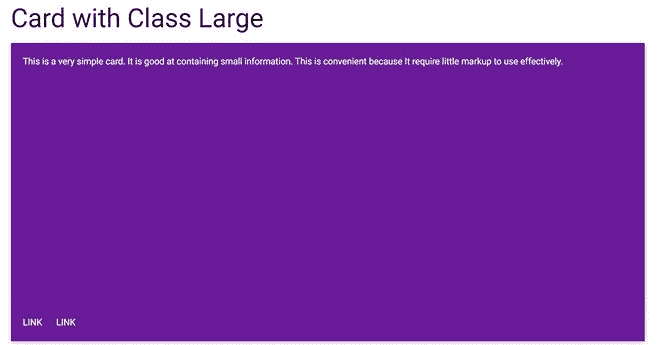
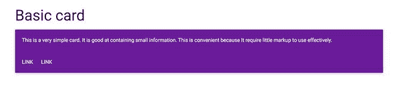

# 物化|卡片

> 原文:[https://www.geeksforgeeks.org/materialize-cards/](https://www.geeksforgeeks.org/materialize-cards/)

卡片是显示不同类型相关内容的便捷方式。物化使用卡片来呈现相似的对象，这些对象的大小和动作可以根据需要改变。下面是一个基本卡的例子。

## 超文本标记语言

```html
<!DOCTYPE html>
<html>
    <head>
        <title>Page Title</title>
    </head>
    <body>
        <h3>Basic card</h3>
        <div class="card green lighten-1">
            <div class="card-content black-text">
                <span class="card-title"></span>

<p>This is a very simple card.
                  It is good at containing small
                  information. This is convenient
                  because It require little markup
                  to use effectively.</p>

            </div>
            <div class="card-action">
                <a href="#"
                   class="white-text">Link</a>
                <a href="#"
                   class="white-text">Link</a>
            </div>
        </div>
    </body>
</html>
```

物化根据需要提供不同类型的卡，名称如下:

*   **<u>图像卡</u> :** 借助图像缩略图作为标准卡使用。为此**卡牌类内增加了卡牌图像类**。
*   **<u>卡片中的晶圆厂</u> :** 在图像卡片内，可以添加不同大小的浮动动作按钮。
*   **<u>横版卡片</u> :** 在这里，空间被分成两个区块，一边用于图像，另一边用于信息。
*   **<u>卡片展示</u> :** 用于添加额外的信息，点击即可访问。为此，**牌-展示** div 被添加了 **span 牌-标题类**，为了打开牌展示，**激活器类**被添加到牌内的一个元素中。
*   **<u>卡片中的标签</u> :** 用于在卡片中添加不同的标签。为此，在标题和标签内容之间添加了**卡片-标签类**。
*   **<u>卡牌面板</u> :** 这是用于一张简单的卡牌，需要最小的标记，带有填充和阴影效果。

**这里展示了一个使用以上所有卡片的例子:**

**示例:**

## 超文本标记语言

```html
<!DOCTYPE html>
<html>
    <head>
        <!--Import Google Icon Font-->
        <link href=
"https://fonts.googleapis.com/icon?family=Material+Icons"
              rel="stylesheet" />

        <!-- Compiled and minified CSS -->
        <link rel="stylesheet"
              href=
"https://cdnjs.cloudflare.com/ajax/libs/materialize/0.97.5/css/materialize.min.css" />

        <script type="text/javascript"
                src=
"https://code.jquery.com/jquery-2.1.1.min.js">
      </script>

        <!--Let browser know website is
            optimized for mobile-->
        <meta name="viewport"
              content="width=device-width,
                       initial-scale=1.0" />
    </head>

    <body>
        <div class="container">
            <h3>Basic card</h3>
            <div class="card green lighten-1">
                <div class="card-content black-text">
                    <span class="card-title">
                  </span>

<p>This is a very simple card.
                      It is good at containing small
                      information. This is convenient
                      because It require little markup
                      to use effectively.</p>

                </div>
                <div class="card-action">
                    <a href="#"
                       class="white-text">Link</a>
                    <a href="#"
                       class="white-text">Link</a>
                </div>
            </div>

            <div class="divider black"></div>
            <h3>Image card with link</h3>
            <div class="card">
                <div class="card-image">
                    
                    <span class="card-title">
                  </span>
                </div>
                <div class="card-content">

<p>This is a very simple card.
                      It is good at containing small
                      information.This is because It
                      require little markup to use
                      effectively.</p>

                </div>
                <div class="card-action">
                    <a href="#"
                       class="green-text">Link</a>
                </div>
            </div>

            <div class="divider black"></div>

            <div class="row">
                <h2>FABs in Cards</h2>
                <div class="col s12 m6">
                    <div class="card">
                        <div class="card-image">
                            
                            <span class="card-title">
                              Card Title
                          </span>
                            <a class=
"btn-floating halfway-fab waves-effect waves-light red">
                              <i class="material-icons">
                                add</i></a>
                        </div>
                        <div class="card-content">

<p>This is a very simple
                              card. It is good at
                              containing small information.
                              This is because It require
                              little markup to use effectively.
                          </p>

                        </div>
                    </div>
                </div>
                <div class="col s12 m6">
                    <div class="card">
                        <div class="card-image">
                            
                            <span class="card-title">
                              Card Title</span>
                            <a class=
"btn-floating btn-large halfway-fab waves-effect waves-light red">
                              <i class="material-icons">add</i>
                          </a>
                        </div>
                        <div class="card-content">

<p>This is a very simple card.
                              It is good at containing small
                              information. This is because It
                              require little markup to use
                              effectively.</p>

                        </div>
                    </div>
                </div>
            </div>

            <div class="divider black"></div>

            <div class="col s12 m7">
                <h2 class="header">
                  Horizontal Card</h2>
                <div class="card horizontal">
                    <div class="card-image">
                        
                    </div>
                    <div class="card-stacked">
                        <div class="card-content">

<p>This is a very simple card.
                              It is good at containing
                              small information.</p>

                        </div>
                        <div class="card-action">
                            <a href="#"
                               class="green-text">Link</a>
                        </div>
                    </div>
                </div>
            </div>

            <div class="divider black"></div>

            <h2>Card Reveal</h2>
            <div class="card">
                <div class=
"card-image waves-effect waves-block waves-light">
                    
                </div>
                <div class="card-content">
                    <span class=
"card-title activator grey-text text-darken-4">
                      Card Title
                      <i class="material-icons right">
                        more_vert</i></span>

<p><a href="#"
                          class="green-text">
                      Link</a></p>

                </div>
                <div class="card-reveal">
                    <span class=
                 "card-title grey-text text-darken-4">
                      Card Title
                      <i class="material-icons right">
                        close
                      </i></span>
                    <h5>Here is some more information that
                      will be only revealed once clicked on.
                  </h5>
                </div>
            </div>

            <div class="divider black"></div>

            <h2>Tabs in Cards</h2>
            <div class="card">
                <div class="card-content">

<p>This is a very simple card.
                      It is good at containing small
                      information. This is because
                      It require little markup to use
                      effectively.</p>

                </div>
                <div class="card-tabs">
                    <ul class="tabs tabs-fixed-width">
                        <li class="tab">
                          <a class="active green-text"
                             href="#test4">Test 1</a>
                      </li>
                        <li class="tab">
                          <a href="#test5"
                             class="green-text">Test 2</a>
                      </li>
                        <li class="tab">
                          <a href="#test6"
                             class="green-text">Test 3</a>
                      </li>
                    </ul>
                </div>
                <div class="card-content grey lighten-4">
                    <div id="test4"><h5>Test 1</h5></div>
                    <div id="test5"><h5>Test 2</h5></div>
                    <div id="test6"><h5>Test 3</h5></div>
                </div>
            </div>

            <div class="divider black"></div>
            <div class="divider black"></div>
            <br />
            <br />
            <br />
            <br />
        </div>
        <!-- Compiled and minified JavaScript -->
        <script src=
"https://cdnjs.cloudflare.com/ajax/libs/materialize/0.97.5/js/materialize.min.js">
      </script>
    </body>
</html>
```

**输出:**

 

### 卡片尺寸

我们也可以使用物化 CSS 类制作统一大小的卡片。

**i .小–**小类用于制作高度高达 300px 的卡片。

#### 语法:

```html
  <div class="card small">
    <!-- Card Content -->
  </div>
```

**二。中等–**中等等级用于制作高度高达 400 像素的卡片。

#### 语法:

```html
  <div class="card medium">
    <!-- Card Content -->
  </div>
```

**三。大型–**“大型类”用于制作高度高达 500px 的卡片。

#### 语法:

```html
  <div class="card large">
    <!-- Card Content -->
  </div>
```

**注:**

*   <u>我们还可以使用 CSS 为卡片定义自定义高度。</u>
*   <u>如果我们不提任何卡片大小或类别，那么卡片得到的高度和宽度默认为 auto，即高度和宽度随着内容的增加而增加。</u>

#### 下面是一个代码示例，显示了不同大小的不同卡片:

## 超文本标记语言

```html
<!DOCTYPE html>
<html>

<head>
    <!--Import Google Icon Font-->
    <link href="https://fonts.googleapis.com/icon?family=Material+Icons" rel="stylesheet" />

    <!-- Compiled and minified CSS -->
    <link rel="stylesheet" href="https://cdnjs.cloudflare.com/ajax/libs/materialize/0.97.5/css/materialize.min.css" />

    <script type="text/javascript" src="https://code.jquery.com/jquery-2.1.1.min.js">
    </script>

    <!--Let browser know website is
            optimized for mobile-->
    <meta name="viewport" content="width=device-width,
                       initial-scale=1.0" />
</head>

<body>
    <div class="container">
        <h3>Card with Class Small </h3>
        <div class="card purple darken-3 small">
            <div class="card-content">
                <span class="card-title">
                </span>
                <p class="white-text">This is a very simple card.
                    It is good at containing small
                    information. This is convenient
                    because It require little markup
                    to use effectively.</p>

            </div>
            <div class="card-action">
                <a href="#" class="white-text">Link</a>
                <a href="#" class="white-text">Link</a>
            </div>

        </div>
    </div>
    <div class="container">
        <h3>Card with Class Medium</h3>
        <div class="card purple darken-3 medium">
            <div class="card-content">
                <span class="card-title">
                </span>
                <p class="white-text">This is a very simple card.
                    It is good at containing small
                    information. This is convenient
                    because It require little markup
                    to use effectively.</p>

            </div>
            <div class="card-action">
                <a href="#" class="white-text">Link</a>
                <a href="#" class="white-text">Link</a>
            </div>

        </div>
    </div>
    <div class="container">
        <h3>Card with Class Large</h3>
        <div class="card purple darken-3 large">
            <div class="card-content">
                <span class="card-title">
                </span>
                <p class="white-text">This is a very simple card.
                    It is good at containing small
                    information. This is convenient
                    because It require little markup
                    to use effectively.</p>

            </div>
            <div class="card-action">
                <a href="#" class="white-text">Link</a>
                <a href="#" class="white-text">Link</a>
            </div>

        </div>
    </div>

    <!-- Compiled and minified JavaScript -->
    <script src="https://cdnjs.cloudflare.com/ajax/libs/materialize/0.97.5/js/materialize.min.js">
    </script>
</body>

</html>
```

#### 输出:

  

### 彩色卡片

我们也可以制作不同颜色的卡片，也可以从[物化 CSS 调色板](https://materializecss.com/color.html)中使用不同的颜色给卡片添加不同的文本颜色。

#### 语法:

```html
<div class="card purple darken-3">
<!-- Card Content -->
</div>
```

#### 完整的代码示例:

## 超文本标记语言

```html
<!DOCTYPE html>
<html>

<head>
    <!--Import Google Icon Font-->
    <link href="https://fonts.googleapis.com/icon?family=Material+Icons" rel="stylesheet" />

    <!-- Compiled and minified CSS -->
    <link rel="stylesheet" href="https://cdnjs.cloudflare.com/ajax/libs/materialize/0.97.5/css/materialize.min.css" />

    <script type="text/javascript" src="https://code.jquery.com/jquery-2.1.1.min.js">
    </script>

    <!--Let browser know website is
            optimized for mobile-->
    <meta name="viewport" content="width=device-width,
                       initial-scale=1.0" />
</head>

<body>
    <div class="container">
        <h3>Basic card</h3>
        <div class="card purple darken-3">
            <div class="card-content">
                <span class="card-title">
                </span>
                <p class="white-text">This is a very simple card.
                    It is good at containing small
                    information. This is convenient
                    because It require little markup
                    to use effectively.</p>

            </div>
            <div class="card-action">
                <a href="#" class="white-text">Link</a>
                <a href="#" class="white-text">Link</a>
            </div>
        </div>

        <!-- Compiled and minified JavaScript -->
        <script src="https://cdnjs.cloudflare.com/ajax/libs/materialize/0.97.5/js/materialize.min.js">
        </script>
</body>

</html>
```

#### 输出:



### 支持的浏览器:

*   谷歌 Chrome
*   勇敢的浏览器
*   Mozilla Firefox
*   歌剧
*   旅行队
*   微软边缘