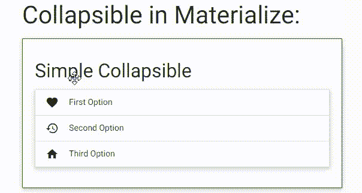

# 物化|可折叠

> 原文:[https://www.geeksforgeeks.org/materialize-collapsible/](https://www.geeksforgeeks.org/materialize-collapsible/)

可折叠是可折叠的元素，允许您在点击时展开或折叠内容，有助于提供内容的紧凑呈现。它允许隐藏与用户不直接相关的内容。下面是一个简单可折叠的语法:

以下是物化提供的可折叠类及其用途:

*   **可折叠类**用于将元素标识为可折叠组件。
*   **可折叠-表头** **类**用于将 div 标签设置为节表头。
*   **可折叠体类**用于将 div 标签设置为节内容。
*   **可扩展类**允许多个部分同时保持开放。这是默认行为。
*   **弹出类**用于制作弹出部分。
*   **手风琴类**一次只允许一节保持开放。
*   **激活类**允许当前节在选择前打开。

**示例:**

```html
<!DOCTYPE html>
<html>
  <head>
    <!--Import Google Icon Font-->
    <link href=
"https://fonts.googleapis.com/icon?family=Material+Icons" 
          rel="stylesheet">

    <!-- Compiled and minified CSS -->
    <link rel="stylesheet" 
          href=
"https://cdnjs.cloudflare.com/ajax/libs/materialize/0.97.5/css/materialize.min.css">

    <script type = "text/javascript"  
            src = 
"https://code.jquery.com/jquery-2.1.1.min.js">
    </script>  

    <!--Let browser know website is optimized for mobile-->
    <meta name="viewport" 
          content="width=device-width,
                   initial-scale=1.0"/>

    <style>
        .card-panel{
            border: thin solid green;
        }
    </style>
  </head>

  <body class="container">

      <h3>Collapsible in Materialize:</h3>
      <div class="card-panel">
          <h4>Simple Collapsible</h4>
    <ul class="collapsible" 
        data-collapsible="accordion">
      <li>
        <div class="collapsible-header">
            <i class="material-icons">
                      favorite</i>
                First Option
        </div>
        <div class="collapsible-body">
            <p>GeeksforGeeks</p>
        </div>
      </li>
      <li>
        <div class="collapsible-header">
             <i class="material-icons">history</i>
            Second Option
        </div>
        <div class="collapsible-body">
                 <p>GeeksforGeeks</p>
        </div>
      </li>
      <li>
        <div class="collapsible-header">
          <i class="material-icons">
               home</i>Third Option
        </div>
        <div class="collapsible-body">
          <p>GeeksforGeeks</p></div>
      </li>
    </ul>

    </div>

    <div class="card-panel">
        <h4>Expandable Collapsible</h4>
    <ul class="collapsible" 
        data-collapsible="expandable">
      <li>
        <div class="collapsible-header">
          <i class="material-icons">favorite
                  </i>First Option</div>
        <div class="collapsible-body">
          <p>GeeksforGeeks</p></div>
      </li>
      <li>
        <div class="collapsible-header">
           <i class="material-icons">
                history</i>Second Option</div>
        <div class="collapsible-body">
               <p>GeeksforGeeks</p></div>
      </li>
      <li>
        <div class="collapsible-header">
          <i class="material-icons">
              whatshot</i>Third Option</div>
        <div class="collapsible-body">
           <p>GeeksforGeeks</p></div>
      </li>
    </ul>
    </div>
    <div class="card-panel">
        <h4>Pop-out Collapsible</h4>
        <ul class="collapsible popout"
            data-collapsible="accordion">
          <li>
            <div class="collapsible-header">
               <i class="material-icons">
                   favorite</i>First Option</div>
            <div class="collapsible-body">
                 <p>GeeksforGeeks</p></div>
          </li>
          <li>
            <div class="collapsible-header">
               <i class="material-icons">history
                   </i>Second Option</div>
            <div class="collapsible-body">
               <p>GeeksforGeeks</p></div>
          </li>
          <li>
            <div class="collapsible-header">
              <i class="material-icons">whatshot
                  </i>Third Option</div>
            <div class="collapsible-body">
                <p>GeeksforGeeks</p></div>
          </li>
        </ul>
    </div>
    <div class="card-panel">
        <h4>Pre-selected Collapsible</h4>
        <ul class="collapsible" data-collapsible="expandable">
            <li>
              <div class="collapsible-header active">
                    <i class="material-icons">
                        favorite</i>First Option</div>
              <div class="collapsible-body">
                      <p>GeeksforGeeks</p></div>
            </li>
            <li>
              <div class="collapsible-header">
                  <i class="material-icons">history
                           </i>Second Option</div>
              <div class="collapsible-body">
                   <p>GeeksforGeeks</p></div>
            </li>
            <li>
              <div class="collapsible-header">
                <i class="material-icons">whatshot
                      </i>Third Option</div>
              <div class="collapsible-body">
                     <p>GeeksforGeeks</p></div>
            </li>
          </ul>
    </div>
     <!-- Compiled and minified JavaScript -->
     <script src=
"https://cdnjs.cloudflare.com/ajax/libs/materialize/0.97.5/js/materialize.min.js">
      </script>
      </body>
</html>
```

**输出:**

