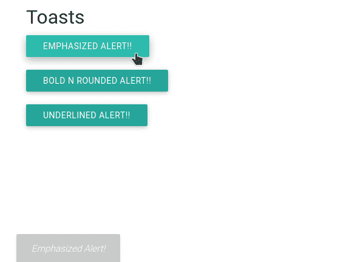

# 物化|介绍安装

> 原文:[https://www . geesforgeks . org/物化-介绍-安装/](https://www.geeksforgeeks.org/materialize-introduction-and-installation/)

**简介:**
物化是一种将成功设计的经典原则与创新和技术相结合的设计语言。物化由谷歌创建和设计。谷歌的目标是开发一个设计系统，允许任何平台上所有产品的统一用户体验。

**特征:**

*   它更容易使用。
*   它使网页充满活力，反应迅速。
*   它使网页兼容手机，平板电脑，笔记本电脑。
*   在[materializecss.com](https://materializecss.com/)免费提供

**安装物化:**安装物化有以下两种方式。

**方法 1:** 前往物化 CSS https://materializecss.com/getting-started.html 的官方文档，下载可用的最新版本。然后把下载的**物化. min.js** 和**物化. min.css** 文件放到你的项目目录中。

**方法二:**也可以用 CDN 版本安装。在脚本标签中包含以下 CDN 链接。

> < link rel= "样式表"
> 
> href=
> 
> " https://cdnjs . cloud flare . com/Ajax/libs/物化/1 . 0 . 0/CSS/物化. min.css " >
> 
> " https://cdnjs . cloud flare . com/Ajax/libs/物化/1 . 0 . 0/js/物化. min.js " >

现在我们用一个例子来理解物化的工作原理。

**示例:** 下面的示例展示了物化 CSS 中对话框的实现。

## 超文本标记语言

```html
<!DOCTYPE html>
<html>

<head>
    <link rel="stylesheet" href=
"https://cdnjs.cloudflare.com/ajax/libs/materialize/0.97.3/css/materialize.min.css">
    <script type="text/javascript"
src="https://code.jquery.com/jquery-2.1.1.min.js"></script>
    <script src=
"https://cdnjs.cloudflare.com/ajax/libs/materialize/0.97.3/js/materialize.min.js">
    </script>

    <script>
        function Toast1(string, timeLength) {
            Materialize.toast(
                '<em>' + string + '</em>', timeLength
            );
        }
        function Toast2(string, timeLength) {
            Materialize.toast(
                '<b>' + string + '</b>', timeLength, 'rounded'
            );
        }
        function Toast3(string, timeLength) {
            Materialize.toast(
                '<u>' + string + '<u>', timeLength
            );
        }
    </script>
</head>

<body>
    <body class="container">
        <h4>Toasts</h4>
        <a class="btn" onclick=
            "Toast1('Emphasized Alert!', 1500)">
            Emphasized Alert!!
        </a><br><br>

        <a class="btn" onclick=
            "Toast2('Bold N rounded Alert!', 1500)">
            Bold N rounded Alert!!
        </a><br><br>

        <a class="btn" onclick=
            "Toast3('Underlined Alert!', 1500)">
            Underlined Alert!!
        </a><br><br>
    </body>
</body>

</html>
```

**输出:**

