# 梅栈

> 原文:[https://www.geeksforgeeks.org/mern-stack/](https://www.geeksforgeeks.org/mern-stack/)

**MERN 栈:** MERN 栈是一个 Javascript 栈，用于更容易和更快地部署全栈 web 应用程序。MERN 栈由 4 项技术组成，分别是: [MongoDB](https://www.geeksforgeeks.org/mongodb-an-introduction/) 、 [Express](https://www.geeksforgeeks.org/introduction-to-express/) 、 [React](https://www.geeksforgeeks.org/react-js-introduction-working/) 和 [Node.js.](https://www.geeksforgeeks.org/introduction-to-nodejs/) 旨在使开发过程更加流畅和容易。

这 4 种强大的技术中的每一种都为开发人员提供了一个端到端的工作框架，并且每一种技术都在 web 应用程序的开发中发挥了很大的作用。

**开始:**首先，创建一个新的项目文件夹。然后转到命令提示符/终端中的项目文件夹，并在下面键入命令来初始化一个 package.json 文件。(确保安装了 npm)

```
npm init

```

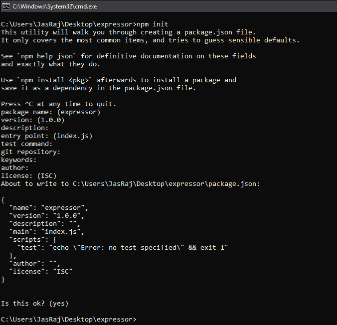

一个普通的 package.json 文件如下所示:

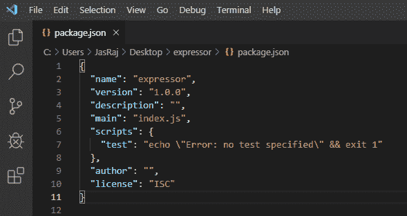

**注意:**根据您的要求，您可以安装模块(通过键入**NPM install module _ name–save**)，该模块将显示在 package.json 文件中。

**了解 MERN 堆栈组件:**

**1。MongoDB:跨平台面向文档的数据库**
MongoDB 是一个 NoSQL 数据库，其中每个记录都是一个由键值对组成的文档，键值对类似于 JSON (JavaScript 对象符号)对象。MongoDB 很灵活，允许其用户创建模式、数据库、表等。可由主键识别的文档构成了 MongoDB 的基本单元。一旦安装了 MongoDB，用户也可以使用 Mongo shell。Mongo shell 提供了一个 JavaScript 接口，用户可以通过它进行交互和操作(例如:查询、更新记录、删除记录)。

**为什么要用 MongoDB？**

*   快速–作为一个面向文档的数据库，易于索引文档。因此反应更快。
*   可扩展性–大数据可以通过将它分成几台机器来处理。
*   使用 JavaScript–MongoDB 使用 JavaScript，这是最大的优势。
*   无模式–单独文档中的任何类型的数据。
*   以 JSON 形式存储的数据–
    1.  对象、对象成员、数组、值和字符串
    2.  JSON 语法非常容易使用。
    3.  JSON 具有广泛的浏览器兼容性。
    4.  共享数据:任何大小和类型的数据(视频、音频)都可以轻松共享。
*   简单的环境设置–设置 MongoDB 非常简单。
*   灵活的文档模型——蒙古数据库支持更快更简单的文档模型(表、模式、列和 SQL)。
*   **创建数据库:简单地使用“使用”命令完成:**

```
use database_name;
```

*   **创建表:如果集合/表不存在，则将创建新的集合/表:**

```
db.createCollection("collection_name");
```

*   **将记录插入集合:**

```
db.collection_name.insert
(
    {
        "id" : 1,
        "Name" : "Klaus",
                "Department": "Technical",
                "Organization": "Geeks For Geeks"
    }
);
```

*   **查询单据:**

```
db.collection_name.find({Name : "Klaus"}).forEach(printjson);
```

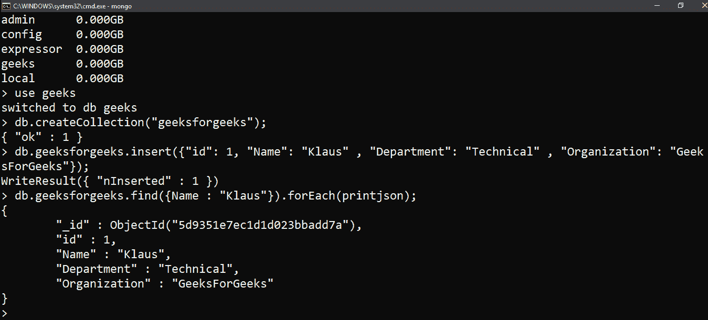

**2。Express:后端框架:**
Express 是 Node.js 框架。与使用 Node.js 编写代码和创建大量 Node 模块不同，Express 使得编写后端代码变得更加简单和容易。Express 有助于设计优秀的 web 应用程序和 API。Express 支持许多中间件，这使得代码更短，更容易编写。

**为什么用快递？**

*   异步和单线程。
*   高效、快速且可扩展
*   拥有最大的 Node.js 社区
*   Express 通过其内置路由器提高了代码的可重用性。
*   强大的应用编程接口
*   创建一个新文件夹来启动您的 express 项目，并在命令提示符下键入以下命令来初始化 package.json 文件。接受默认设置并继续。

```
npm init
```

*   然后通过键入以下命令并按 enter 键来安装 express。现在终于在名为 index.js 的目录中创建了一个文件。

```
npm install express --save
```

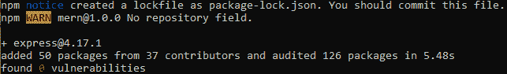

*   现在在 index.js 中键入以下内容来创建一个示例服务器。

## java 描述语言

```
const express = require('express'),
http = require('http');

const hostname = 'localhost';
const port = 8080;
const app = express();

app.use((req, res) => {
  console.log(req.headers);
  res.statusCode = 200;
  res.setHeader('Content-Type', 'text/html');
  res.end('<html><body><h1>This is a test server</h1></body></html>');

});
const sample_server = http.createServer(app);

sample_server.listen(port, hostname, () => {
  console.log(`Server running at http://${hostname}:${port}/`);
});
```

*   更新 package.json 文件中的“脚本”部分

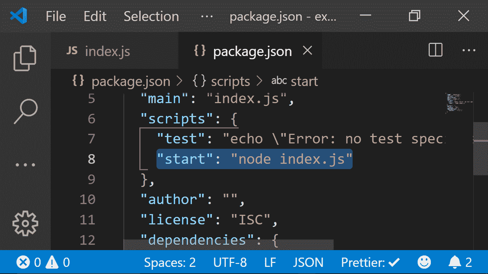

*   然后通过运行以下命令来启动服务器

```
npm start
```

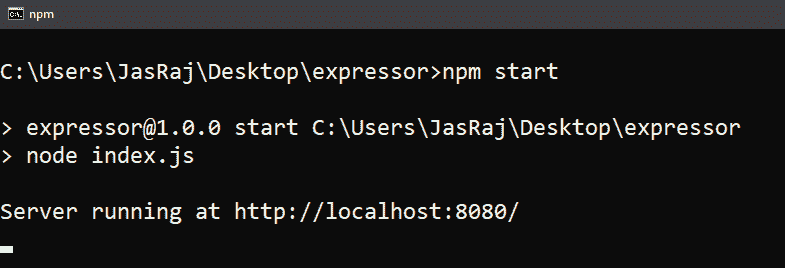

*   现在，您可以打开浏览器并获得正在运行的服务器的输出。

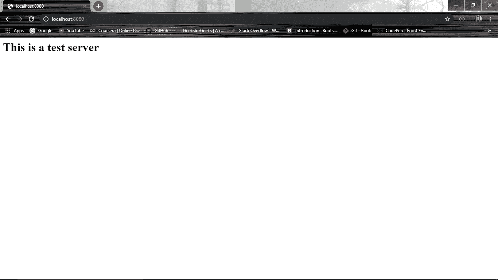

**3。React:前端库**
React 是一个用于构建用户界面的 JavaScript 库。React 用于开发单页应用程序和移动应用程序，因为它能够处理快速变化的数据。React 允许用户用 JavaScript 编写代码并创建 UI 组件。

**为什么要用 React？**

*   虚拟 DOM–虚拟 DOM 对象是一个 DOM 对象的表示。虚拟 DOM 实际上是原始 DOM 的副本。web 应用程序中的任何修改都会导致整个用户界面重新呈现虚拟 DOM。然后比较原始 DOM 和这个虚拟 DOM 之间的差异，并对原始 DOM 进行相应的更改。
*   JSX——代表 JavaScript XML。它是一个用于反应的超文本标记语言/可扩展标记语言扩展。使编写 React 组件变得越来越简单。
*   组件–ReactJS 支持组件。组件是用户界面的构建模块，其中每个组件都有一个逻辑，并对整个用户界面做出贡献。这些组件还提高了代码的可重用性，并使整个 web 应用程序更容易理解。
*   高性能——像虚拟 DOM、JSX 和组件这样的特性使它比其他框架快得多。
*   开发安卓/Ios 应用程序–借助 React Native，您只需了解 JavaScript 和 ReactJS，就可以轻松编写基于安卓或 Ios 的应用程序。
*   您可以通过首先使用 npm 或纱线安装“create-react-app”来启动 react 应用程序。

```
npm install create-react-app --global
```

运筹学

```
yarn global add create-react-app
```

*   之后，您可以使用创建一个新的 react 应用程序。

```
create-react-app app_name
```

*   然后导航到“app_name”文件夹，输入**纱线启动**或 **npm 启动**启动您的应用程序。

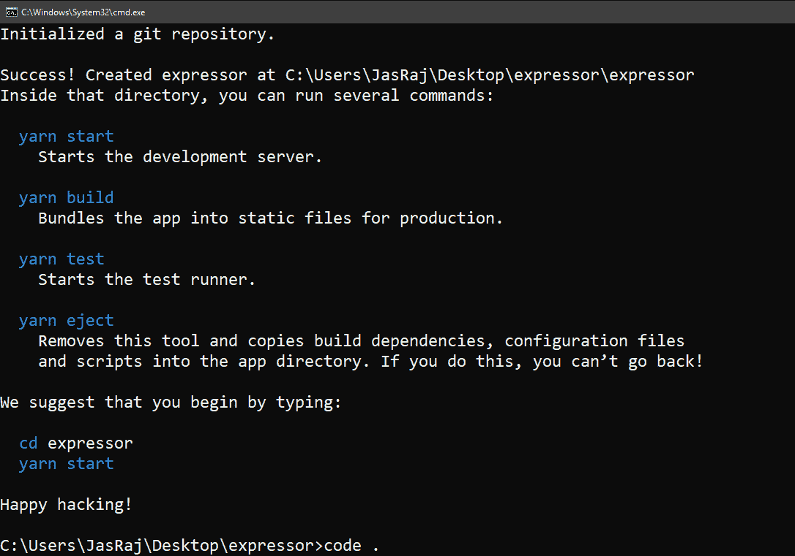

*   典型的 React 应用程序如下所示:

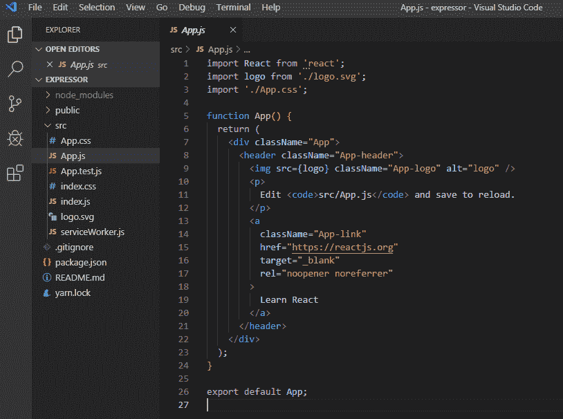

*   更新 index.js 文件

## java 描述语言

```
ReactDOM.render(
  <h1>Hello DEVELOPERS!!</h1>,
  document.getElementById('root')
);
```

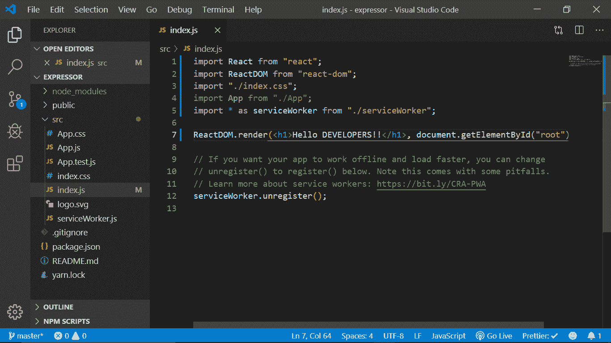

*   使用以下命令运行您的应用程序。

```
npm start
```

或者

```
yarn start
```

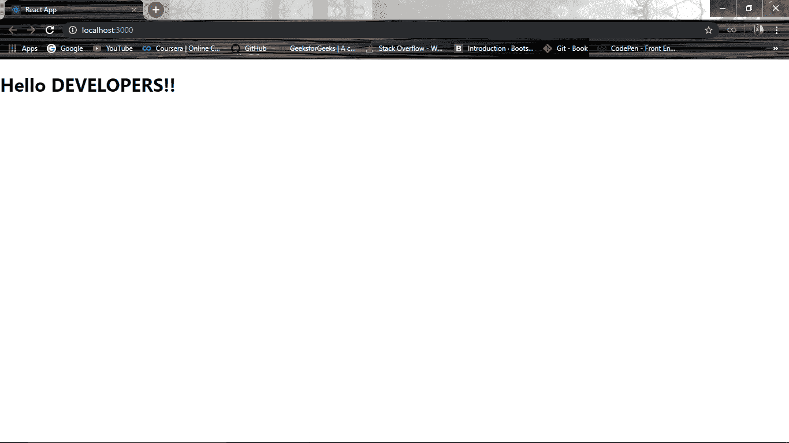

**4。Node.js: JS 运行时环境**
Node.js 提供了一个 JavaScript 环境，允许用户在服务器上运行他们的代码(在浏览器之外)。节点包管理器，即 npm，允许用户从数千个免费包(节点模块)中选择下载。

**为什么要用 Node。JS？**

*   开源 JavaScript 运行时环境
*   单线程–遵循单线程模型。
*   数据流
*   快速——基于谷歌 Chrome 的 JavaScript 引擎，Node.js 的代码执行速度很快。
*   高度可扩展
*   通过在命令窗口中键入运行以下命令来初始化 Node.js 应用程序。接受标准设置。

```
npm init
```

*   创建一个名为 index.js.
    **的文件示例:**
    一个计算矩形周长&面积的基本 Node.js 示例。

## java 描述语言

```
var rectangle = {
    perimeter: (x, y) => (2*(x+y)),
    area: (x, y) => (x*y)
};

function Rectangle(l, b) {
    console.log("A rectangle with l = " + l + " and b = " + b);

    if (l <= 0 || b <= 0) {
        console.log("Error! Rectangle's length & breadth should be greater than 0:  l = "
               + l + ",  and b = " + b);
    }
    else {
        console.log("Area of the rectangle: " + rectangle.area(l, b));
        console.log("Perimeter of the rectangle: " + rectangle.perimeter(l, b));
    }
}

Rectangle(1, 8);
Rectangle(3, 12);
Rectangle(-6, 3);
```

*   通过在命令窗口中运行以下命令来运行节点应用程序。

```
npm start
```

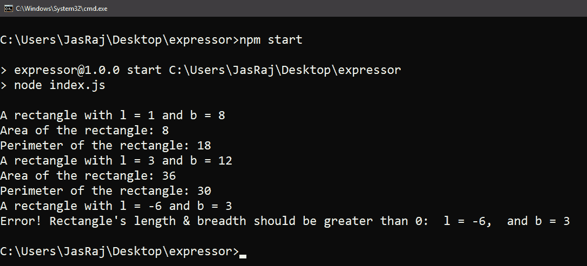