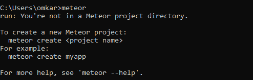
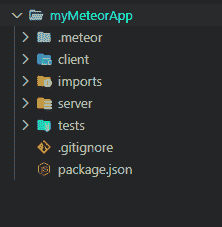
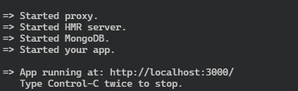
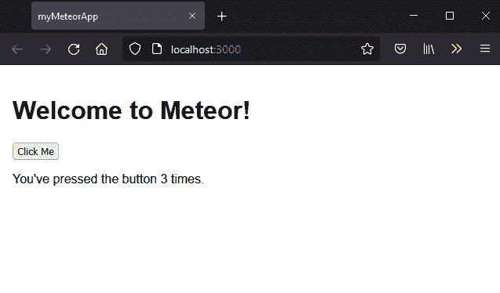

# 流星介绍和环境设置

> 原文:[https://www . geesforgeks . org/meteor-introduction-and-environment-setup/](https://www.geeksforgeeks.org/meteor-introduction-and-environment-setup/)

Meteor 是一个开源的全栈 JavaScript 平台，对于开发现代 web 和移动应用程序非常有用。Meteor 帮助开发人员用一种语言开发。Meteor 有几个特性，有助于使用 JavaScript 或框架中可用的不同包来创建响应性和反应性的网络或移动应用程序。

对于开始使用任何技术的人来说，首先，我们需要创造一个合适的环境。

**先决条件:**首先，我们需要[流星](https://www.geeksforgeeks.org/meteor-introduction-to-meteor/)安装在我们的操作系统中，要运行任何流星应用程序，我们必须在我们的电脑上安装 NodeJS。NodeJS 是 Meteor 开发所需的平台。

*   如果你没有安装 NodeJS。可以访问 [NodeJS](https://www.geeksforgeeks.org/introduction-to-nodejs/) 了解如何下载安装。
*   您可以访问 NodeJS 的[官方下载链接](https://nodejs.org/en/download/current/)下载安装 NodeJS 的最新版本。

**安装流星的分步程序:**

**第一步:**我们需要[下载](https://www.meteor.com/developers/install)官方流星安装程序。在安装过程中，如果出现任何错误，请尝试以管理员身份运行安装程序包。安装完 Meteor 后，您需要检查每个软件包是否安装正确，为此，您需要在命令提示符窗口中运行以下命令。

```html
C:\Users\..>meteor
```

您将获得以下输出，这意味着流星包已成功安装在您各自的系统上。



**步骤 2:** 现在您只需要在您想要的位置使用以下命令创建一个项目目录。

**语法:**

```html
meteor create <name of project>
```

**示例:**

```html
meteor create myMeteorApp
```

**项目结构:**在该命令之后，您会看到项目目录结构如下:



**第三步:**现在可以开始发育了。

要运行 Meteor web 应用程序项目，您需要键入如下几个命令:

**语法:**

```html
cd myMeteorApp
```

```html
meteor
```

它将在终端中为您提供如下图所示的输出:



**输出:**在浏览器上启动 localhost 后会看到的输出。

