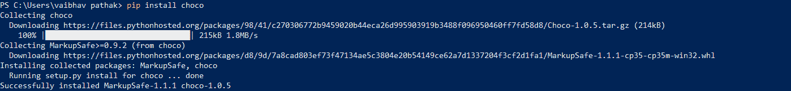
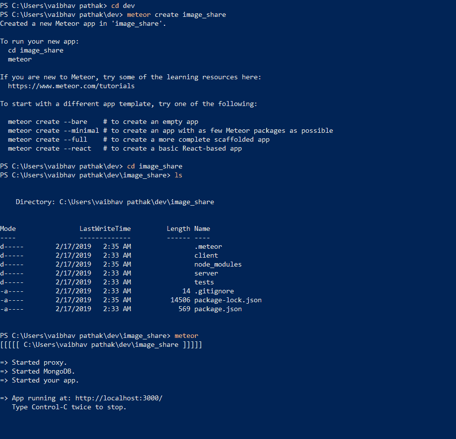

# 流星|流星简介

> 原文:[https://www . geesforgeks . org/meteor-简介-meteor/](https://www.geeksforgeeks.org/meteor-introduction-to-meteor/)

Meteor 是一个全栈 JavaScript 平台，用于开发现代网络和移动应用程序。Meteor 有一组特性，这些特性有助于使用 javaScript 或框架中可用的不同包创建一个响应迅速的网络或移动应用程序。它用于构建连接客户端的反应式应用程序。流星的特点如下:

*   Meteor 帮助开发人员用一种语言开发。
*   Meteor 将数据直接发送到服务器，而不是发送由客户端呈现的 HTML 文件。
*   Meteor can provide full stack relativity which thus allows the UI to reflect the true state of the world with the minimum development effort.

    **安装流星:-**

    从流星开始

    1.对于 WINDOWS:-

    首先安装**巧克力**

    ```html
    -    Pip install choco
    ```

    使用管理员命令提示符运行此命令

    ```html
     -    Choco install meteor
    ```

    2.对于 OSX/LINUX:-

    在您的终端中运行以下命令来安装 Meteor

    ```html
    -   Curl https://install.meteor.com/ |sh
    ```

    

    **如何用流星启动项目:-**

    创建新项目。您必须运行以下命令

    ```html
     - meteor create project_name
    ```

    要在 Meteor 中运行项目，您需要运行以下命令:

    ```html
     " meteor "
    ```

    