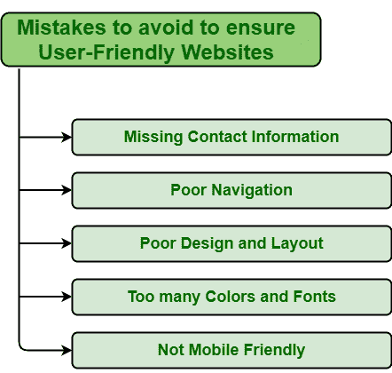

# 避免错误，确保网站用户友好

> 原文:[https://www . geesforgeks . org/避免错误确保用户友好网站/](https://www.geeksforgeeks.org/mistakes-to-avoid-to-ensure-user-friendly-website/)

网页设计是一个至关重要的过程。网站的设计应该能够吸引用户的注意力，让他们获得信息，并将他们转化为忠实的客户。这反过来将提高业务的绩效和增长。设计良好的网站包括许多令人惊叹的功能，看起来很棒，具有出色的功能，并且也吸引用户。但是设计不佳的网站直接影响用户体验和业务增长。它不仅会让你失去用户，还会造成更大的金钱损失，拖垮业务。因此，网站的设计应该遵循一些用户友好的基本规则。要制作用户友好的网站，需要避免一些可能对企业的长期成功产生更大影响的错误。应该避免的一些错误如下:

**1。缺少联系方式:**联系方式对于任何网站都非常重要。这是用户可以轻松联系到你，让人们信任你的最好方式。包括联系信息应该是设计网站的首要任务之一。不管你的生意有多大，公司有多大，拥有一个没有任何联系方式的网站只是浪费资源。用户对您提供的服务和产品有许多疑问和疑虑。因此，提供联系方式将使他们更容易联系到你，这反过来又会增加用户体验。因此，为用户提供与您联系的不同方式，实际页面必须包含所有联系信息，以便用户更容易找到联系信息。

**2。导航差:**好的导航对于提高网站的性能真的很重要。它不仅提高了用户搜索的速度，而且使搜索过程更加流畅和容易。这将改善用户体验，鼓励他们留在主页上，并允许用户以更有效的方式理解和了解您的网站。导航不好对用户影响很大。它只是很快就把它们关掉了，人们可能不会继续浏览这些网站。现在的人想尽快完成每一项任务，没有任何耐心。因此，拥有良好的导航以增加用户体验非常重要，并且应该避免导航不佳。

**3。糟糕的设计和布局:**好的设计和布局很重要，因为它吸引并保持用户对你的网站的关注。它还使查找和访问信息变得简单。它还增强了网站的外观，并使其更容易导航。这将使用户更舒服，并希望他们再次访问您的网站并探索更多。然而，糟糕的设计和布局不仅让用户感到沮丧，而且不会给用户留下心理印象。因此，对于一个人来说，避免网站设计和布局不佳是很重要的。事实上，他们应该努力使它更有吸引力和更有效，以增加它的用户友好性。

**4。颜色和字体太多:**颜色和字体在网页设计中非常重要，因为这是向用户有效传达品牌信息的最佳方式。它们基本上使网站元素更清晰、更有吸引力、更有效，并以良好的方式影响用户。可以说，颜色和字体都会发展人的情感。但是使用太多的颜色和字体可能会对用户产生负面影响。用户可能会感到困倦，难以阅读或浏览，影响用户情绪，影响用户行为等。因此，人们应该避免犯这样的错误，为你的网站选择合适的颜色和字体以使其更具吸引力是非常重要的。

**5。不移动友好:**移动友好网站是接触更多用户的最佳方式。它不仅会增加用户数量，还会确保所有用户都必须有一个良好和积极的体验。因此，应该避免犯不做移动友好网站的错误。在设计网站的时候，我们需要让它们对移动用户友好，因为现在大多数人都用手机搜索网页，如果一个网站在移动上看起来不太好，那么它会对用户产生负面影响。