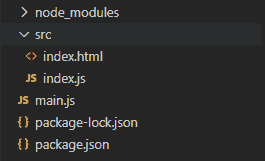
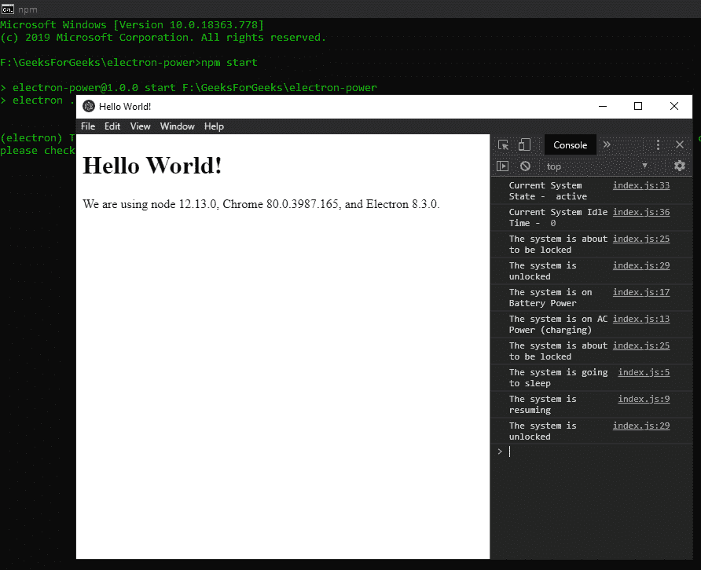

# 监控电子系统中的系统电源状态

> 原文:[https://www . geesforgeks . org/monitor-system-power-States-in-electronijs/](https://www.geeksforgeeks.org/monitor-system-power-states-in-electronjs/)

**[electronijs](https://www.geeksforgeeks.org/introduction-to-electronjs/)**是一个开源框架，用于使用能够在 Windows、macOS 和 Linux 操作系统上运行的 HTML、CSS 和 JavaScript 等网络技术构建跨平台的本机桌面应用程序。它将铬引擎和**T5 节点 T7】结合成一个单一的运行时。**

可以直接影响本机桌面应用程序执行的一种系统行为是系统电源及其状态变化。例如，开发人员想知道系统何时从充电切换到电池供电，反之亦然，以便他们可以通过应用程序自动调整系统的亮度，从而消耗更少的电池电量。类似地，当系统即将被挂起或关闭时，可以让应用程序知道并采取必要的措施，如干净地退出等。电子为我们提供了一种使用内置**电源监控器**模块监控系统电源状态变化的方法。本教程将演示如何使用**电源监控器**模块实例方法和事件来监控这些系统电源状态。

我们假设您熟悉上述链接中介绍的先决条件。电子要工作， **[节点](https://www.geeksforgeeks.org/introduction-to-nodejs/)** 和 **[npm](https://www.geeksforgeeks.org/node-js-npm-node-package-manager/)** 需要预装在系统中。

**电子系统电源状态变化:****电源监控器**模块是**主流程**的一部分。为了在**渲染过程**中导入和使用该模块，我们将使用电子**远程**模块。有关远程模块的更多详细信息，请参考此[链接](https://www.electronjs.org/docs/api/remote)。在**应用程序**模块的**就绪**事件发出且应用程序准备创建**浏览器窗口**实例之前，**电源监视器**模块不能使用。更多信息请参考[链接](https://www.electronjs.org/docs/api/app#appwhenready)。

*   **项目结构:**
    

**示例:**我们将按照给定的步骤开始构建用于监控系统电源状态变化的电子应用程序。

*   **Step 1:** Navigate to an Empty Directory to setup the project, and run the following command,

    ```html
    npm init
    ```

    生成**包. json** 文件。安装 **[电子](https://www.geeksforgeeks.org/introduction-to-electronjs/)** 如果没有安装，使用 npm。

    ```html
    npm install electron --save
    ```

    该命令还将创建**包-lock.json** 文件，并安装所需的**节点 _ 模块**依赖项。一旦电子安装成功，打开**包. json** 文件，并在**脚本**键下执行必要的更改。
    **package.json:**

    ```html
    {
      "name": "electron-power",
      "version": "1.0.0",
      "description": "Power State Changes in Electron ",
      "main": "main.js",
      "scripts": {
        "start": "electron ."
      },
      "keywords": [
        "electron"
      ],
      "author": "Radhesh Khanna",
      "license": "ISC",
      "dependencies": {
        "electron": "^8.3.0"
      }
    }

    ```

*   **Step 2:** Create a **main.js** file according to the project structure. This file is the **Main Process** and acts as an entry point into the application. Copy the Boilerplate code for the **main.js** file as given in the following [link](https://www.electronjs.org/docs/tutorial/first-app#electron-development-in-a-nutshell). We have modified the code to suit our project needs.

    **main.js:**

    ```html
    const { app, BrowserWindow } = require('electron')

    function createWindow () {
      // Create the browser window.
      const win = new BrowserWindow({
        width: 800,
        height: 600,
        webPreferences: {
          nodeIntegration: true
        }
      })

      // Load the index.html of the app.
      win.loadFile('src/index.html')

      // Open the DevTools.
      win.webContents.openDevTools()
    }

    // This method will be called when Electron has finished
    // initialization and is ready to create browser windows.
    // Some APIs can only be used after this event occurs.
    // This method is equivalent to 'app.on('ready', function())'
    // The powerMonitor Module cannot be used until this event is emitted.
    app.whenReady().then(createWindow)

    // Quit when all windows are closed.
    app.on('window-all-closed', () => {
      // On macOS it is common for applications and their menu bar
      // to stay active until the user quits explicitly with Cmd + Q
      if (process.platform !== 'darwin') {
        app.quit()
      }
    })

    app.on('activate', () => {
        // On macOS it's common to re-create a window in the 
        // app when the dock icon is clicked and there are no 
        // other windows open.
      if (BrowserWindow.getAllWindows().length === 0) {
        createWindow()
      }
    })

    // In this file, you can include the rest of your 
    // app's specific main process code. You can also 
    // put them in separate files and require them here.
    ```

*   **Step 3:** Create the **index.html** file and the **index.js** file within the **src** directory according to the project structure. We will also copy the Boilerplate code for the **index.html** file from the above-mentioned link. We have modified the code to suit our project needs.

    **index.html:**

    ```html
    <!DOCTYPE html>
    <html>
      <head>
        <meta charset="UTF-8">
        <title>Hello World!</title>
        <!-- https://electronjs.org/docs/tutorial
                               /security#csp-meta-tag -->
        <meta http-equiv="Content-Security-Policy" 
              content="script-src 'self' 'unsafe-inline';" />
      </head>
      <body>
        <h1>Hello World!</h1>
        We are using node 
        <script>
            document.write(process.versions.node)
        </script>, Chrome 
        <script>
            document.write(process.versions.chrome)
        </script>, and Electron 
        <script>
            document.write(process.versions.electron)
        </script>.

        <!-- Adding Individual Renderer Process JS File -->
        <script src="index.js"></script>
      </body>
    </html>
    ```

    **输出:**此时，我们的应用程序已经设置好了，我们可以启动应用程序来检查 GUI 输出。要启动电子应用程序，请运行命令:

    ```html
    npm start
    ```

    

*   **Step 4:** We are going to monitor the System Power State Changes throughout the Application without binding this module to any HTML DOM element.
    **index.js:** Add the following snippet in that file.

    ```html
    const electron = require('electron');
    // Importing powerMonitor from Main Process 
    // Using remote Module
    const powerMonitor = electron.remote.powerMonitor;

    powerMonitor.on('suspend', () => {
        console.log('The system is going to sleep');
    });

    powerMonitor.on('resume', () => {
        console.log('The system is resuming');
    });

    powerMonitor.on('on-ac', () => {
        console.log('The system is on AC Power (charging)');
    });

    powerMonitor.on('on-battery', () => {
        console.log('The system is on Battery Power');
    });

    powerMonitor.on('shutdown', () => {
        console.log('The system is Shutting Down');
    });

    powerMonitor.on('lock-screen', () => {
        console.log('The system is about to be locked');
    });

    powerMonitor.on('unlock-screen', () => {
        console.log('The system is unlocked');
    });

    const state = powerMonitor.getSystemIdleState(4);
    console.log('Current System State - ', state);

    const idle = powerMonitor.getSystemIdleTime();
    console.log('Current System Idle Time - ', idle);
    ```

    **解释:**下面详细解释代码中使用的**电源监控器**模块的所有实例事件。更多详细信息，请参考[链接](https://www.electronjs.org/docs/api/power-monitor#events)。

    *   **暂停:当系统即将暂停或进入睡眠模式时发出的事件**。
    *   **恢复:当系统从暂停状态或睡眠模式恢复时发出的事件**。
    *   **on-ac:事件**此实例事件仅在**窗口**中受支持。当系统电源状态变为交流电源且系统正在通电运行时(例如为笔记本电脑充电时)，会发出此事件。要在交流电源和电池电源之间切换，只需按照输出中的操作插入/拔出笔记本电脑的充电器。
    *   **电池供电:事件**此实例事件仅在**窗口**中受支持。当系统电源状态变为“电池电源”并且系统使用电池运行时，会发出此事件。要在交流电源和电池电源之间切换，只需按照输出中的操作插入/拔出笔记本电脑的充电器。
    *   **关机:事件**此实例事件仅在 **Linux** 和 **macOS** 中受支持。当系统即将重新启动或关闭时，会发出此事件。如果事件处理程序从全局**事件**对象调用 **e.preventDefault()** 方法，电子将尝试延迟系统关闭，以便应用程序干净地退出。调用此方法时，应用程序应使用 **main.js** 文件中使用的 **app.quit()** 方法立即退出，以停止所有后台进程并关闭任何打开的**浏览器窗口**实例。有关 **app.quit()** 方法和与之相关的所有实例事件的更多详细信息，请参考此[链接](https://www.electronjs.org/docs/api/app#appquit)。
    *   **锁屏:事件**此实例事件仅在**窗口**和**苹果操作系统**中受支持。当系统即将锁定屏幕时，会发出此事件。在**窗口**上，该功能由**窗口+L** 触发。
    *   **解锁-屏幕:事件**此实例事件仅在**窗口**和**苹果操作系统**中受支持。一旦系统屏幕解锁，就会发出此事件。

    下面详细解释了代码中使用的**电源监控器**模块的所有实例方法。更多详细信息，请参考[链接](https://www.electronjs.org/docs/api/power-monitor#methods)。

    *   **power monitor . getsystem dlestate(idle threshold)**该方法用于计算系统**空闲**状态，并根据提供的**空闲阈值**值返回系统当前状态。**空闲阈值**值是系统被认为处于空闲状态之前的时间量(以秒为单位)。该方法返回代表系统当前状态的**字符串**值。返回值可以是**激活**、**空闲**、**锁定**或**未知**。在上面的代码中，我们已经将 4s 作为**空闲阈值**，我们应该将**活动**作为返回值。
        **注意**–锁定的返回值**仅在选定的系统环境下可用。**
    *   ****power monitor . getsystem dletime()**此方法用于计算系统处于空闲状态的时间(以秒为单位)。它不接受任何参数。它返回一个**整数**值，以秒为单位表示系统空闲时间。**

****注意**–**电源监控器**模块不控制系统行为，如防止系统进入睡眠状态等，不要与**电源保护阻塞器**模块混淆。**

****输出:****

**<video class="wp-video-shortcode" id="video-419055-1" width="665" height="373" preload="metadata" controls=""><source type="video/mp4" src="https://media.geeksforgeeks.org/wp-content/uploads/20200518233936/Output-1-Final.mp4?_=1">[https://media.geeksforgeeks.org/wp-content/uploads/20200518233936/Output-1-Final.mp4](https://media.geeksforgeeks.org/wp-content/uploads/20200518233936/Output-1-Final.mp4)</video>**

**由于无法记录将系统置于睡眠模式并将其恢复，以下是这些实例事件的输出。为了使系统进入睡眠模式，系统执行锁屏操作。同样，当系统从睡眠模式恢复时，系统需要解锁才能访问。
**输出:**
**