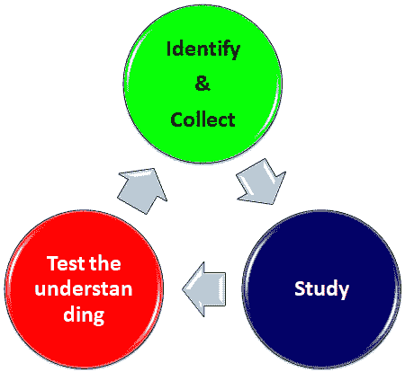
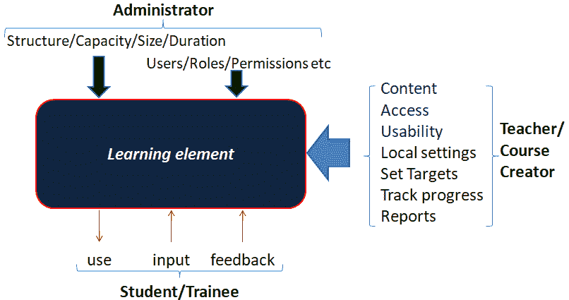
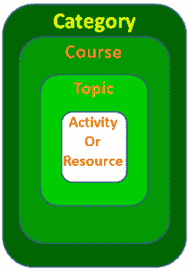

# MOODLE——数字化学习平台

> 原文:[https://www . geesforgeks . org/Moodle-a-digital-learning-platform/](https://www.geeksforgeeks.org/moodle-a-digital-learning-platform/)

学习过程包括三个不同的阶段，即。、**鉴定**、**收集**各种学习资料、**研究**从而有组织地收集器物、**检验理解**。通常这个过程隐含着许多贡献者。例如，一个标准(教育或考试)委员会会为我们设定目标。该委员会将为我们提供一些关于范围的建议，并为我们提供一份学习材料清单。老师们会收集这样的推荐材料，并添加他们的知识、专业知识和经验来进行生动的解释，并制作配套的课堂笔记，以丰富我们的学习体验。当然，有短期或期中和期末考试，无论是描述性的还是客观的问题。总的来说，类似的程序也适用于角色和责任逐渐淡化的竞争性考试，在这些考试中，责任主要落在学生身上。

**图 1 学习过程**

最近几天，互联网和移动设备在我们的生活中发挥着至关重要的作用，学习过程也不例外。学习系统也见证了技术的进步。基于互联网，出现了几种数字化学习模式和工具。这类数字学习平台中最著名的是 Moodle。除了 moodle，还有 [Courseplay](https://courseplay.co/?utm_source=capterra) 、 [Adobe Captivate Prime](https://www.adobe.com/products/captivateprime/buying-guide.html) 等多个付费开源学习平台

#### 什么是 MOODLE？

**模块化面向对象动态学习环境(MOODLE)** 是一个开源的学习管理系统(LMS)，它为数字学习铺平了道路，能够容纳各种类型的学习内容。它是符合 SCORM 1.2 标准的系统。作为学习内容设计的一部分，可以创建 20 多种类型的活动。学习内容或课程材料可以包括:

*   简单文本文件
*   Microsoft 文档(本机形式的 powerpoint 演示文稿除外)
*   不同格式的视频和(或)音频文件
*   可移植文档格式的文件(。pdf)

Moodle 平台提供了一个全面的学习平台，学生可以在一个温和的环境下进行合作。参与者可以学习、讨论、完成作业和测试，并根据规定的学习目标获得结业证书。如前所述，教师可以创建和更新各种形式的课程材料。根据时间表和最低分数为学生定义课程格式和设定目标，以证明课程完成。

图 2 描述了 Moodle 的典型操作:

**图 Moodle 平台的运行模型**

在 moodle 平台上创建和维护课程有多种角色。在各种角色中，典型的重要角色是管理员、教师、课程创建者和学生。

**管理员**可以定义和修改系统中任意用户的角色和职责。它们还可以选择性地启用各种访问方法。例如，启用/禁用移动访问。限制访问课程的 IP 地址。运行站点范围的公告。

**教师和课程创建者**将能够创建课程材料。教师将拥有额外的特权来分别分配和跟踪学生的课程进度。设计和进行调查、测验等。分析回应并提供反馈。

#### 课程结构的层次

当我们检查课程结构时，以下是一些关于课程结构的有趣因素。图 3 总结了课程内容骨架组织的层次结构。最小的单元可以定义为“学习元素”。一组学习元素将创建一个“活动”。

*   **资源/活动**–为学习者提供可衡量行动的一组学习要素
*   **主题**–包含一组称为资源或活动的项目，这些项目包含特定的面向动作的信息元素
*   **课程**–一组有特定覆盖范围和特定目标或学习者要达到的目标的主题
*   **类别**–例如，一组课程，它类似于一本包含多个章节的书

**图 3:Moodle**中课程元素的分层视图

#### 平台要求

Linux 版本、Ubuntu 12.x 和更高版本的 Windows Server 2008 都支持 Moodle。Moodle 服务器可以安装在任何网络服务器上，如 Apache 2.x 或 NGINX 或同等产品。

#### 结论

Moodle 是一个功能强大的开源学习平台，提供了所有重要的设施，如发布全网站公告、课程级公告。启用和禁用移动访问。使课程创建者能够以各种形式和格式提供课程内容和材料。控制课程可用性并评估参与者。开展调查和反馈会议等。为学生设定目标，跟踪并提醒他们截止日期。