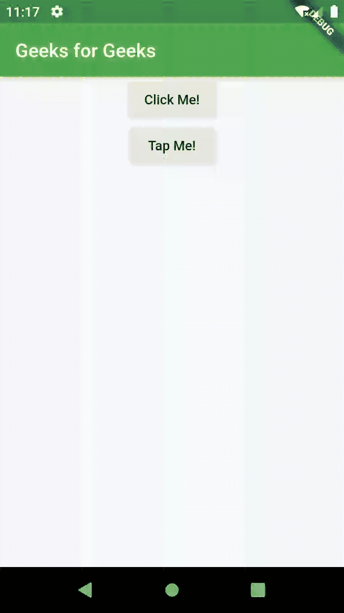

# 颤振中的多页应用

> 原文:[https://www . geeksforgeeks . org/多页应用程序-in-flutter/](https://www.geeksforgeeks.org/multi-page-applications-in-flutter/)

**简介:**在这个科技世界里，app 被人类广泛使用。应用商店中的应用数量日益增加。由于这场竞争，应用程序开发人员已经开始在他们的应用程序中添加一些功能。为了降低这种复杂性，该应用的内容大部分被分成各种**页面**，以便用户可以轻松地在这些页面之间导航。

[Flutter](https://www.geeksforgeeks.org/flutter-an-introduction-to-the-open-source-sdk-by-google/) 是一款开源移动应用 SDK，用于开发跨平台移动应用。近年来，Flutter 变得越来越受欢迎，因为它有着惊人的特性，如热重装、吸引人的用户界面等。在 Flutter 中，一切都是一个小部件。

**航线和导航员:**在 Flutter 中，页面/屏幕被称为**航线**。从一条路线导航到另一条路线的过程由一个名为**导航器**的小部件来执行。导航器以**栈**的形式维护其所有子路线。它有很多方法，像 **push()** 和 **pop()** 在堆栈规则下工作。但是，对于多页应用程序，我们将使用一种称为 pushNamed()的独特方法。这种方法主要遵循**面向对象**的概念。

**Navigator.pushNamed()** 方法用于调用一个路由，该路由的类是预先创建和定义的。这就像在 OOPs 中需要的时候调用一个类。现在，让我们继续创建多页应用程序。

**多页申请:**

*   **创建路线:**路线主要以类的形式创建。每条路线都有一个唯一的类，其中包含唯一的内容和用户界面。在这里，我们将创建三条路由，即 HomeRoute()，SecondRoute()和 ThirdRoute()。每条路线都将有一个包含唯一标题的应用程序栏和一个用于在路线之间导航的凸起按钮。可以按如下方式创建路线:

    ```
    class HomeRoute extends StatelessWidget {
      @override
      Widget build(BuildContext context) {
        return Scaffold(
          appBar: AppBar(
            title: Text('Geeks for Geeks'),
            backgroundColor: Colors.green,
          ),
          body: Center(
              child: Column(
              children: <Widget>[
              RaisedButton(
                child: Text('Click Me!'),
                onPressed: () {
                  /* Contains the code that helps us
                 navigate to the second route. */
                },
              ),
              RaisedButton(
                child: Text('Tap Me!'),
                onPressed: () {
                  /* Contains the code that helps us
                 navigate to the third route. */
                },
              ),
            ],
          )),
        );
      }
    }
    ```

*   **定义路线:**在路线之间导航之前，在 MaterialApp 小部件中定义路线非常重要。这有助于我们尽可能轻松地访问和调用它们。因为，我们正在初始化第一条路由，所以我们没有必要提及归属路由。路线可定义如下:

    ```
    void main() {
      runApp(MaterialApp(
        initialRoute: '/',
        routes: {
          '/': (context) => HomeRoute(),
          '/second': (context) => SecondRoute(),
          '/third': (context) => ThirdRoute(),
        },
      ));
    }
    ```

    从代码中可以了解到，每条路由都有唯一的名称。因此，当 navigator 小部件在 route 类中遇到这些名称中的任何一个时，它就会导航到相应的路由。此代码中的 initialRoute 指定了应用程序的起始路线，并用“/”符号进行符号化。在这个小部件中初始化主页是一件强制性的事情。

*   **导航到一个页面:**navigator . pushnamed()方法在这个片段中开始发挥作用。此方法调用路由类中特定路由的名称。从而初始化导航过程。导航可以按如下方式进行:

    ```
    onPressed: () {
      Navigator.pushNamed(context, '/second');
    }
    ```

*   **导航返回:**但是，要访问最近访问的路线，可以使用 Navigator.pop()方法。它帮助我们回到最后一条路线。在这种情况下，堆栈规则如下。pop 方法的使用如下:

    ```
    onPressed: () {
      Navigator.pop(context);
    }
    ```

所以，现在让我们看看所有这些代码是如何组合在一起创建这个多页应用程序的。

#### 示例:

```
import 'package:flutter/material.dart';

void main() {
  runApp(MaterialApp(
    initialRoute: '/',
    routes: {
      '/': (context) => HomeRoute(),
      '/second': (context) => SecondRoute(),
      '/third': (context) => ThirdRoute(),
    },
  ));
}

class HomeRoute extends StatelessWidget {
  @override
  Widget build(BuildContext context) {
    return Scaffold(
      appBar: AppBar(
        title: Text('Geeks for Geeks'),
        backgroundColor: Colors.green,
      ),
      body: Center(
          child: Column(
          children: <Widget>[
          RaisedButton(
            child: Text('Click Me!'),
            onPressed: () {
              Navigator.pushNamed(context, '/second');
            },
          ),
          RaisedButton(
            child: Text('Tap Me!'),
            onPressed: () {
              Navigator.pushNamed(context, '/third');
            },
          ),
        ],
      )),
    );
  }
}

class SecondRoute extends StatelessWidget {
  @override
  Widget build(BuildContext context) {
    return Scaffold(
      appBar: AppBar(
        title: Text("Click Me Page"),
        backgroundColor: Colors.green,
      ),
      body: Center(
        child: RaisedButton(
          onPressed: () {
            Navigator.pop(context);
          },
          child: Text('Back!'),
        ),
      ),
    );
  }
}

class ThirdRoute extends StatelessWidget {
  @override
  Widget build(BuildContext context) {
    return Scaffold(
      appBar: AppBar(
        title: Text("Tap Me Page"),
        backgroundColor: Colors.green,
      ),
    );
  }
}
```

**输出:**

