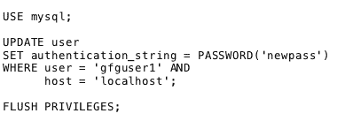

# MySQL |更改用户密码

> 原文:[https://www.geeksforgeeks.org/mysql-change-user-password/](https://www.geeksforgeeks.org/mysql-change-user-password/)

在 MySQL 中，可以使用 3 种不同的语句来更改用户帐户密码:

1.  更新语句
2.  设置密码语句
3.  更改用户语句。

但是在更改帐户密码之前，应该记住两件非常重要的事情:

*   要更改密码的用户帐户详细信息。
*   您将要更改其密码的用户正在使用该应用程序，因为如果在不更改应用程序的连接字符串的情况下更改了密码，则该应用程序将无法连接到数据库服务器。

现在让我们了解如何使用上面提到的三个 SQL 语句来更改 SQL 中的用户密码:

1.  **使用 SET PASSWORD 语句更改 MySQL 用户密码**:要使用 SET PASSWORD 语句更改用户密码，第一个要求是账户至少需要有 UPDATE 权限。

用户帐户应该是“用户@主机”格式，您要更新其密码。

要使用 SET PASSWORD 语句将用户帐户“gfguser1”的密码更改为“newpass”，应执行以下代码语句:

**语法:**

*   **Changing MySQL User Password Using The ALTER USER statement**: The second way to change the password for a user account is to use the ALTER USER statement.

    ALTER USER 语句与“IDENTIFIED BY”子句一起使用。

    要使用 Alter User 语句将用户帐户“gfguser1”的密码更改为“newpass”，语法如下所示:
    **语法:**
    

    *   **Changing MySQL User Password Using UPDATE Statement**: The third way to change the password of a user account is by using the UPDATE statement.

    Update 语句更新 *mysql* 数据库的*用户*表。

    执行更新语句后，需要执行**刷新权限**语句。

    FLUSH PRIORIES 语句用于从 mysql 数据库的 grant 表中重新加载特权。

    要将从本地主机服务器连接的用户帐户“gfguser1”的密码更改为“newpass ”,语法如下所示:

    **语法:**
    