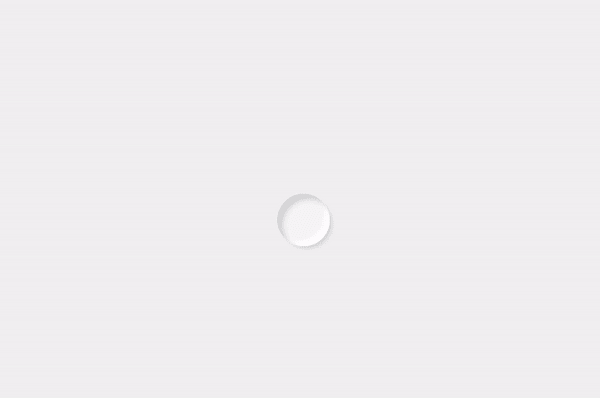

# 新造主义动画

> 原文:[https://www.geeksforgeeks.org/neumorphismui-animation/](https://www.geeksforgeeks.org/neumorphismui-animation/)

NeumorphismUI 是一种用于设计网页元素、框架和屏幕的现代软 UI，也是一种相对较新的设计趋势，最近获得了很大的流行。它的美学特征是极简而真实的用户界面，这是对旧的 SkeuomorphismUI 设计趋势的一种重新推进。

**HTML 代码:**

## 超文本标记语言

```htmlhtml
<!DOCTYPE html>
<html>

<head>
    <meta charset="utf-8">
    <meta name="viewport" content="width=device-width">
    <link rel="stylesheet" href="index.css">
</head>

<body>
    <div class="container">
        <div class="anime"></div>
    </div>
</body>

</html>
```

**index.css:** 以下是上述 HTML 代码中使用的文件“index.css”的代码。

```htmlhtml
<style>
    .container {
        background: #f2f2f2;
        box-sizing: border-box;
        display: grid;
        place-items: center;
        width: 100vw;
        height: 100vh;
    }

    .anime {
        border-radius: 999px;
        width: 50px;
        height: 50px;
        background: #f2f2f2;
        box-shadow: 0 0 0 #ddd,
            0 0 0 #fff,
            10px 10px 10px #ddd inset,
            -10px -10px 10px #fff inset;

        /* Adding Animations */
        animation: gfg 5s cubic-bezier(0.16, 
            1, 0.3, 1) 1s infinite alternate;
    }

    @keyframes gfg {
        0% {
            width: 60px;
            height: 60px;
            background: #f2f2f2;
            box-shadow: 0 0 0 #ddd,
                0 0 0 #fff,
                10px 10px 10px #ddd inset,
                -10px -10px 10px #fff inset;
        }

        25% {
            width: 60px;
            height: 60px;
            background: #fcfcfc;
            box-shadow: 10px 10px 10px #ddd,
                10px 10px 10px #fff,
                0 0 0 #cccccc inset,
                0 0 0 #fff inset;
        }

        50% {
            width: 60px;
            height: 160px;
            background: #fcfcfc;
            box-shadow: 10px 10px 10px #ddd,
                10px 10px 10px #fff,
                0 0 0 #ddd inset,
                0 0 0 #fff inset;
        }

        100% {
            width: 556px;
            height: 77px;
            /* background: #fefefe; */
            background: url(
https://media.geeksforgeeks.org/wp-content/cdn-uploads/20200817185016/gfg_complete_logo_2x-min.png);
            box-shadow: 40px 40px 40px #ddd,
                0 0 0 #fff,
                0 0 0 #ddd inset,
                2px 2px 2px #fff inset;
        }
    }
</style>
```

**输出:**



**支持的浏览器:**

*   谷歌 Chrome
*   边缘
*   Mozilla Firefox
*   歌剧
*   旅行队