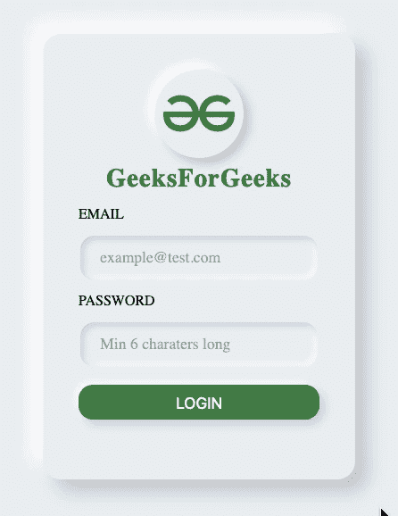

# 新型畸形形式

> 原文:[https://www.geeksforgeeks.org/neumorphismui-form/](https://www.geeksforgeeks.org/neumorphismui-form/)

NeumorphismUI 是一种用于设计网页元素、框架和屏幕的现代软 UI，也是一种相对较新的设计趋势，最近获得了很大的流行。它的美学特征是极简而真实的用户界面，这是对旧的 SkeuomorphismUI 设计趋势的一种重新推进。

**我们要造什么？**



**HTML 代码:**

## 超文本标记语言

```htmlhtml
<!DOCTYPE html>
<html>

<head>
    <meta charset="utf-8">
    <meta name="viewport" content="width=device-width">
    <link rel="stylesheet" href="index.css">
</head>

<body>
    <div class="container">
        <div class="logo">
            
        </div>

        <div class="title">GeeksForGeeks</div>
        <form class="form">
            <label>EMAIL</label>

            <input type="email"
                placeholder="example@test.com" />

            <label>PASSWORD</label>

            <input type="password"
                placeholder="Min 6 characters long" />

            <button class="btn" type="submit">
                LOGIN
            </button>
        </form>
    </div>
</body>

</html>
```

下面是在上面的 HTML 代码中使用的样式化表单的 CSS 文件。

**文件名:index.css**

## 半铸钢ˌ钢性铸铁(Cast Semi-Steel)

```htmlhtml
body {
    background: #ecf0f3;
    text-align: center;
}

.container {
    position: relative;
    width: 350px;
    height: 500px;
    border-radius: 20px;
    padding: 40px;
    box-sizing: border-box;
    box-shadow: 14px 14px 20px #cbced1,
               -14px -14px 20px #fff;
}

.logo {
    height: 100px;
    width: 100px;
    margin: auto;
    border-radius: 50%;
    box-sizing: border-box;
    box-shadow: 7px 7px 10px #cbced1,
               -7px -7px 10px white;
    padding: 10px
}

.logo img {
    height: 100%;
    width: 100%;
}

.title {
    margin-top: 10px;
    font-weight: 900;
    font-size: 1.8rem;
    color: #2f8d46;
    letter-spacing: 1px;
}

.form label {
    float: left;
    margin: 14px 0;
}

.form input {
    width: 90%;
    height: 3rem;
    border: none;
    border-radius: 1rem;
    font-size: 1.1rem;
    padding-left: 1.4rem;
    box-shadow: inset .2rem .2rem .5rem #c8d0e7,
                inset -.2rem -.2rem .5rem #fff;
    background: none;
    font-family: inherit;
}

.form input::placeholder {
    color: rgba(0, 0, 0, 0.6);
}

.form input:focus {
    outline: none;
    box-shadow: .3rem .3rem .6rem #c8d0e7,
               -.2rem -.2rem .5rem #fff;
}

.btn {
    width: 100%;
    height: 2.4rem;
    border-radius: 1rem;
    cursor: pointer;
    font-size: 1.1rem;
    margin: 20px 0;
    border: none;
    box-shadow: .3rem .3rem .6rem #c8d0e7,
               -.2rem -.2rem .5rem #fff;
    background-color: #2f8d46;
    color: #fff;
}
```

**支持的浏览器:**

*   谷歌 Chrome
*   边缘
*   Mozilla Firefox
*   歌剧
*   旅行队