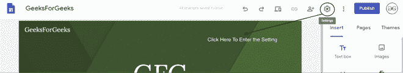
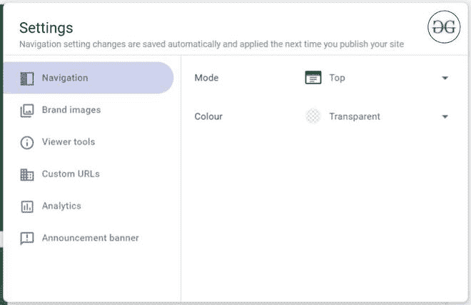
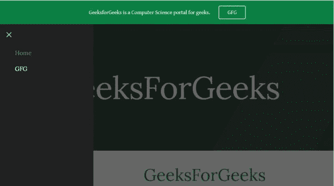

# 新增谷歌网站导航栏

> 原文:[https://www . geesforgeks . org/new-Google-site-navigation-bar/](https://www.geeksforgeeks.org/new-google-site-navigation-bar/)

新的谷歌网站为我们的网站提供了一个设置导航栏的工具。该导航栏可以根据用户进行定制，尽管定制仅限于位置和背景颜色。

首先去**站点设置**。

现在转到设置的**导航部分**。

**导航的属性:**导航没有加载很多属性，原因是它们必须保持布局的响应性。

1.  **模式:**导航栏有两种显示方式，即顶部和侧面。
2.  **颜色:**有透明、白色、黑色三种颜色可选。

目前，没有太多的颜色可供选择，但也许他们会在未来增加更多。

新谷歌网站的侧面导航

新谷歌网站的顶级导航