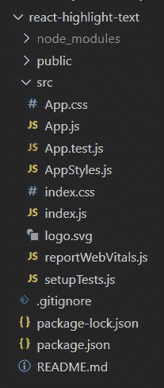
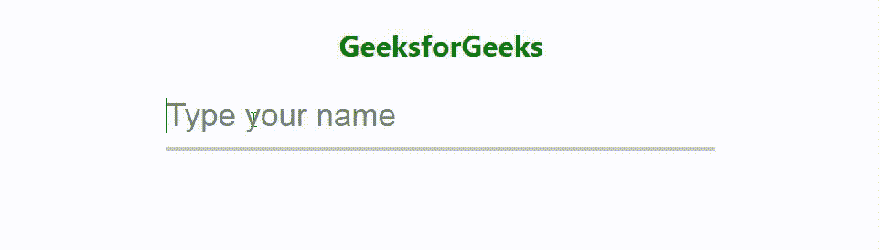

# 如何用 React.js 基于用户输入突出显示文本？

> 原文:[https://www . geesforgeks . org/NPM-install-save-style-components/](https://www.geeksforgeeks.org/npm-install-save-styled-components/)

下面的方法介绍了如何突出显示用户在 ReactJS 中给出的文本输入。这是一个简单的效果，你可以添加到任何 ReactJS 网站。

**先决条件:**

*   npm 和创建-反应-应用命令的基本知识。
*   样式组件的基本知识。
*   [**<u>知识使用状态()反应挂钩</u>**](https://www.geeksforgeeks.org/what-is-usestate-in-react/) 。
*   [**<u>onChange()</u>** 事件的知识。](https://www.geeksforgeeks.org/how-to-use-handlechange-function-in-react-component/)

**基本设置:**您将使用 [**<u>创建-反应-app</u>**](https://www.geeksforgeeks.org/reactjs-setting-development-environment/) 开始一个新项目，因此打开您的终端并键入:

```html
npx create-react-app react-highlight-text
```

现在，通过在终端中键入给定的命令，进入您的**反应-高亮-文本**文件夹:

```html
cd react-highlight-text
```

**所需模块:**通过在终端中键入给定的命令，安装本项目所需的依赖项:

```html
npm install --save styled-components
```

现在转到 **src** 文件夹，创建一个文件 **AppStyles.js** 。

**项目结构:**项目中的文件结构如下图所示:



**示例:**我们创建一个状态，第一个元素输入为初始状态，空字符串的值，第二个元素为函数 **setInput()** 用于更新状态。然后一个名为**的函数被创建，它将状态的值设置为我们在输入字段中输入的值。**

我们将输入字段设置为受控组件，以便它相应地更新状态。当我们在**输入字段**中输入一个值时，toggleInput 功能通过 [**<u>onChange 事件</u>**](https://www.geeksforgeeks.org/how-to-use-handlechange-function-in-react-component/) 触发，该事件将状态设置为该输入值。我们还在带有上边框的**inputthighlight**元素中使用输入字段正下方的状态值(它覆盖了输入字段的下边框)。这样，我们使用反应状态来更新输入字段和输入更轻的的值。因此，当我们在输入字段中输入一个值时，该值也会在 InputHighlighter 中更新。这就是为什么当我们输入文本时，后者的边界不断增加，但是我们没有看到它，因为我们已经为 InputHighlighter 将 CSS 溢出属性设置为 none。

这使得网页用户认为输入字段实际上是在突出显示他们正在输入的文本。但实际上，事情并非如此。他们只是将另一个元素的上边框视为输入荧光笔。

## App.js

```html
import React,{useState} from 'react';
import {
  InputContainer, 
  Input, 
  InputHighlighter, 
  Heading
} from './AppStyles';

const App = () => {
  const [input, setInput] = useState('');

  const toggleInput = (e) => {
    setInput(e.target.value);
  }
    return (
      <InputContainer>
      <Heading>GeeksforGeeks</Heading>
      <Input
        onChange={toggleInput}
        placeholder='Type your name'
        value={input}
        />
      <InputHighlighter>
        {input}
      </InputHighlighter>
    </InputContainer>
    );
}

export default App;
```

## AppStyles.js

```html
import styled from 'styled-components';

export const InputContainer = styled.div`
   width: 600px;
   margin: 40px auto;
   position: relative;
`
export const Heading = styled.h1`
   text-align: center;
   color: green;
`;

export const Input = styled.input`
   height: 70px;
   width: 100%;
   padding: 0;
   font-size: 35px;
   border: none;
   outline: none;
   border-bottom: 4px solid rgba(192, 192, 192);
`

export const InputHighlighter = styled.span`
   font-size: 35px;
   border-top: 4px solid green;
   position: absolute;
   left: 0;
   bottom: 0;
   height: 0;
   overflow: hidden;
`;
```

**运行应用程序的步骤:**从项目的根目录使用以下命令运行应用程序。

```html
npm start
```

**输出:**现在打开浏览器，转到 **http://localhost:3000/** ，会看到如下输出。看看当我们输入一个文本时，边界是如何增加的，当我们一个接一个地删除字符时，边界是如何开始减少的。

