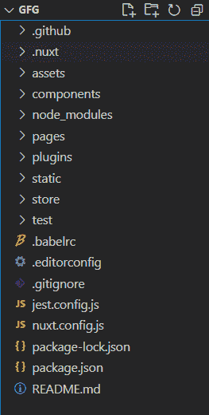
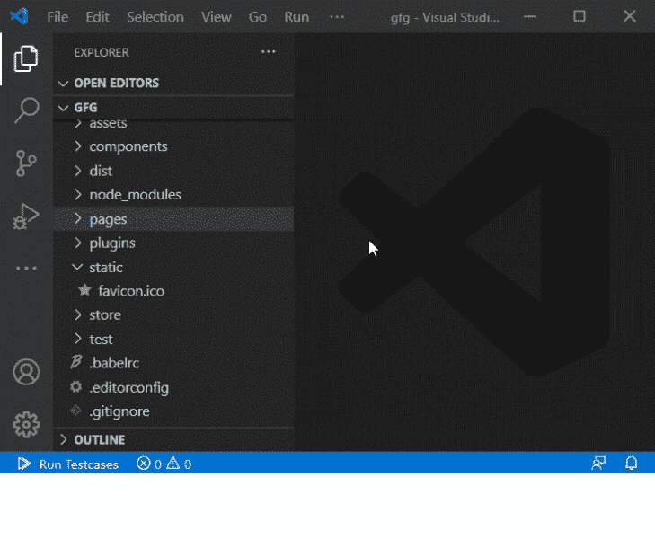
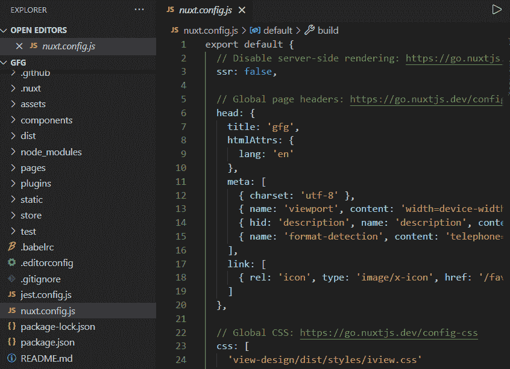
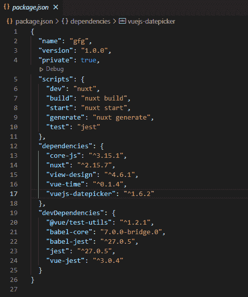
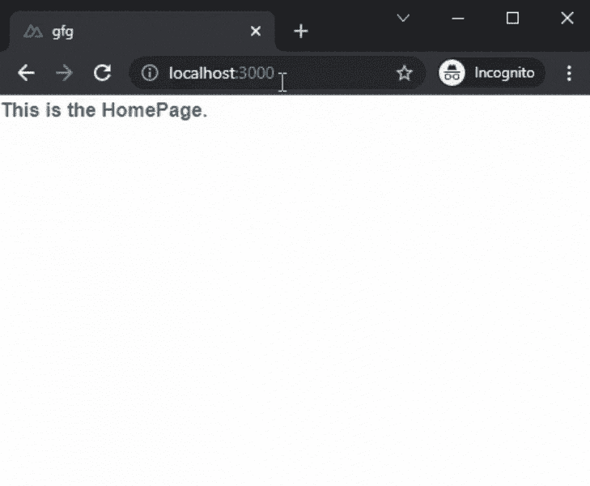

# NuxtJS 目录结构

> 原文:[https://www.geeksforgeeks.org/nuxtjs-directory-structure/](https://www.geeksforgeeks.org/nuxtjs-directory-structure/)

在本文中，我们将学习 NuxtJs 的目录结构。Nuxt.js 是一个基于 Vue.js、Node.js、Webpack 和 Babel.js 的免费开源 web 应用框架，Nuxt 的灵感来源于 Next.js，这是一个类似用途的框架，基于 React.js。

**[创建 NuxtJS 应用程序](https://www.geeksforgeeks.org/how-to-install-and-creating-first-nuxt-js-app/) :**

**步骤 1:** 您可以使用以下命令创建一个新的 NuxtJs 项目:

```html
npx create-nuxt-app gfg
```

**步骤 2:** 现在使用以下命令导航到您的应用程序:

```html
cd gfg
```

**项目结构:**会是这样的。



NuxtJs 中有 **7** 主子目录:

*   **组件:**在这个目录中，我们可以存储我们要在主应用中使用的所有组件。与 NextJs 或 ReactJs 不同，我们不需要在 NuxtJs 中手动导入页面中的组件。NuxtJs 将自动扫描您的组件并将其导入您的页面。

*   **页面:**在这个目录中，我们可以为我们的 NuxtJs 应用创建页面。你只需要创造一个新的。vue 文件在页面目录内创建一个新页面。之后，NuxtJs 将自动扫描页面，并为应用程序创建路由器。您也可以通过在 pages 目录中创建新文件夹来创建嵌套页面。

*   **资产:**在这个目录中，我们可以存储我们将在我们的应用程序中使用的不同类型的资产，如图像、字体、音频文件、徽标和样式。

    **注意:**如果这个目录在你的应用程序中不存在，那么你可以通过简单地添加一个名为“assets”的文件夹来创建它。

*   **插件:**在这个目录中，我们可以添加将要在我们的 NuxtJs 应用中使用的插件。安装插件后，我们必须在插件目录中为该插件创建一个新文件。

*   **Static:** 在这个目录中，我们将存储那些不会像 robot.txt、sitemaps 或 favicons 那样改变的静态文件。

    

*   **nuxt.config.js:** 这是你的 NuxtJs 应用的配置文件。您可以通过创建插件部分来添加新模块。您也可以使用这个 nuxt.config.js 文件覆盖您的 NuxtJs 文件的默认设置。

    

*   **packages.json:** 这个文件包含了你的 NuxtJs 应用的所有依赖项。您还可以在这个文件中看到运行或构建应用程序的命令，以及您的 NuxtJs 应用程序的名称和版本。

    

**示例:**在本例中，让我们创建一个新页面。为此，我们必须在 pages 目录中创建一个名为 **gfg.vue** 的新文件。在文件中添加以下内容:

## gfg .视图

```html
<template>
  <div>
    <h3>This is a simple NuxtJs Page.</h3> 
  </div>
</template>
```

**运行应用:**在终端使用下面的命令运行应用。

```html
npm run dev
```

**输出:** 

**参考:**T2】https://nuxtjs.org/docs/get-started/directory-structure/