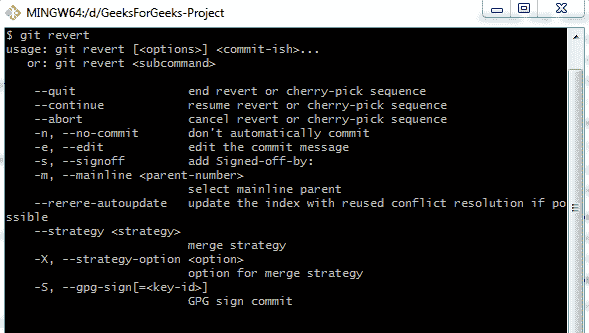

# 翻转 Git 的变化

> 原文:[https://www.geeksforgeeks.org/overturning-changes-in-git/](https://www.geeksforgeeks.org/overturning-changes-in-git/)

Git 提供了一个选项来跟踪我们的项目进度，从重新访问旧的提交到修正我们的错误和撤销变更。它为用户提供了查看其作品的选项。以下命令执行类似的功能。

**git revert:** 顾名思义，这个命令用于返回一些现有的提交。该命令引入了一个新的提交，以逆转之前一些错误提交的影响。此选项不会将分支引用指针移动到错误的提交，而是反转该提交的更改，并创建新的恢复提交。以这种方式，项目历史被保持。但是要执行这个命令，您的工作树应该是干净的。

git 转售选项:

*   **-e 或–编辑:**此选项允许您在提交恢复之前编辑提交消息。这是默认选项。
*   **–无编辑:**使用该选项不会启动提交文本编辑器。
*   **-n 或–no-commit:**使用此选项可以向分段索引和工作树添加反向更改，而不是进行新的提交。

**git 复位:**将当前磁头复位到指定状态。这个 git 命令并不常用来限制它的使用。它有三个基本选项，即**–软**、**–硬**和**–混合**。

**git rm:** 此命令用于从索引或工作树和 git 索引中删除跟踪的文件。它不能仅从工作目录中删除文件。删除的文件必须与当前标题中的文件相同。

**git rm 选项:**

*   **(文件)……:**指定要删除的文件。可以有单个文件或由空格分隔的文件列表。
*   **-f 或–force:**它会覆盖最新检查，以确保 head 中的文件与工作目录和暂存索引中的文件相匹配。
*   **-n 或–试运行:**它不删除文件，而是通过执行 rm 命令来告知哪些文件将被删除。
*   **-r:** 当给定前导目录名时，该命令允许递归删除。
*   **–-:**该选项可用于从文件列表中分离命令行选项。当文件名可能被误认为命令行选项时，这很有用。
*   **-q–安静:**该选项抑制输出。它通常为每个删除的文件输出一行。
*   **–缓存:**此选项仅在我们必须从分段索引中删除文件时使用。工作树文件将被单独留下。

**总结:**我们已经了解到 **git revert** 是一个更安全的撤销更改的选项，而不是删除提交历史。它创建了一个新的提交，将更改反转并**重置**，另一方面，这是一个撤销更改的困难选项。 **git rm** 用于从存储库中移除文件，因此这些是一些最常用的撤销更改的命令。