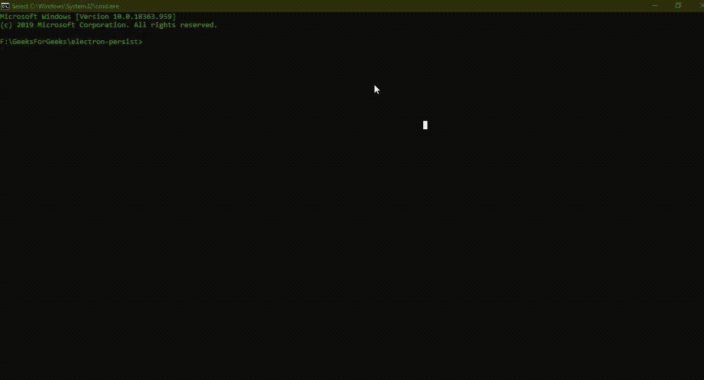

# 在电子表格中保存数据

> 原文:[https://www . geesforgeks . org/persisting-data-in-electronijs/](https://www.geeksforgeeks.org/persisting-data-in-electronjs/)

[**electronijs**](https://www.geeksforgeeks.org/introduction-to-electronjs/)是一个开源框架，用于使用能够在 Windows、macOS 和 Linux 操作系统上运行的 HTML、CSS 和 JavaScript 等网络技术构建跨平台的本机桌面应用程序。它将铬引擎和[T5 节点 T7】结合成一个单一的运行时。](https://www.geeksforgeeks.org/introduction-to-nodejs/)

所有复杂的网络应用程序都使用**本地存储**。本地存储(又名 **DOM Storage** )是一种网络存储类型，允许网站在客户端浏览器中存储、保存和访问这些数据，而没有任何过期日期。即使在浏览器窗口关闭或重新加载后，本地存储中保存的数据仍然可以访问。应用程序数据本地存储在客户端浏览器中。 **HTML5** 和**香草 JavaScript** 通过 API 为**本地存储**提供广泛支持。在实现本地存储之前，数据通常存储在 cookiess 中，cookie 包含在对服务器的每个 HTTP REST API 调用中。Web 本地存储比 cookies 更安全，我们可以在不影响网站性能的情况下存储大量数据(高达 **5 MB** )。这些数据永远不会传输到服务器，并将保留在客户端浏览器中，直到本地存储没有被手动清除。本地存储是基于**域**和网站的**协议**实现的。来自同一来源的所有网页都可以访问本地存储中的相同数据。从不同协议(如 **HTTP** 或 **HTTPS** 访问的同一网页为它们创建了不同的本地存储实例。当网页处于**私密**或**隐名**模式时，所有**隐名**标签关闭后，本地存储的任何数据将被清除一次。不要将本地存储与**会话存储**混淆，在会话存储中，数据一直保存到页面会话结束。一旦会话终止，数据将被擦除。所有现代浏览器都支持本地存储，包括 Chromium。

尽管 Chromium 支持本地存储，但 Electron 并没有为我们提供在本地存储中存储和保存用户设置和其他数据的内置方式。然而，在外部[**【NPM】**](https://www.geeksforgeeks.org/node-js-npm-node-package-manager/)包的帮助下，我们可以简单有效地在一个电子应用程序中持久化和访问数据。在本教程中，我们将使用**电子设置** npm 包在电子中实现本地存储。更多详细信息，请参考链接:**https://www.npmjs.com/package/electron-settings**。该软件包已被采用，并由电子公司自己用于演示目的。我们假设您熟悉上述链接中介绍的先决条件。电子要工作，需要在系统中预装 [**节点**](https://www.geeksforgeeks.org/introduction-to-nodejs/)[**NPM**](https://www.geeksforgeeks.org/node-js-npm-node-package-manager/)。

*   **项目结构:**


**示例:**按照 [**中给出的步骤，设置基本的电子应用程序。复制文章中提供的 **main.js** 文件和**index.html**文件的样板代码。我们将继续使用相同的代码库构建我们的应用程序。另外，使用**](https://www.geeksforgeeks.org/dynamic-styling-in-electronjs/) **[npm](https://www.geeksforgeeks.org/node-js-npm-node-package-manager/) 安装**电子设置**组件。根据官方文档，这个包是一个简单而强大的电子应用程序设置管理库。这个包允许我们在重新加载和应用程序启动之间在应用程序中保存用户数据和设置，就像本地存储一样。使用这个包保存的所有数据都存储在一个名为 **settings.json** 的 **JSON** 文件中，该文件位于用户的本地系统应用程序目录中。为了更好的理解，请参考代码。**

```html
npm install electron-settings --save

```

此外，对**包进行必要的更改，以启动电子应用程序。我们将继续使用相同的代码库构建我们的应用程序。设置电子应用程序所需的基本步骤保持不变。
T3**

```html
{
  "name": "electron-persist",
  "version": "1.0.0",
  "description": "Persist Data in Electron ",
  "main": "main.js",
  "scripts": {
    "start": "electron ."
  },
  "keywords": [
    "electron"
  ],
  "author": "Radhesh Khanna",
  "license": "ISC",
  "dependencies": {
    "electron": "^8.3.0",
    "electron-settings": "^4.0.2"
  }
}

```

**输出:**

[](https://media.geeksforgeeks.org/wp-content/uploads/20200512225834/Output-1105.png)

**电子持久化数据:****电子设置** **npm** 包可以直接在应用程序的**主进程**和**渲染器进程**中用于访问存储。与[**window . local storage**](https://developer.mozilla.org/en-US/docs/Web/API/Window/localStorage)Web API 相比，该包的设计和工作方式类似。该软件包是兼容的，从*electronic v 8 . 3 . 0*开始没有任何错误，并定期更新。我们现在将在电子应用程序中实现这个包。有关此软件包、版本更新和变更日志的更多详细信息，请参考链接:**https://electron-settings.js.org/**。

*   **index.html:** 在该文件中添加以下代码片段。

## 超文本标记语言

```html
<h3>Persist Data and User Settings in Electron</h3>
  <h5>Enter Sample Text here</h5>
  <input type="text" id="sample">
  <button id="submit">
       Submitting the Data
   </button>
```

*   **index.js:** 提交数据按钮还没有任何相关功能。要更改这一点，请在 **index.js** 文件中添加以下代码片段。

## java 描述语言

```html
const electron = require('electron')
const settings = require('electron-settings');

console.log('File used for Persisting Data - ' + 
        settings.file());

var sample = document.getElementById('sample');
var submit = document.getElementById('submit');

settings.get('key.data').then(value => {
    console.log('Persisted Value - ' + value);
})

settings.has('key1.data').then(bool => {
    console.log('Checking if key1.data Exists - ' + bool)
});

submit.addEventListener('click', () => {
    console.log('Sample Text Entered - ' + sample.value);
    console.log('Persisting Data in electron-settings');

    settings.set('key', {
        data: sample.value
    });
});
```

**说明:**在上面的应用程序中，我们使用 **HTML DOM Input** 元素从用户输入一个示例文本数据。然后，我们使用**电子设置**包的实例方法在电子应用程序中保存和访问这些数据。**电子设置** npm 包支持以下实例方法，这些方法也在上述代码中使用过。

*   **settings.set(key，value)** 这个 Instance 方法用于在应用程序中保存数据。数据由**键**参数唯一存储和识别。此方法没有返回类型。默认情况下，该实例方法为**异步**。相反，我们可以使用 **settings.setSync(键，值)**方法进行**同步**数据操作。它接受以下参数。
    *   **键:字符串**该参数用于唯一识别正在存储的实际数据。使用此**键**参数，我们可以稍后使用**设置. get()** 实例方法访问此数据。
    *   **值:对象**该参数表示需要在电子应用程序中保存的实际数据。该参数可以保存任何有效的 **JSON** 对象，包括一个 **JSON 数组**。然后我们可以使用点注释**。**结合**键**参数，从 **JSON** 对象中过滤提取所需的准确数据。为了更好的理解，请参考代码。从 JSON 数组中访问数据
*   **设置. has(键)**该实例方法用于检查由**键**参数表示的数据在应用程序中是否存在。然后实例方法返回一个**承诺**，并返回一个**布尔**值，说明数据是否存在。如果密钥存在于存储器中，则返回**真**。默认情况下，该实例方法为**异步**。相反，我们可以使用**设置. hasSync(键)**方法进行**同步**数据操作。在上面的例子中，我们提供了一个无效的**键**参数，该参数应该返回 **false** 。
*   **settings.get(key)** 该实例方法用于返回由**键**参数唯一标识的应用程序中保存的数据。这与在**设置. set()** 实例方法中设置的**键**参数相同。该方法返回一个**承诺**，并解析为一个包含实际数据的**对象**。返回的**对象**可以是有效的 **JSON 对象**，也可以是简单的原始数据类型，如**整数**或**字符串**。在这种情况下，我们传递一个未定义的**键**参数，返回的对象将是**未定义的**。我们也可以使用**settings . has()**Instance 方法检查**键**参数是否存在。默认情况下，该实例方法为**异步**。相反，我们可以使用**设置. getSync(键)**方法进行**同步**数据操作。该包使用发动机罩下的 **Lodash get()** 方法来执行该操作。 **Lodash** 是一个用于常见编程任务的 JavaScript 实用程序库。
*   **settings.file()** 该实例方法返回 **settings.json** 的完整路径，该路径已创建并用于将数据保存在应用程序中。如上所述，默认情况下，该文件存储在本机系统的应用程序用户数据目录中。不建议更改**设置文件**的位置。这个实例方法返回一个**字符串**值，代表**设置. json** 文件的完整路径。
*   **设置.重置()**该实例方法用于将**电子设置**包的所有配置重置为默认值。此实例方法没有返回类型。该方法不会重置存储在 **settings.json** 文件中的数据，而只会重置该软件包的配置。
*   **设置.取消设置(键)**此实例方法用于使用**设置.设置()**实例方法清除应用程序中存储的数据。该方法将根据提供的唯一识别数据的**键**参数重置数据。该实例方法返回一个承诺，当**键**参数识别的数据/所有数据成功复位时，该承诺被解决。默认情况下，该实例方法为**异步**。相反，我们可以使用**设置.取消同步(键)**方法进行**同步**数据操作。

**注意:****键**参数是**可选的**参数。如果**键**参数没有通过，它将使用**电子设置**包重置应用程序中保存的所有数据。

**输出:**此时，在启动 Electron 应用程序时，我们应该能够将用户输入的数据保存在应用程序中，并在应用程序重新加载或重新启动时成功检索到这些数据。

[](https://media.geeksforgeeks.org/wp-content/uploads/20200802002041/Output-1-GIF21.gif)