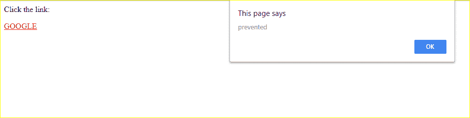
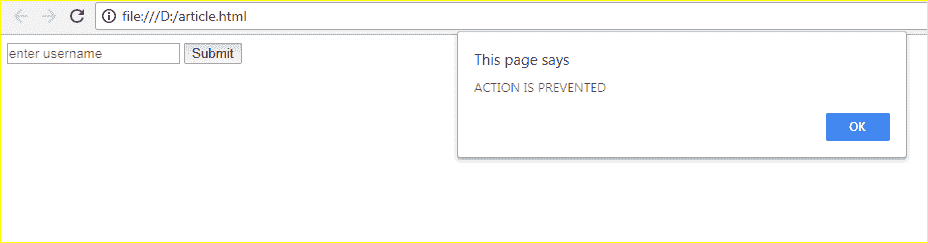

# Default()事件方法

> Original: [https://www.geeksforgeeks.org/preventdefault-event-method/](https://www.geeksforgeeks.org/preventdefault-event-method/)

方法的作用是：阻止浏览器执行所选元素的默认操作。 它可以阻止用户通过单击该链接来处理请求。
**语法：**

```html
event.preventDefault()
```

**参数：**不接受任何参数。
事件**用来表示用户响应的事件或动作，该方法对该事件或动作起作用。** 

<center>****jQuery code to show the working of the preventDefault() function:****</center>

 ****Code #1:**
This code will prevents the browser from going to another page.

```html
<html>
      <head>
            <title>GEEKSFORGEEKS ARTICLE<title/>
                <!-- INCLUDE THE JQUERY CDN -->
                <script src="https://ajax.googleapis.com/ajax/
                libs/jquery/3.3.1/jquery.min.js"></script>
            <script type="text/javascript">
               $(document).ready(function()
                {    
              $("a").click(function(event)
               {            
                event.preventDefault();
                alert("prevented");
               });
                });
             </script>
    </head>
    <body>
        <p>Click the link:</p>
           <a href="https://www.google.com">GOOGLE</a>
    </body>
</html>
```

**输出：**
它显示如下所示的输出-

**代码#2：**
此代码将阻止浏览器将页面重定向到另一个 PHP 文件。

```html
<html>
         <head>
             <title>GEEKSFORGEEKS ARTICLE<title/>
        <script src="https://ajax.googleapis.com/ajax/
             libs/jquery/3.3.1/jquery.min.js"></script>
           <script type="text/javascript">
              $(document).ready(function()
               {    
              $("#submit").click(function(event)
               {            
                event.preventDefault();
                alert("ACTION IS PREVENTED");
                });
                });
            </script>
    </head>
    <body>
       <form action="submit.php">
            <input type="text" placeholder="enter username">
            <input id="submit" type="submit" name="submit">
       </form>
    </body>
</html>
```

**输出：**
它显示如下所示的输出-
**