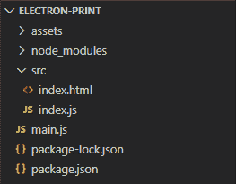
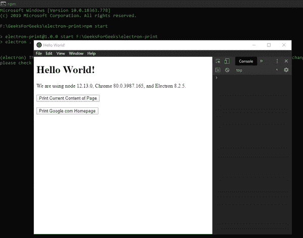
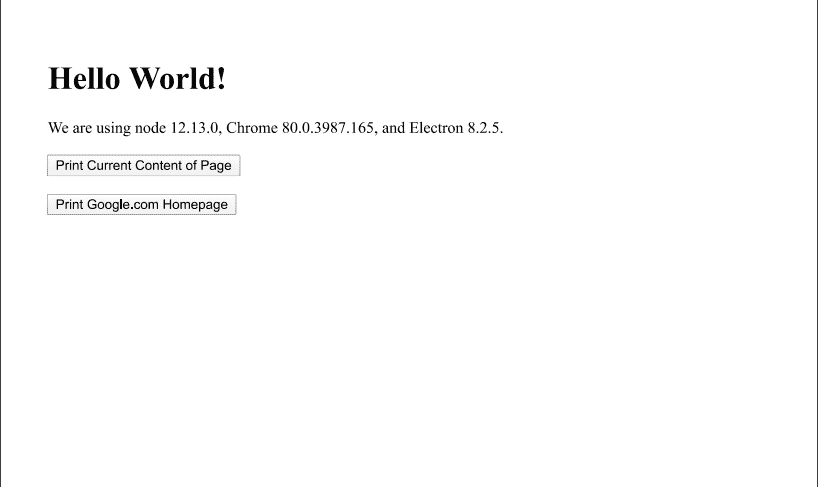
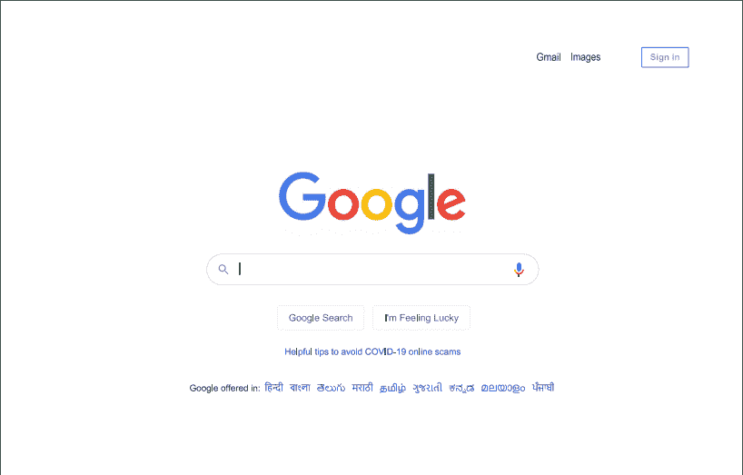

# 在 ElectronJS

中打印

> Original: [https://www.geeksforgeeks.org/printing-in-electronjs/](https://www.geeksforgeeks.org/printing-in-electronjs/)

**[ElectronJS](https://www.geeksforgeeks.org/introduction-to-electronjs/)**是一个开源框架，用于使用能够在 Windows、MacOS 和 Linux 操作系统上运行的 Web 技术(如 HTML、CSS 和 JavaScript)构建跨平台的本机桌面应用程序。 它将 Chromium 引擎和**[NodeJS](https://www.geeksforgeeks.org/introduction-to-nodejs/)**合并到一个运行时中。

在某些桌面应用程序中，开发人员希望提供用户可以从应用程序内下载或打印内容的功能。 例如，在银行应用程序中，用户希望打印屏幕上显示的他/她的账户对账单。 除了将内容另存为 PDF 文件外，电子还提供了一种使用**BrowserWindow**对象和**webContents**属性直接打印内容的方法。 **webContents**属性为我们提供了某些实例事件和方法，通过这些事件和方法，我们可以打印正在显示的**BrowserWindow**实例的内容、打印远程 URL 的内容或从本地系统打印文件。 本教程将演示如何在 Electron 中打印内容。

我们假设您熟悉上述链接中包含的前提条件。 要使 Electron 正常工作，需要在系统中预先安装**[节点](https://www.geeksforgeeks.org/introduction-to-nodejs/)**和**[NPM](https://www.geeksforgeeks.org/node-js-npm-node-package-manager/)**。

*   **项目结构：**
    

**示例：**我们将按照给定的步骤构建基本的电子应用程序。

*   **Step 1:** Navigate to an Empty Directory to setup the project, and run the following command,

    ```html
    npm init
    ```

    生成**Package.json**文件。 如果未安装，请使用 NPM 安装**[Electron](https://www.geeksforgeeks.org/introduction-to-electronjs/)**。

    ```html
    npm install electron --save
    ```

    该命令还将创建**package-lock.json**文件，并安装所需的**node_module**依赖项。 根据项目结构创建**Assets**文件夹。
    **Package.json：**

    ```html
    {
      "name": "electron-print",
      "version": "1.0.0",
      "description": "Print Files in Electron ",
      "main": "main.js",
      "scripts": {
        "start": "electron ."
      },
      "keywords": [
        "electron"
      ],
      "author": "Radhesh Khanna",
      "license": "ISC",
      "dependencies": {
        "electron": "^8.2.5"
      }
    }

    ```

*   **Step 2:** Create a **main.js** file according to the project structure. This file is the **Main Process** and acts as an entry point into the application. Copy the Boilerplate code for the **main.js** file as given in the following [link](https://www.electronjs.org/docs/tutorial/first-app#electron-development-in-a-nutshell). We have modified the code to suit our project needs.

    {T0}Main.js:{T1}*

    ```html
    const { app, BrowserWindow } = require('electron')

    function createWindow () {
      // Create the browser window.
      const win = new BrowserWindow({
        width: 800,
        height: 600,
        webPreferences: {
          nodeIntegration: true
        }
      })

      // Load the index.html of the app.
      win.loadFile('src/index.html')

      // Open the DevTools.
      win.webContents.openDevTools()
    }

    // This method will be called when Electron has finished
    // initialization and is ready to create browser windows.
    // Some APIs can only be used after this event occurs.
    // This method is equivalent to 'app.on('ready', function())'
    app.whenReady().then(createWindow)

    // Quit when all windows are closed.
    app.on('window-all-closed', () => {
      // On macOS it is common for applications and their menu bar
      // to stay active until the user quits explicitly with Cmd + Q
      if (process.platform !== 'darwin') {
        app.quit()
      }
    })

    app.on('activate', () => {
        // On macOS it's common to re-create a window in the 
        // app when the dock icon is clicked and there are no 
        // other windows open.
      if (BrowserWindow.getAllWindows().length === 0) {
        createWindow()
      }
    })

    // In this file, you can include the rest of your 
    // app's specific main process code. You can also 
    // put them in separate files and require them here.
    ```

*   **Step 3:** Create the **index.html** file and **index.js** file within the **src** directory. We will also copy the boilerplate code for the **index.html** file from the above-mentioned link. We have modified the code to suit our project needs.

    **index.html：**

    ```html
    <!DOCTYPE html>
    <html>
      <head>
        <meta charset="UTF-8">
        <title>Hello World!</title>
        <!-- https://electronjs.org/docs/tutorial
                               /security#csp-meta-tag -->
        <meta http-equiv="Content-Security-Policy" 
              content="script-src 'self' 'unsafe-inline';" />
      </head>
      <body>
        <h1>Hello World!</h1>
        We are using node 
        <script>
            document.write(process.versions.node)
        </script>, Chrome 
        <script>
            document.write(process.versions.chrome)
        </script>, and Electron 
        <script>
            document.write(process.versions.electron)
        </script>.

        <!-- Adding Individual Renderer Process JS File -->
        <script src="index.js"></script>
      </body>
    </html>
    ```

*   **Output:** At this point, our basic Electron Application is set up. To launch the Electron Application, run the Command:

    ```html
    npm start
    ```

    

**电子打印：****BrowserWindow**实例和**webContents**属性是**主进程**的一部分。 要在**呈现器进程**中导入和使用****BrowserWindow****，我们将使用电子**远程**模块。 有关远程模块的更多详细信息，请参阅此[链接](https://www.electronjs.org/docs/api/remote)。

*   **Approach 1:** Print the contents of the current active **BrowserWindow** Instance.

    **webContents.print(Options，Callback)**方法使用 Chromium 的预览打印设置打印**BrowserWindow**内容。 此方法实现了一个**回调**函数。 它接受以下参数。 有关**webContents.print()**方法的更多详细信息，请参阅此[链接](https://www.electronjs.org/docs/api/web-contents#contentsprintoptions-callback)。

    *   **options: Object (Optional)** It takes in the following parameters,
        *   **静默：布尔型(可选)**如果此值设置为**true**，应用程序将不会提示用户输入打印机设置和配置。 它将采用对象中设置的值或默认打印机设置。 默认值为**FALSE**。
        *   **printBackground：布尔值(可选)**它接受网页的背景色和图像(如果有的话)。 默认值为**False**。
        *   **deviceName：string(可选)**设置要使用的打印机设备名称。 必须是打印机驱动程序识别的系统定义名称。
        *   **color：boolean(可选)**设置打印的页面是**颜色**还是**灰度**。 默认值为**TRUE**。
        *   **横向：布尔值(可选)**定义打印页的模式。 该值定义网页是否应以**横向**模式打印。 默认值为**FALSE**，表示**纵向**模式。
        *   **scalefactor：整数(可选)**网页的比例因子。 在必要之前，不应更改此值。
        *   **pagesPerSheet：整数(可选)**每个实际页面应打印的网页数量。 网页将在实际打印页面上显示为幻灯片。
        *   **COLLATE：boolean(可选)**定义是否应该对页面进行排序。 默认值为**False**。 排序是指将网页排列成预定的顺序。 COLLATE 从多个不同部分创建一致的逻辑集。 例如，按页码顺序排列页面。
        *   **份数：整数(可选)**需要打印的文档集的份数。
        *   **duexMode：string(可选)**设置打印网页的双面模式。 值可以是**单工**、**短边**或**长边**。 **Short Edge**定义从纸张的**宽度**翻页，例如在传统记事本中。
        *   **Header：String(可选)**网页打印副本上的自定义页眉。
        *   **footer：string(可选)**网页打印副本上的自定义页脚。
        *   **dpi：Object(可选)**它表示**每英寸点数**。 它是打印页面密度的量度。 它接受以下参数，
            *   **水平：整数(可选)**水平 dpi。
            *   **垂直：整数(可选)**垂直 dpi。
        *   **margins: Object (Optional)** It takes in the following parameters,
            *   **边沿类型：字符串(可选)**值可以是**默认值**、**无**、**printableArea**或**自定义**。 如果选择了**自定义**。 我们还需要定义以下值，
            *   **top：整数(可选)**以**像素**定义的上边距。
            *   **Left：整数(可选)**在**像素**中定义的左边距。
            *   **Bottom：整数(可选)**以**像素**定义的下边距。
            *   **right：整数(可选)**在**像素**中定义的右边距。

            所有这些值都是单个对象的一部分。

        当**静默**属性设置为**TRUE**时，如果未定义**deviceName**属性并使用打印的默认系统设置，Electron 将选择系统的默认打印机。 如果将**静默**属性设置为**False**，则 Electron 将打开一个对话框，显示所有默认系统打印机设置。 可以从该自定义对话框调整和更改对象中定义的所有其他值。
        **注意：**若要强制此方法打印到新页，请使用 CSS 中的**page-Break-Beer：Always；**属性。 根据最新版本的 Electron，某些系统环境中的**SILENT**属性存在一些相关错误。 当**SILENT**属性设置为**TRUE**时，打印不同文件(如 PDF 文件)时会出现一些问题。

    *   **回调：函数(可选)**它由两个值组成，
        *   **成功：布尔值**表示打印调用是否成功。
        *   **ailureReason：String**打印调用失败时的错误描述。

要获得**呈现器进程**中的当前**BrowserWindow**实例，我们可以使用**BrowserWindow**对象提供的一些**静态**方法。

*   **BrowserWindow.getAllWindows()：**此方法返回活动/打开的**BrowserWindows**实例数组。 在此应用程序中，我们只有一个活动的**BrowserWindow**实例，可以直接从 Array 引用它，如代码所示。
*   **BrowserWindow.getFocusedWindow()：**此方法返回应用程序中聚焦的**BrowserWindow**实例。 如果没有找到当前的**BrowserWindow**实例，则返回**NULL**。 在此应用程序中，我们只有一个活动的**BrowserWindow**实例，可以使用该方法直接引用它，如代码所示。

**index.html**：在该文件中添加以下代码片段。

```html
<br><br>
   <button id="current">
    Print Current Content of Page
   </button>
```

**index.js**：在该文件中添加以下代码片段。

```html
const electron = require('electron')
// Importing BrowserWindow from Main
const BrowserWindow = electron.remote.BrowserWindow;

var current = document.getElementById('current'); 
var options = {
    silent: false,
    printBackground: true,
    color: false,
    margin: {
        marginType: 'printableArea'
    },
    landscape: false,
    pagesPerSheet: 1,
    collate: false,
    copies: 1,
    header: 'Header of the Page',
    footer: 'Footer of the Page'
}

current.addEventListener('click', (event) => {
    let win = BrowserWindow.getFocusedWindow();
    // let win = BrowserWindow.getAllWindows()[0];

    win.webContents.print(options, (success, failureReason) => {
        if (!success) console.log(failureReason);

        console.log('Print Initiated');
    });
});
```

**输出：**

**可打印页面：**


*   **Approach 2:** Print the contents of a remote URL or a file from the local System by loading the contents in a BrowserWindow Instance.

    在本例中，我们创建了一个**新的 BrowserWindow**实例，并将**show**属性设置为**false**。 因此，新创建的窗口将永远不会显示。 我们使用**win.loadURL(Path)**方法在**BrowserWindow**中加载外部 URL 的内容。 Url 路径可以是**http：//**协议指定的远程地址，也可以是使用**file：//**协议指定的本地系统文件的路径。 此方法返回**Promise**，并在页面加载完成并发出**webContents**属性的**DID-Finish-Load**事件时解析。 有关更多详细信息，请参阅此[链接](https://www.electronjs.org/docs/api/browser-window#winloadurlurl-options)。

    **DID-Finish-Load**实例事件属于**webContents**属性。 它在导航完成且页面完全加载时发出。 当页面的微调控件停止旋转，并且**onLoad**事件已被调度时，就会发生这种情况。 如果未使用此事件发射器，并且调用了**webContents.print()**方法，则打印的页面将是空白文档，因为内容未在**BrowserWindow**中完成加载。

    **index.html**：在该文件中添加以下代码片段。

    ```html
    <br><br>
      <button id="url">Print Google.com Homepage</button>
    ```

    **index.js**：在该文件中添加以下代码片段。

    ```html
    const electron = require('electron')
    // Importing BrowserWindow from Main
    const BrowserWindow = electron.remote.BrowserWindow;

    var url = document.getElementById('url');
    var options = {
        silent: false,
        printBackground: true,
        color: false,
        margin: {
            marginType: 'printableArea'
        },
        landscape: false,
        pagesPerSheet: 1,
        collate: false,
        copies: 1,
        header: 'Header of the Page',
        footer: 'Footer of the Page'
    }

    url.addEventListener('click', (event) => {
        // Defining a new BrowserWindow Instance
        let win = new BrowserWindow({
            show: false,
            webPreferences: {
                nodeIntegration: true
            }
        });
        win.loadURL('https://www.google.com/');

        win.webContents.on('did-finish-load', () => {
            win.webContents.print(options, (success, failureReason) => {
                if (!success) console.log(failureReason);
                console.log('Print Initiated');
            });
        });
    });
    ```

    **输出：**
    