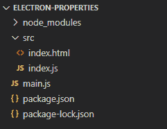
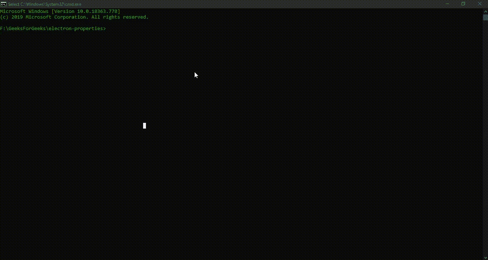

# ElectronJS

中的处理对象

> Original: [https://www.geeksforgeeks.org/process-object-in-electronjs/](https://www.geeksforgeeks.org/process-object-in-electronjs/)

[**ElectronJS**](https://www.geeksforgeeks.org/introduction-to-electronjs/)是一个开源框架，用于使用能够在 Windows、MacOS 和 Linux 操作系统上运行的 Web 技术(如 HTML、CSS 和 JavaScript)构建跨平台的本机桌面应用程序。 它将 Chromium 引擎和[**NodeJS**](https://www.geeksforgeeks.org/introduction-to-nodejs/)合并到一个运行时中。

如上所述，Electron 将 Chromium 引擎和 NodeJS 组合到一个运行时中。 Electronics 扩展了 NodeJS 的功能，并提供了对几个 API 的访问，否则这些 API 在沙箱浏览器环境中是无法访问的。 其中一个关键特性是[**NodeJS 进程对象**](https://nodejs.org/api/process.html)。 NodeJS**Process**对象是一个全局对象，它提供大量信息并定义 NodeJS 应用程序的行为。 因为它是一个全局对象，所以可以在 NodeJS 应用程序的任何模块中访问它。 它为我们提供了一组广泛的可用实例属性、方法和事件。

有关 Process 对象的详细说明，请参阅文章：[**Node.js**](https://www.geeksforgeeks.org/global-process-and-buffer-in-node-js/)中的全局、进程和缓冲区。 电子还支持全局**进程**对象。 它是 NodeJS Process 对象的扩展，并添加了自己的一组 Electron 独有的实例属性、方法和事件。 在本教程中，我们将介绍电子进程对象的一些功能。

我们假设您熟悉上述链接中包含的前提条件。 要使 Electron 正常工作，需要在系统中预先安装[**节点**](https://www.geeksforgeeks.org/introduction-to-nodejs/)和[**NPM**](https://www.geeksforgeeks.org/node-js-npm-node-package-manager/)。

*   **项目结构：**和



**示例：**按照[**拖放 ElectronJS**](https://www.geeksforgeeks.org/drag-and-drop-files-in-electronjs/)中的文件中给出的步骤设置基本电子应用程序。 复制本文中提供的**main.js**文件和**index.html**文件的样板代码。 此外，执行**Package.json**文件所述的必要更改以启动电子应用程序。 我们将继续使用相同的代码库构建我们的应用程序。 设置电子应用程序所需的基本步骤保持不变。

**Package.json：**

```
{
  "name": "electron-properties",
  "version": "1.0.0",
  "description": "Process Object in Electron",
  "main": "main.js",
  "scripts": {
    "start": "electron ."
  },
  "keywords": [
    "electron"
  ],
  "author": "Radhesh Khanna",
  "license": "ISC",
  "dependencies": {
    "electron": "^8.3.0"
  }
}

```

发帖主题：Re：Колибри0.7.0

[](https://media.geeksforgeeks.org/wp-content/uploads/20200512225834/Output-1105.png)

**电子中的进程对象：**A**进程**对象是可在**主进程**以及**呈现器进程**中访问的全局对象。 如上所述，除了 NodeJS Process 对象已经存在的特性之外，Electron 中的 Process 对象还提供了它自己的特性集。 在沙箱环境中，Process 对象只包含 API 的子集。

**注意：**Electron 中的**Process**对象也可以与系统 API 交互，因此可以访问可在桌面应用程序中使用的详细系统属性，如 CPU 信息、内存信息等。

*   **index.html**：在该文件中添加以下代码片段。

## 超文本标记语言

```
<h3>System Properties in Electron</h3>
  <button id="print">
    Print all System Properties in Console
  </button>
```

**index.js**：**Print All System Properties in Console**按钮还没有任何与其关联的功能。 要更改这一点，请在**index.js**文件中添加以下代码。

## JavaScript

```
const electron = require('electron')

// Instance Properties 
process.noDeprecation = false;
process.throwDeprecation = false;
process.traceDeprecation = true;
process.traceProcessWarnings = true;

// Instance Event 
process.once('loaded', () => {
    console.log('Pre-Initialization Complete');
  });

function properties(label, value) {
    this.label = label;
    this.value = value;
}

var props = {};

var print = document.getElementById('print');
// Instance Properties, continued ...
print.addEventListener('click', (event) => {
    props.defaultApp = new properties('Default App', process.defaultApp);
    props.mainFrame = new properties('Main Frame', process.isMainFrame);
    props.resourcePath = new properties('Resource Path', process.resourcesPath);
    props.sandbox = new properties('Sandbox Environment', process.sandboxed);
    props.processType = new properties('Type of Process', process.type);
    props.chrome = new properties('Chrome Version', process.versions.chrome);
    props.electron = new properties('Electron Version', process.versions.electron);
    props.windowsStore = new properties('Window Store', process.windowsStore);
    props.CreationTime = new properties('Window Store', process.getCreationTime());

    console.table(props);
    // Instance Methods 
    console.log('-------------------');
    console.log('Application Creation Time');
    console.log(process.getCreationTime());
    console.log('-------------------');
    console.log('CPU Usage Information')
    console.log(process.getCPUUsage());
    console.log('-------------------');
    console.log('IOCounters Information')
    console.log(process.getIOCounters());
    console.log('-------------------');
    console.log('Heap Statistics Information')
    console.log(process.getHeapStatistics());
    console.log('-------------------');
    console.log('Blink Memory Information')
    console.log(process.getBlinkMemoryInfo());
    console.log('-------------------');
    console.log('System Memory Information')
    console.log(process.getSystemMemoryInfo());
    console.log('-------------------');
    console.log('System Versions Information')
    console.log(process.getSystemVersion());
    console.log('-------------------');
    console.log('Process Memory Information')
    process.getProcessMemoryInfo().then(processMemoryInfo => {
        console.log(processMemoryInfo);
    }).catch(err => {
        console.log(err);
    })
});
```

### 实例事件：

*   **已加载：事件**当 Electron 已加载其内部初始化脚本和库并开始加载网页或主脚本(即**main.js**文件)时，会发出此实例事件。 此事件的一个重要用例是，当为电子应用程序关闭节点集成时(如定义**BrowserWindow WebPreferences**属性)，预加载脚本可以使用它来添加已移除的节点全局符号，返回全局范围。

### 实例属性：

*   **process.defaultApp：**此实例属性是**ReadOnly**属性。 它返回一个**布尔值**。 此属性在应用程序启动期间设置，并传递给**主进程**。 如果是默认应用程序，则返回的值为**true**，否则返回**unfined**。
*   **process.isMainFrame：**此实例属性是**ReadOnly**属性。 它返回一个**布尔值**。 当当前渲染器上下文是**主**渲染器帧时，它返回**TRUE**。 要更好地理解，请参阅下面的输出。 如果我们需要当前帧的 ID，我们应该使用**webFrame.routingId**实例属性。
*   **process.mers：**此实例属性是**ReadOnly**属性。 它返回一个**布尔值**。 对于*Mac*App Store 版本，此属性设置为**true**。 对于其他操作系统版本，它返回为**未定义**。
*   **process.noAsar：**此实例属性接受**布尔值**。 此属性控制应用程序内部的**ASAR**支持。 将其设置为**true**将禁用 NodeJS 内置模块中对**asar**存档的支持。 **Asar**是一种简单的扩展归档格式，其工作原理类似于**.tar**，它将所有文件连接在一起，无需压缩，同时支持随机访问。 启用此属性后，Electron 可以从其中读取任意文件，而无需解压缩整个文件。 有关详细说明和利用**ASR**支持，请参阅**https://www.npmjs.com/package/asar**。
*   **process.noDeproation：**此实例属性接受**布尔值**。 此属性控制是否将**弃用**警告打印到**stderr**/console。 将其设置为**true**将使弃用警告静音。 使用此属性代替**-不建议使用**命令行标志。 有关命令行参数和开关的详细说明，请参阅 ElectronJS 中的[**命令行参数**](https://www.geeksforgeeks.org/command-line-arguments-in-electronjs/)

*   **process.resource cesPath：**此实例属性是**ReadOnly**属性。 它返回**字符串**值。 它表示到 Electron 中的**资源**目录的路径。
*   **process.sandboxed：**此实例属性是**ReadOnly**属性。 它返回一个**布尔值**。 当呈现器进程是沙箱时，此属性返回**true**，否则返回**unfined**。
*   **process.throwDeproation：**此实例属性接受**布尔值**。 此实例属性控制是否将**弃用警告**作为**异常**引发。 将其设置为**true**将抛出**错误**作为弃用，并中断应用程序的执行。 此属性用于代替**-throp-deposation**命令行标志。 有关命令行参数和开关的详细说明，请参阅 ElectronJS 中的[**命令行参数**](https://www.geeksforgeeks.org/command-line-arguments-in-electronjs/)
*   **process.traceDeproation：**此实例属性接受**布尔值**。 此实例属性控制是否将弃用警告及其堆栈跟踪打印到**stderr**/console。 将其设置为**TRUE**将打印堆栈轨迹。 使用此属性代替**-trace-deposation**命令行标志。 有关命令行参数和开关的详细说明，请参阅 ElectronJS 中的[**命令行参数**](https://www.geeksforgeeks.org/command-line-arguments-in-electronjs/)
*   **process.traceProcessWarning：**此实例属性接受**布尔值**。 此实例属性控制是否将进程警告及其堆栈跟踪打印到**stderr**/console。 将其设置为**TRUE**将打印堆栈轨迹。 使用此属性代替**-trace-warning**命令行标志。 有关命令行参数和开关的详细说明，请参阅 ElectronJS 中的[**命令行参数
    **注意**-将此实例属性设置为**true**将覆盖**进程的行为.traceDeproation**，因为它还会将弃用项的堆栈跟踪打印到**stderr**。**](https://www.geeksforgeeks.org/command-line-arguments-in-electronjs/)
*   **process.type：**此实例属性是**ReadOnly**属性。 它返回表示当前进程类型的**字符串**值。 它可以返回以下值：
    *   **浏览器：主进程的**。
    *   **渲染器：**用于渲染器进程。
    *   **Worker：**表示 Web Worker。
*   **process.versions.Chrome：**此实例属性是**ReadOnly**属性。 它返回一个**字符串**值，表示正在使用的 Chrome 的当前版本。
*   **process.versions.Electronics：**此实例属性是**ReadOnly**属性。 它返回一个**字符串**值，表示正在使用的 Electron 的当前版本。
*   **process.windowsStore：**此实例属性是**ReadOnly**属性。 它返回一个**布尔值**。 如果应用程序作为 Windows 应用商店应用程序(**appx**)版本运行，则此属性设置为**true**。 对于其他操作系统版本，它返回为**未定义**。

### 实例方法：

*   **process.crash()：**此实例方法导致当前进程的主线程**崩溃**。 在针对生产环境测试应用程序以确定应用程序在崩溃时在不同操作系统中的行为时，此实例方法非常有用。 此方法没有返回类型。
*   **process.han()**此实例方法导致当前进程的主线程**挂起**。 在针对生产环境测试应用程序以确定应用程序在崩溃时在不同操作系统中的行为时，此实例方法非常有用。 此方法没有返回类型。
*   **process.getCreationTime()：**此实例方法返回一个整数值，表示从纪元开始的毫秒数。 这表示应用程序的创建时间。 如果无法获取进程创建时间，则返回**NULL**。
*   **process.getCPUUsage()：**此实例方法返回一个**CPUsage**对象。 此对象由以下参数组成。
    *   **PercentCPUUsage：Integer**此参数表示自上次调用此实例方法以来使用的 CPU 百分比。 第一次调用总是返回**0**并设置测量任务。
    *   **idleWakeupsPerSecond：整数**此参数在*Windows*中不支持**，并将始终返回**0**。 此参数返回自上次调用此实例方法以来平均每秒的空闲 CPU 唤醒次数。 第一次调用总是返回**0**并设置测量任务。**
*   **process.getIOCounters()：**此实例方法仅在*Windows*和*Linux*中受支持。 它返回一个**IOCounters**对象。 此对象由以下参数组成。
    *   **readOperationCount：整数**读取 I/O 操作数。
    *   **WriteOperationCount：整数**写入 I/O 操作数。
    *   **therOperationCount：整数**I/O 其他操作的数量。
    *   **readTransferCount：INTEGER**I/O 读取传输数。
    *   **writeTransferCount：Integer**I/O 写入传输数。
    *   **其他传输计数：整数**其他传输的 I/O 数。
*   **process.getHeapStatistics()：**此实例方法返回具有**v8 heap**Statistics 的**对象**，与上传到 Chrome Dev 工具时由**.shot**文件生成的统计信息相同。 此实例方法在分析应用程序内的代码统计信息和内存泄漏时非常重要。 所有统计数据都以**千字节**为单位报告。 有关 V8 堆快照的详细说明，请参阅文章：[**在 ElectronJS**](https://www.geeksforgeeks.org/create-a-v8-heap-snapshot-in-electronjs/)中创建 V8 堆快照。 该对象由以下参数组成。
    *   **totalHeapSize：整数**
    *   **totalHeapSizeExecutable：整数**
    *   **totalPhysicalSize：整数**
    *   **totalAvailableSize：整数**
    *   **heapSizeLimit：整数**
    *   **已使用堆大小：整数**
    *   **错误定位内存：整数**
    *   **peakMallocedMemory：整数**
    *   **ZapGarbn：Boolean**
*   **process.takHeapSnapshot(FilePath)：**此实例方法获取应用程序的**V8 Heap**快照，并将其保存到提供的**filePath**字符串参数。 它的行为方式与**BrowserWindow**对象的**webContents**属性的**webContents.takHeapSnapshot(Filepath)**实例方法完全相同。 有关 V8 堆快照在 ElectronJS 中如何工作的详细说明和理解，请参阅文章：[**在 ElectronJS 中创建 V8 堆快照**](https://www.geeksforgeeks.org/create-a-v8-heap-snapshot-in-electronjs/)。
*   **process.getBlinkMemoryInfo()：**此实例方法返回具有闪烁内存信息的**对象**。 它对于调试渲染、DOM 相关的内存问题非常有用。 所有统计数据都以**千字节**为单位报告。 该对象由以下参数组成。
    *   **已分配：所有已分配对象的整数**大小。
    *   **已标记：所有已标记对象的整数**大小。
    *   **Total：整数**分配的总空间。
*   **process.getSystemVersion()：**此实例方法返回表示主机操作系统当前版本的**字符串**值。
    **注意：**此实例方法返回实际操作系统版本，而不是**MacOS**上的**内核**版本。
*   **process.getSystemMemoryInfo()：**此实例方法返回一个对象，该对象提供有关承载应用程序的整个系统的一般内存使用统计信息。 所有统计数据都以**千字节**为单位报告。 此对象由以下参数组成。
    *   **Total：整数**系统可用的物理内存总量。
    *   **free：整数**应用程序或磁盘缓存未使用的内存总量。
    *   **swapTotal：INTEGER**此参数仅在*Windows*和*Linux*中受支持。 系统可用的**交换内存**的总量。
    *   **swapFree：INTEGER**此参数仅在*Windows*和*Linux*中受支持。 系统可用的**交换内存**的空闲量。
*   **process.setFdLimit(MaxDescriptors)：**此实例方法仅在 MacOS 和 Linux 中受支持。 它将文件描述符软限制或操作系统硬限制设置为指定的**maxDescriptors**整数值，取当前进程中较小的值。 此方法没有返回类型。

**输出：**

[](https://media.geeksforgeeks.org/wp-content/uploads/20200717022751/Output-1-GIF11.gif)