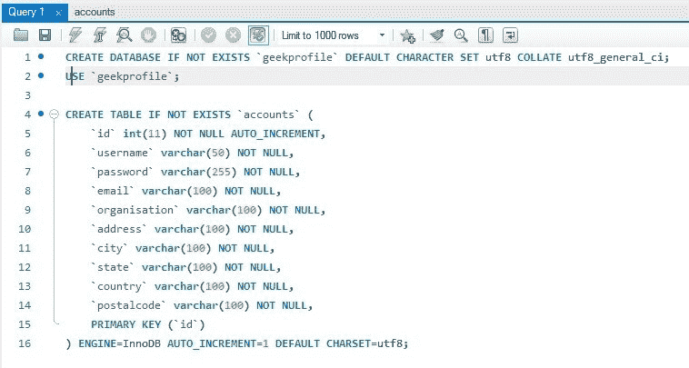
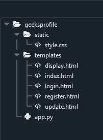

# 使用 Python Flask 和 MySQL 的配置文件应用程序

> Original: [https://www.geeksforgeeks.org/profile-application-using-python-flask-and-mysql/](https://www.geeksforgeeks.org/profile-application-using-python-flask-and-mysql/)

**项目标题：**使用 Python Flask 和 MySQL 的配置文件应用程序

**应用程序类型(类别)：**Web 应用程序。

**简介：**框架是一个代码库，通过为常见操作提供可重用的代码，使开发人员在构建 Web 应用程序时更加轻松。 有许多 Python 框架，包括 Flask、Tornado、金字塔和 Django。 Flask 是一个轻量级的 Web 应用程序框架。 它被归类为微框架，因为它不需要特定的工具或库。 侧栏用于单页 Web 应用程序或显示不同的内容。

**先决条件：**了解 Python、MySQL Workbench 和 Flask Framework 基础知识。 系统中应安装 Python 和 MySQL Workbench。 Visual Studio 代码或 Spyder 或任何处理应用程序的代码编辑器。

**项目中使用的技术：**Flask 框架、MySQL Workbench。

**项目实施情况：**

**(1)创建环境**

**第 1 步：**创建环境。 在其中创建一个 Project 文件夹和一个 venv 文件夹。

> **py-3-m venv venv**

**步骤 2：**激活环境。

> **venv\脚本\激活**

**步骤 3：**安装烧瓶。

> **管道安装烧瓶**

Колибри(2)mysql 工作台Колибри

**第一步：**安装 MySQL 工作台。
安装链接：[https://dev.mysql.com/downloads/workbench/](https://dev.mysql.com/downloads/workbench/)
了解更多信息：[https://www.mysql.com/products/workbench/](https://www.mysql.com/products/workbench/)

**步骤 2：**在您的 venv 中安装‘mysqlbd’模块。

> **pip install flask-mysqldb**

**第三步：**打开 MySQL 工作台。

**步骤 4：**编写以下代码。 上面的 SQL 语句将使用表**ACCOUNTS**创建我们的数据库**geekprofile**。

**步骤 5：**执行查询。


**(3)创建项目**

**步骤 1：**创建一个空文件夹**‘geeksprofile’**。

**第二步：**现在打开你的代码编辑器，打开这个‘geeksprofile’文件夹。

**第三步：**创建**‘app.py’**文件夹并编写下面给出的代码。

```html
# Store this code in 'app.py' file
from flask import Flask, render_template, request, redirect, url_for, session
from flask_mysqldb import MySQL
import MySQLdb.cursors
import re

app = Flask(__name__)

app.secret_key = 'your secret key'

app.config['MYSQL_HOST'] = 'localhost'
app.config['MYSQL_USER'] = 'root'
app.config['MYSQL_PASSWORD'] = 'password'
app.config['MYSQL_DB'] = 'geekprofile'

mysql = MySQL(app)

@app.route('/')
@app.route('/login', methods =['GET', 'POST'])
def login():
    msg = ''
    if request.method == 'POST' and 'username' in request.form and 'password' in request.form:
        username = request.form['username']
        password = request.form['password']
        cursor = mysql.connection.cursor(MySQLdb.cursors.DictCursor)
        cursor.execute('SELECT * FROM accounts WHERE username = % s AND password = % s', (username, password, ))
        account = cursor.fetchone()
        if account:
            session['loggedin'] = True
            session['id'] = account['id']
            session['username'] = account['username']
            msg = 'Logged in successfully !'
            return render_template('index.html', msg = msg)
        else:
            msg = 'Incorrect username / password !'
    return render_template('login.html', msg = msg)

@app.route('/logout')
def logout():
   session.pop('loggedin', None)
   session.pop('id', None)
   session.pop('username', None)
   return redirect(url_for('login'))

@app.route('/register', methods =['GET', 'POST'])
def register():
    msg = ''
    if request.method == 'POST' and 'username' in request.form and 'password' in request.form and 'email' in request.form and 'address' in request.form and 'city' in request.form and 'country' in request.form and 'postalcode' in request.form and 'organisation' in request.form:
        username = request.form['username']
        password = request.form['password']
        email = request.form['email']
        organisation = request.form['organisation']  
        address = request.form['address']
        city = request.form['city']
        state = request.form['state']
        country = request.form['country']    
        postalcode = request.form['postalcode'] 
        cursor = mysql.connection.cursor(MySQLdb.cursors.DictCursor)
        cursor.execute('SELECT * FROM accounts WHERE username = % s', (username, ))
        account = cursor.fetchone()
        if account:
            msg = 'Account already exists !'
        elif not re.match(r'[^@]+@[^@]+\.[^@]+', email):
            msg = 'Invalid email address !'
        elif not re.match(r'[A-Za-z0-9]+', username):
            msg = 'name must contain only characters and numbers !'
        else:
            cursor.execute('INSERT INTO accounts VALUES (NULL, % s, % s, % s, % s, % s, % s, % s, % s, % s)', (username, password, email, organisation, address, city, state, country, postalcode, ))
            mysql.connection.commit()
            msg = 'You have successfully registered !'
    elif request.method == 'POST':
        msg = 'Please fill out the form !'
    return render_template('register.html', msg = msg)

@app.route("/index")
def index():
    if 'loggedin' in session: 
        return render_template("index.html")
    return redirect(url_for('login'))

@app.route("/display")
def display():
    if 'loggedin' in session:
        cursor = mysql.connection.cursor(MySQLdb.cursors.DictCursor)
        cursor.execute('SELECT * FROM accounts WHERE id = % s', (session['id'], ))
        account = cursor.fetchone()    
        return render_template("display.html", account = account)
    return redirect(url_for('login'))

@app.route("/update", methods =['GET', 'POST'])
def update():
    msg = ''
    if 'loggedin' in session:
        if request.method == 'POST' and 'username' in request.form and 'password' in request.form and 'email' in request.form and 'address' in request.form and 'city' in request.form and 'country' in request.form and 'postalcode' in request.form and 'organisation' in request.form:
            username = request.form['username']
            password = request.form['password']
            email = request.form['email']
            organisation = request.form['organisation']  
            address = request.form['address']
            city = request.form['city']
            state = request.form['state']
            country = request.form['country']    
            postalcode = request.form['postalcode'] 
            cursor = mysql.connection.cursor(MySQLdb.cursors.DictCursor)
            cursor.execute('SELECT * FROM accounts WHERE username = % s', (username, ))
            account = cursor.fetchone()
            if account:
                msg = 'Account already exists !'
            elif not re.match(r'[^@]+@[^@]+\.[^@]+', email):
                msg = 'Invalid email address !'
            elif not re.match(r'[A-Za-z0-9]+', username):
                msg = 'name must contain only characters and numbers !'
            else:
                cursor.execute('UPDATE accounts SET  username =% s, password =% s, email =% s, organisation =% s, address =% s, city =% s, state =% s, country =% s, postalcode =% s WHERE id =% s', (username, password, email, organisation, address, city, state, country, postalcode, (session['id'], ), ))
                mysql.connection.commit()
                msg = 'You have successfully updated !'
        elif request.method == 'POST':
            msg = 'Please fill out the form !'
        return render_template("update.html", msg = msg)
    return redirect(url_for('login'))

if __name__ == "__main__":
    app.run(host ="localhost", port = int("5000"))
```

**第-4 步：**创建文件夹**‘Templates’**。 在 Templates 文件夹中创建文件‘index.html’、‘display.html’、‘update.html’、‘login.html’、‘register.html’。

**第-5 步：**打开**‘login.html’**文件并编写下面给出的代码。 在‘login.html’中，我们有两个字段，即用户名和密码。 当用户输入正确的用户名和密码时，它会将您转到索引页，否则会显示“用户名/密码不正确”。

```html
<!--Store this code in 'login.html' file inside the 'templates' folder-->
<html>
    <head>
        <meta charset="UTF-8">
        <title> Login </title>
        <link rel="stylesheet" href="../static/style.css">       
    </head>
    <body>
        <div class="logincontent" align="center">
            <div class="logintop">
                <h1>Login</h1>
            </div></br></br></br></br>
            <div class="loginbottom">
              <form action="{{ url_for('login')}}" method="post" autocomplete="off">
            <div class="msg">{{ msg }}</div>
            <input type="text" name="username" placeholder="Enter Your Username" class="textbox" id="username" required></br></br>
            <input type="password" name="password" placeholder="Enter Your Password" class="textbox" id="password" required></br></br></br>
            <input type="submit" class="btn" value="Login">
              </form></br></br>
              <p class="worddark">New to this page? <a class="worddark" href="{{ url_for('register')}}">Register here</a></p>
            </div>
        </div>
    </body>
</html>
```

**第-6 步：**打开**‘register.html’**文件并编写下面给出的代码。 在‘register.html’中，我们有九个字段，即用户名、密码、电子邮件、组织、地址、城市、州、国家和邮政编码。 当用户输入所有信息时，它会将数据存储在数据库中，并显示“注册成功”。

```html
<!--Store this code in 'register.html' file inside the 'templates' folder--> 
<html>
    <head>
        <meta charset="UTF-8">
        <title> register </title>
        <link rel="stylesheet" href="../static/style.css">       
    </head>
    <body>
        <div class="registercontent" align="center">
            <div class="registertop">
                <h1>Register</h1>
            </div></br></br>
            <div class="registerbottom">
              <form action="{{ url_for('register')}}" method="post" autocomplete="off">
            <div class="msg">{{ msg }}</div>
            <input type="text" name="username" placeholder="Enter Your Username" class="textbox" id="username" required></br></br>
            <input type="password" name="password" placeholder="Enter Your Password" class="textbox" id="password" required></br></br>
            <input type="email" name="email" placeholder="Enter Your Email ID" class="textbox" id="email" required></br></br>
            <input type="text" name="organisation" placeholder="Enter Your Organisation" class="textbox" id="organisation" required></br></br>
            <input type="text" name="address" placeholder="Enter Your Address" class="textbox" id="address" required></br></br>
            <input type="text" name="city" placeholder="Enter Your City" class="textbox" id="city" required></br></br>
            <input type="text" name="state" placeholder="Enter Your State" class="textbox" id="state" required></br></br>
            <input type="text" name="country" placeholder="Enter Your Country" class="textbox" id="country" required></br></br>
            <input type="text" name="postalcode" placeholder="Enter Your Postal Code" class="textbox" id="postalcode" required></br></br>
            <input type="submit" class="btn" value="Register">
              </form>
              <p class="worddark">Already have account? <a class="worddark" href="{{ url_for('login')}}">Login here</a></p>
            </div>
        </div>
    </body>
</html>
```

**Step-7：**打开**‘index.html’**文件并编写下面给出的代码。 当用户登录成功时，会显示此页面并显示“登录成功！” 将显示。

```html
<!--Store this code in 'index.html' file inside the 'templates' folder-->
<html lang="en">
    <head>
        <title>index</title>
        <link rel="stylesheet" href="../static/style.css">
    </head>

    <body bgcolor="#e6ffee">
        <div class="one">
            <div class="two">
                <h1>Side Bar</h1>
                <ul>
                    <li class="active"><a href="{{url_for('index')}}">Index</a></li>
                    <li><a href="{{url_for('display')}}">Display</a></li>
                    <li><a href="{{url_for('update')}}">Update</a></li>
                    <li><a href="{{url_for('logout')}}">Log out</a></li>
                </ul> 
            </div>
            <div class="content" align="center">
                <div class="topbar">
                    <h2>Welcome!! You are in Index Page!! </h2>                        
                </div></br></br>
                <div class="contentbar">
                     <div class="msg">{{ msg }}</div>
                </div>  

            </div>
        </div>
    </body>
</html>
```

**步骤 8：**打开**‘display.html’**文件并编写下面给出的代码。 这里显示了存储在数据库中的用户信息。

```html
<!--Store this code in 'display.html' file inside the 'templates' folder-->

<html lang="en">
    <head>
        <title>display</title>
        <link rel="stylesheet" href="../static/style.css">
    </head>
    <body bgcolor="#e6ffee">
        <div class="one">
            <div class="two">
                <h1>Side Bar</h1>
                <ul>
                    <li><a href="{{url_for('index')}}">Index</a></li>
                    <li class="active"><a href="{{url_for('display')}}">Display</a></li>
                    <li><a href="{{url_for('update')}}">Update</a></li>
                    <li><a href="{{url_for('logout')}}">Log out</a></li>
                </ul> 
            </div>
            <div class="content" align="center">
                <div class="topbar">
                    <h2>Welcome!! You are in Display Page!! </h2>                        
                </div>  </br>
                <div class="contentbar">
                    <h1>Your Details</h1>    </br>
                     
                        <div class="border">
                            <table class="worddark"></br></br></br></br>
                                <tr>
                                    <td>Username:</td>
                                    <td>{{ account['username'] }}</td>
                                </tr>
                                <tr>
                                    <td>Passworde:</td>
                                    <td>{{ account['password'] }}</td>
                                </tr>
                                <tr>
                                    <td>Email ID:</td>
                                    <td>{{ account['email'] }}</td>
                                </tr>
                                <tr>
                                    <td>Organisation:</td>
                                    <td>{{ account['organisation'] }}</td>
                                </tr>
                                <tr>
                                    <td>Address:</td>
                                    <td>{{ account['address'] }}</td>
                                </tr>
                                <tr>
                                    <td>City:</td>
                                    <td>{{ account['city'] }}</td>
                                </tr>
                                <tr>
                                    <td>State:</td>
                                    <td>{{ account['state'] }}</td>
                                </tr>
                                <tr>
                                    <td>Country:</td>
                                    <td>{{ account['country'] }}</td>
                                </tr>  
                                <tr>
                                    <td>Postal code:</td>
                                    <td>{{ account['postalcode'] }}</td>
                                </tr>                          
                            </table>
                        </div>
                                                               
                </div>

            </div>
        </div>
    </body>
</html>
```

**步骤 9：**打开**‘update.html’**文件并编写下面给出的代码。 用户可以更新他/她的数据，这也会更新数据库。

```html
<!--Store this code in 'update.html' file inside the 'templates' folder-->
<html lang="en">
    <head>
        <title>update</title>
        <link rel="stylesheet" href="../static/style.css">
    </head>
    <body bgcolor="#e6ffee">
        <div class="one">
            <div class="two">
                <h1>Side Bar</h1>
                <ul>
                    <li><a href="{{url_for('index')}}">Index</a></li>
                    <li><a href="{{url_for('display')}}">Display</a></li>
                    <li class="active"><a href="{{url_for('update')}}">Update</a></li>
                    <li><a href="{{url_for('logout')}}">Log out</a></li>
                </ul> 
            </div>
            <div class="content" align="center">
                <div class="topbar">
                    <h2>Welcome!! You are in Update Page!! </h2>                        
                </div></br></br>
                <div class="contentbar">
                  <h1>Fill Your Details to Update</h1></br>
              <form action="{{ url_for('update') }}" method="post" autocomplete="off">
                    <div class="msg">{{ msg }}</div>
                    <input type="text" name="username" placeholder="Enter Your Username" class="textbox" id="username" required></br></br>
                    <input type="password" name="password" placeholder="Enter Your Password" class="textbox" id="password" required></br></br>
                    <input type="email" name="email" placeholder="Enter Your Email ID" class="textbox" id="email" required></br></br>
                    <input type="text" name="organisation" placeholder="Enter Your Organisation" class="textbox" id="organisation" required></br></br>
                    <input type="text" name="address" placeholder="Enter Your Address" class="textbox" id="address" required></br></br>
                    <input type="text" name="city" placeholder="Enter Your City" class="textbox" id="city" required></br></br>
                    <input type="text" name="state" placeholder="Enter Your State" class="textbox" id="state" required></br></br>
                    <input type="text" name="country" placeholder="Enter Your Country" class="textbox" id="country" required></br></br>
                    <input type="text" name="postalcode" placeholder="Enter Your Postal Code" class="textbox" id="postalcode" required></br></br>
                    <input type="submit" class="btn" value="Update">
              </form>                     
                </div>  

            </div>
        </div>
    </body>
</html>
```

**步骤-10：**创建文件夹**‘static’**。 在‘static’文件夹中创建文件‘style.css’，并粘贴给定的 CSS 代码。

```html
/*Store this code in 'style.css' file inside the 'static' folder*/

.logincontent{
    margin: 0 auto;
    height: 500px;
    width: 400px;
    background-color: #e6ffee; 
    border-radius: 10px;
}

.registercontent{
    margin: 0 auto;
    height: 720px;
    width: 400px;
    background-color: #e6ffee; 
    border-radius: 10px;
}

.logintop{
    height: 60px;
    width: 400px;
    background-color: #009933; 
    color: #ffffff;
}

.registertop{
    height: 60px;
    width: 400px;
    background-color: #009933; 
    color: #ffffff;
}

.textbox{
    padding: 10px 40px;
    background-color: #009933; 
    border-radius: 10px;
}

::placeholder {
    color: #FFFFFF;
    opacity: 1;
    font-style: oblique;
    font-weight: bold;
}

.btn {
    padding: 10px 40px;
    background-color: #009933; 
    color: #FFFFFF;
    font-style: oblique;
    font-weight: bold;
    border-radius: 10px;
}

.worddark{
    color: #009933;
    font-style: oblique;
    font-weight: bold;
}

.wordlight{
    color: #FFFFFF;
    font-style: oblique;
    font-weight: bold;
}

*{
    margin: 0;
    padding: 0;
    box-sizing: border-box;
    list-style: none;
    text-decoration: none;
    font-family: 'Josefin Sans', sans-serif;
}

.one{
    display: flex;
    position: relative;
}

.one .two{
     width: 225px;
    height: 100%;
    background: #009933;
    padding: 30px 0px;
    position: fixed;
}

.one .two h1{
    color: #fff;
    text-transform: uppercase;
    text-align: center;
    margin-bottom: 30px;
    font-style: oblique;
    font-weight: bold;
}

.one .two h2{
    color: #fff;
    text-align: center;
}

.one .two .active{
     background: #0a8032;
}

.one .two ul li{
    text-align: center;
    padding: 15px;
    border-bottom: 0.1px solid white;
    border-top: 0.1px solid white;
}    

.one .two ul li a{
    color: #ffffff;
    display: block;
}

.one .two ul li a .side{
    width: 25px;
    align:center;
}

.one .content{
    width: 100%;
    margin-left: 200px;
}

.one .content .topbar{
    text-align: center;
    padding: 20px;
    background: #00b33c;
    color: white;
}

.one .content .contentbar{
    margin: auto;
}

.one .content .contentbar h1{
    color: #11a844;
    text-align: center;
    font-style: oblique;
    font-weight: bold;
}
```

**步骤 11：**项目结构如下所示。


**(4)运行项目**

**步骤 1：**运行服务器。

**步骤 2：**浏览 URL‘localhost：5000’。

**步骤 3：**显示输出网页。

**(5)应用程序测试**

**第 1 步：**如果您是新用户，请转到注册页面并填写详细信息。

**第二步：**注册后进入登录页面。 输入您的用户名和密码并登录。

**第三步：**如果您登录成功，将被移至首页，并显示您的姓名。

**第四步：**您可以在显示页面中查看您的个人资料详细信息，也可以在更新页面中更新您的详细信息。

**输出：**
**登录页面**：


**寄存器页：**


**如果登录成功，索引页：**


**更新页面：**


**更新前显示页面：**


**更新后显示页面：**


**数据库-更新前：**


**数据库-更新后：**
