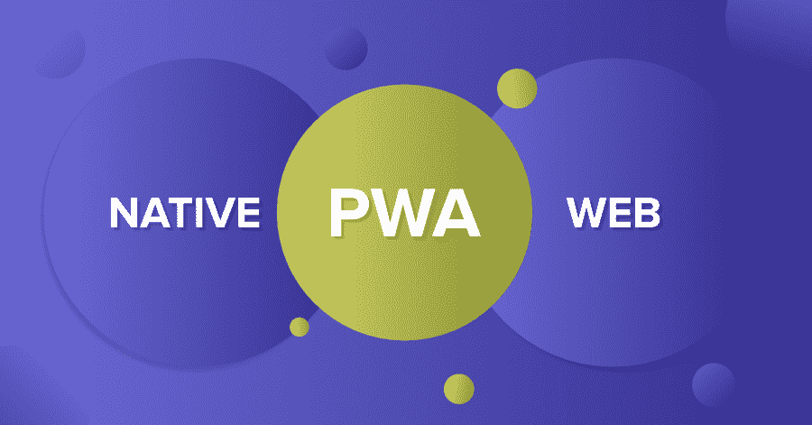
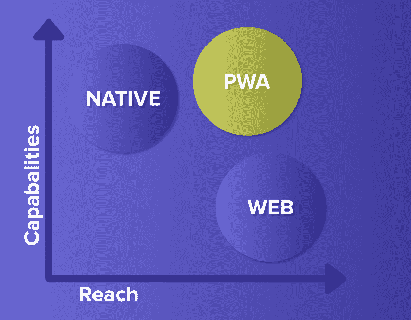
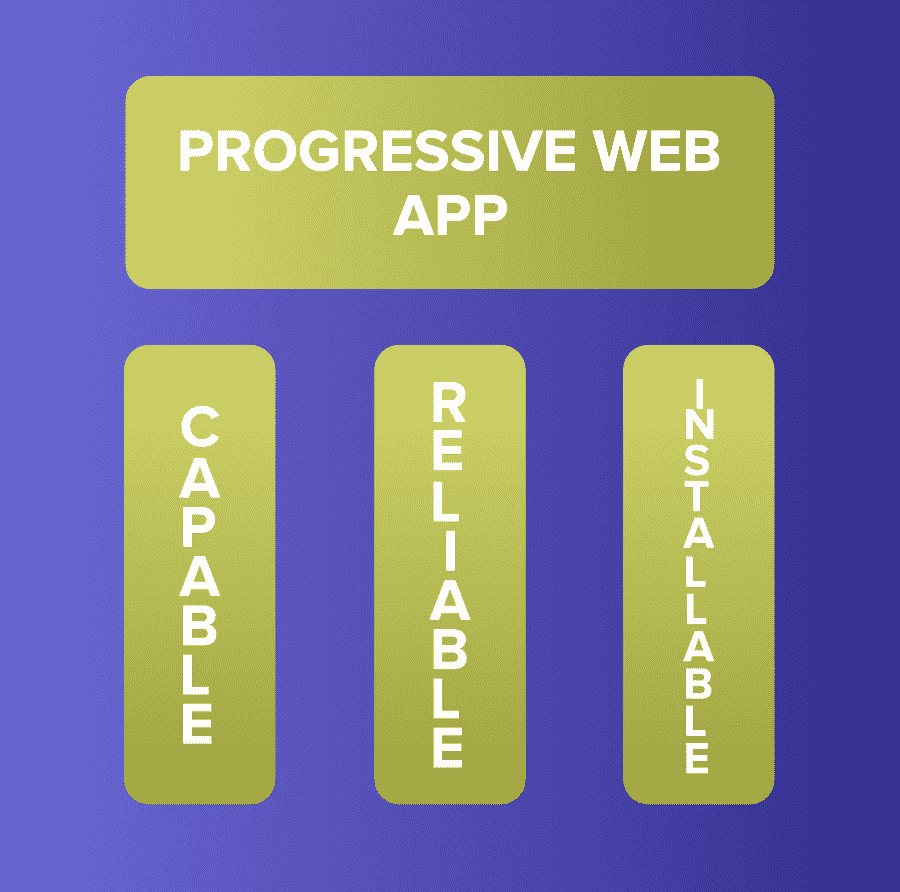
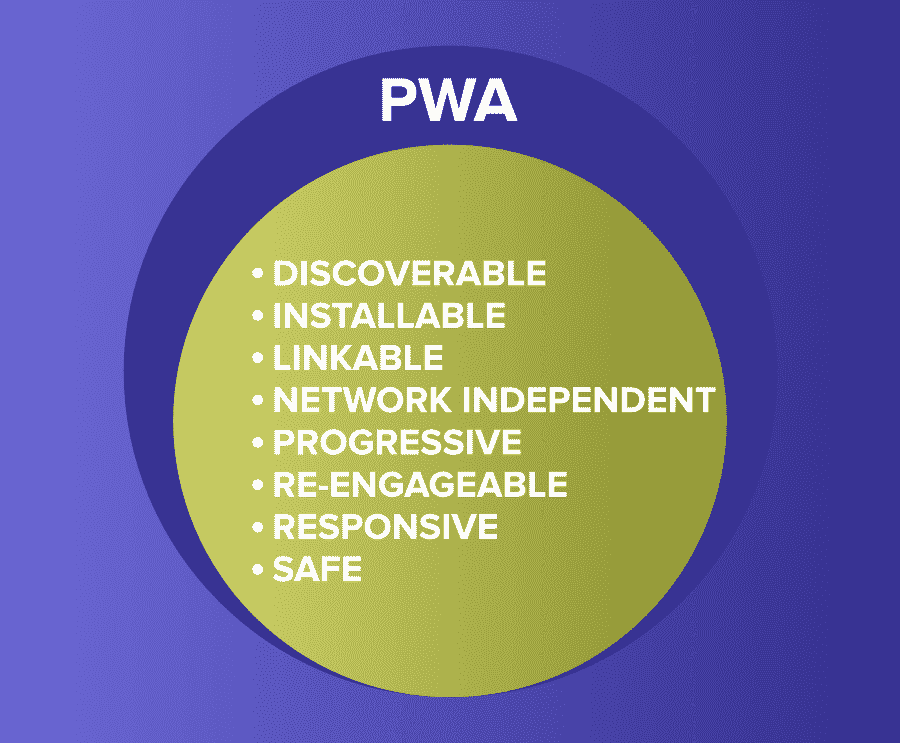

# 渐进式 Web App-原生和 Web App 的结合

> Original: [https://www.geeksforgeeks.org/progressive-web-app-a-combination-of-native-and-web-app/](https://www.geeksforgeeks.org/progressive-web-app-a-combination-of-native-and-web-app/)

***Web***是一个很棒的平台。 它在设备和操作系统中无处不在，它以用户为中心的安全模型，以及它的规范和实现都不是由一家公司或组织维护的事实，这使得 Web 成为一个独特的、有希望在其上开发软件或应用的平台。 除此之外，它还具有与生俱来的亲和力、触角和搜索的可能性，并可以在任何地方与任何人分享你所发现的东西。 无论你何时登陆网络应用，它都是最新的，你在该网站上的体验可以是短暂的，也可以是你想要的永久的。 只需一个代码库，Web 应用程序就可以访问所有设备上的任何人、任何地方、几乎所有设备。

***原生应用程序***以令人难以置信的丰富和可靠的用户体验而闻名。 它们始终存在于主屏幕、码头和任务栏上。 它们大多是独立于网络的。 它们在自己的独立或全屏体验中打开。 它们可以从本地文件系统读取和写入数据，访问通过 USB、串行或蓝牙连接的硬件，甚至可以与您设备上存储的数据(如联系人和日历事件)进行交互。 在本地应用程序中，你可以进行拍照、播放主屏幕上列出的歌曲，或者在其他应用程序中控制歌曲播放等操作。 本机应用程序给人的感觉就像深深扎根于它们运行的设备中。

此图显示了原生应用程序的相对功能和覆盖范围，包括高功能、Web 应用程序、高覆盖范围和渐进式 Web 应用程序，这些应用程序既具有高功能又具有高覆盖范围。 那么，PWA 属于哪一类呢？

***Progative Web Apps***(PWA)构建并增强了现代 API(如服务工作者)，以提供原生功能、可靠性和可安装性，同时通过单一代码库访问任何人、任何地点、任何设备。

### 三根柱子

渐进式 Web 应用程序是经过精心设计的、功能强大、可靠且可安装的 Web 应用程序。 这三个支柱将它们转换成一种感觉像是本机应用程序的体验。

### 1.有能力

如今，网络本身就很有能力。 例如，您可以使用 WebRTC、地理位置和推送通知构建超本地视频聊天应用。 应用程序可以安装，并通过 WebGL 和 WebVR 进行虚拟对话。 随着 Web Assembly 的觉醒，开发人员可以利用其他生态系统，如 C、C++和 Rust，并为 Web 带来数十年的工作和功能。 例如，Squosh.app 就将其用于高级图像压缩。

直到最近，只有本机应用程序才能宣称拥有这些功能。 虽然一些功能仍然不在网络的能力范围之内，但新的和即将推出的 API 正在寻求改变这一点，通过文件系统访问、媒体控制、应用程序标记和全剪贴板支持等功能来扩展网络的功能。 所有这些功能都建立在网络安全的、以用户为中心的权限模型之上，确保访问网站对用户来说永远不是一个可怕的方案。

在现代 API、Web Assembly 以及新的和即将推出的 API 中，Web 应用程序的功能比以往任何时候都要强大，而且这些功能只会不断扩展。

### 2.可靠

无论网络如何，可靠的渐进式 Web App 都能让人感觉速度快、值得信赖。

速度对于让用户使用您的体验非常重要。 随着页面加载时间从 1 秒增加到 10 秒，用户跳跃的机会增加了 123%。 加载事件之后，性能不会停止。 用户永远不会有机会怀疑他们的输入--例如，点击一个按钮--是否已注册。 滚动和动画应该是流畅的。 性能会影响整个体验，从用户如何看待您的应用程序到其性能如何。

最后，尽管有网络连接，可靠的应用程序仍需要可用。 用户希望应用程序在网络连接速度慢或不稳定的情况下启动，甚至在离线的情况下启动。 他们希望他们与之互动的最新内容，如媒体曲目、门票和行程，即使很难向你的服务器发出请求，也会变得可用和可用。 当一个请求不可能时，他们希望被告知有麻烦，而不是应用程序默默地失败或崩溃。

人们喜欢在眨眼之间对交互做出反应的应用程序，以及他们可以依赖的体验。

### 3.可安装

安装的渐进式 Web 应用程序在独立窗口或全屏窗口中运行，而不是在浏览器选项卡中运行。 它们只需从用户的主屏幕、Dock、任务栏或工具架上启动即可。 可以在设备上搜索它们，然后使用应用切换器在它们之间跳转，让它们感觉像是安装在设备上的一部分。

在安装 Web 应用程序之后，会有新的功能出现。 在浏览器中运行时通常保留的键盘快捷键变为可用。 PWAS 可以注册接受来自其他应用程序的内容，或者成为处理不同类型文件的默认应用程序。

当一款渐进式网络应用程序从一个标签移到一个独立的应用程序窗口时，它会重构用户对它的看法，并与之互动。

### 两全其美

从本质上讲，PWA 只是一些网络应用程序。 使用渐进式增强功能，可以在现代浏览器中启用新的功能和特性。 使用服务工作者和 Web 应用程序清单，您的 Web 应用程序变得可靠和可安装，也可以脱机运行。

渐进式 Web 应用程序为您提供了一种独特的可能性，可以产生您的用户会喜欢的 Web 体验。 使用最新的网络功能带来原生的功能和可靠性，Progative Web Apps 允许任何人、任何地方、任何设备使用单一代码库安装您构建的内容。

### 是什么让一款应用程序成为 PWA？

PWA 不是用单一技术制造的。 它们象征着一种新的设计 Web 应用程序的理念，涉及到一些特定的模式、API 和其他功能。 乍一看，Web 应用程序是不是 PWA 并不是那么明显。 当一个应用程序满足一组要求或实现一组给定的功能时，它可以被认为是 PWA：离线工作、可安装、易于同步、具有清单等。

此外，还有一些工具可以衡量网络应用的完成度(以百分比表示)，比如灯塔。 LightTower 在审计部分内置了 Chrome-dev 工具。 通过执行各种技术优势，我们可以使应用程序更加进步，从而最终获得更高的灯塔得分。 但这只是一个粗略的指标。

要成为 PWA，Web 应用程序必须满足以下几个要点。 它应该是：

*   **Discoverable**：内容可以通过搜索引擎发现。
*   **可安装**：它可以在设备的主屏幕或应用程序启动程序中使用。
*   **Linkable**：只需发送一个 URL 即可共享。
*   **与网络无关**：它脱机工作或网络连接不良。
*   **渐进式**：它在较旧的浏览器上仍然可以在基本级别上使用，但在最新的浏览器上功能齐全。
*   **可重新参与的**：只要有新的内容可用，它就能够发送通知。
*   **响应式**：它可用于任何带屏幕和浏览器的设备-手机、平板电脑、笔记本电脑、电视、冰箱等。
*   **安全**：用户、应用程序和您的服务器之间的连接受到保护，以防任何第三方试图访问敏感数据。

提供这些功能并利用 Web 应用程序提供的所有优势，可以为您的用户和客户创建一个极具吸引力、高度灵活的产品。

### 做这么多工作值得吗？

绝对一点儿没错!。 实现核心 PWA 功能所需的工作量相对较少，带来的好处是巨大的。 例如：

*   由于与服务人员进行缓存，应用程序安装后加载时间减少，同时节省了宝贵的带宽和时间。 PWA 的装载几乎是瞬间的(从第二次访问开始)。
*   在应用程序更新可用时仅更改已更新的内容的功能。 相比之下，使用原生应用程序，即使是最轻微的更改也可以让用户重新下载整个应用程序。
*   外观和感觉更多地与原生平台相结合--主屏幕上的应用程序图标或应用程序启动器、在全屏模式下自动运行的应用程序等。
*   通过使用系统通知和推送消息重新与用户互动，从而提高用户参与度和转换率。

### 成功故事

有很多企业尝试 PWA 路径的成功案例，他们选择了改进的网站体验，而不是原生应用程序，并因此看到了有意义的、可衡量的好处。 PWA Stats 网站分享了许多案例研究，表明了这些好处。

一些大公司已经转向 PWA 技术。

1.  Flipkart Lite
2.  特里瓦戈
3.  《福布斯》
4.  Twitter Lite
5.  电报
6.  让我的旅行
7.  法律厅
8.  红色公交车

最著名的成功故事可能是 Flipkart Lite。 印度最大的电子商务网站在 2015 年被重建为一个进步的网络应用程序，这导致转换率增加了 70%。 全球速卖通 PWA 的效果也比网络或原生应用好得多，新用户的转换率提高了 104%。
考虑到它们的附加值，以及将这些应用程序转换为 PWAS 所需的相对较少的工作量，选择是明确的。

推特上的每个会话页面增加了 65%，Tweet 增加了 75%，弹跳率下降了 20%，所有这些都使他们的应用程序的大小减少了 97%以上。 在改用 PWA 后，日经观察到有机流量增加了 2.3 倍，订阅率增加了 58%，每日用户增加了 49%。 Hulu 用渐进式 Web App 取代了他们原生的桌面体验，回访率上升了 27%。

像 Couponmoto 这样的早期初创公司也开始使用先进的网络应用程序来推动更多的客户参与，这表明它们可以帮助小公司和大公司更有效地(重新)吸引用户。 您甚至可以使用 PWABuilder 网站生成 PWA 或将现有的 Web 应用程序转换为 PWA Online。

渐进式网络应用即将彻底改变数字全景图，许多组织要么将他们目前响应迅速的网络应用转移到 PWA，要么考虑很快做出改变。