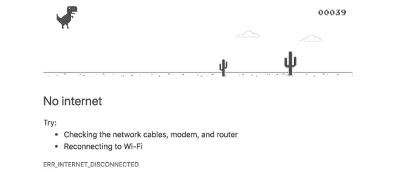
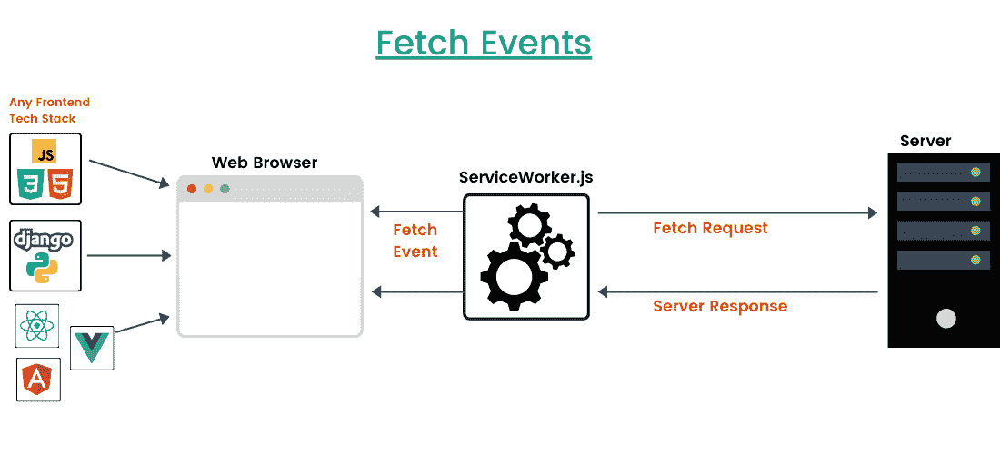
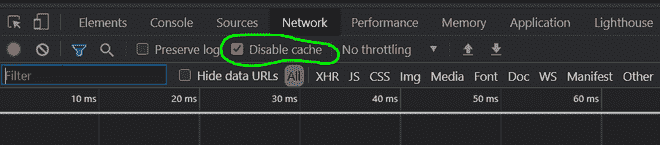
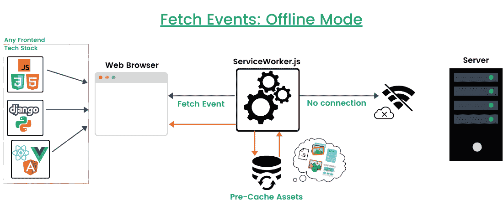

# Chrome 浏览器渐进式 Web App 离线支持检测逻辑

> Original: [https://www.geeksforgeeks.org/progressive-web-app-offline-support-detection-logic-for-chrome-browser/](https://www.geeksforgeeks.org/progressive-web-app-offline-support-detection-logic-for-chrome-browser/)

**Progative Web Apps(PWA)**是为使用 Web 技术的移动和桌面设备构建的可安装应用程序(它们可以在任何标准平台上运行)。 即使在不稳定的网络条件下，PWA 也是高度可靠的。

**最有趣的是：**任何技术堆栈中构建的 Web 应用程序都可以转换为渐进式 Web App！

渐进式 Web App 的优势包括：

*   类似 APP 的外观、手感和功能(添加到主屏幕、推送通知)
*   脱机可访问性
*   无更新问题(自动更新)
*   在任何设备上轻松安装
*   搜索引擎优化
*   装船时间短
*   更好的性能
*   跨平台的
*   数据使用率低
*   反应迅速的 / 积极反应的 / 回答的 / 响应的

可以通过浏览器在设备上安装符合渐进式 Web App 可安装性所有核心标准(包括支持离线模式)的 Web 应用程序。

在本文中，对 PWA 中的离线检测究竟是如何工作的进行了合理的解释。

*   即使在脱机模式下，应用程序也必须继续工作，这仅仅意味着，即使用户失去了设备的网络连接，屏幕上也不会出现谷歌恐龙跑步者(T-Rex Game)。 即使没有网络连接，用户也可以在应用程序中导航并查看内容。
    

    恐龙跑步者

*   要使 PWA 可安装，首先要验证 Web 应用程序是否包含具有**Fetch**事件处理程序的服务工作器。 当我们加载 Web 应用程序时，会发起一个获取**索引**页面的获取请求，然后在浏览器上呈现该页面。 在这里，我们有一个服务工作者充当 App 和 Server 之间的代理。 **Service Worker**只是一个在后台运行的 javascript 文件。 它也被称为 PWA 的心脏。 它独立于主浏览器的线程运行。 因此，不存在与服务人员的网页/用户交互。
    
*   现在，我们将启用 Web 应用程序离线加载内容的功能，而不是加载默认错误页面。
*   为此，我们将资产本地存储在**缓存存储**中(检查页面后，导航到应用程序部分以查看缓存存储)，以便我们可以在需要时(即在脱机模式下)访问它们。
*   有不同类型的缓存来控制 Web 应用程序的资源和资产的存储，浏览器缓存就是其中之一。
    *   **浏览器缓存(自动工作)：**它通过缓存 CSS 文件、图像等资源来提高网站的速度，这样我们就不必每次加载网页时都下载它们。 这里唯一的问题是，我们无法控制在缓存中存储什么和不存储什么！ 因此，最好禁用浏览器缓存。 
*   我们使用的是另一个可以由我们使用服务工作者和常规 Javascript 控制的缓存。 我们可以控制和管理哪些资源应该存储在缓存中，以提高 Web 应用程序的性能。 稍后，我们可以在需要时(即离线)检索它们。
*   最初，缓存是空的。 加载第一个服务工作者后，它会请求服务器获取 Web 应用程序请求的一些核心资产。 资产包括图像、CSS 样式文件、javascript 文件等。服务人员然后返回所有这些资产，并将它们存储到缓存中，因为它们将来可能会有用！ 这称为**预缓存**。 所有这些缓存的资产都存储在本地。
*   如果我们失去网络连接，服务工作者仍然会向服务器发出获取资源的请求，但它永远不会到达服务器端。 现在，使用**个预缓存的资产可以在没有网络连接的情况下获取资源。**
*   服务工作者将中断向服务器发出的这些获取请求(简而言之，服务工作者告诉获取请求没有可用的网络连接，因此不再需要到服务器获取资源！)。 服务工作者本身查看预缓存的资产，并将资源返回给 Web 浏览器。
*   这样，即使在脱机模式下，用户也可以在应用程序中导航，还可以查看内容/资源！
    

**注意：**从 8 月 21 日起更新脱机检测

*   这是之前进行的验证检查(将只执行到**2021 年 8 月**为止！)。 如果你已经建立了任何进步的网络应用，你现在会注意到 Chrome89 在通过 LighTower 审计(生成报告)之后的警告。 从**2021 年 3 月**开始发出警告。
*   从 2021 年年中开始，将会有一些新的检查，因为：
    *   Chrome 无法检查 Web 应用程序的正确离线行为，因为无法通过服务工作人员检查 HTTP 请求的状态。
    *   当我们检查 web 应用程序的离线模式兼容性时，Chrome 只检查服务工作者是否有 FETCH 事件处理程序，但情况并非如此。
    *   应检查 FETCH 事件处理程序在脱机模式下是否返回具有 HTTP 200(成功状态代码)的有效资源。
*   如果您已经以正确的方式实现了脱机模式，则无需再次执行任何更改。
*   否则，如果您的 FETCH 处理程序工作不正常，并且它没有通过 HTTP 请求返回响应状态代码 200，则应该使用最新的所需条件更新该应用程序。