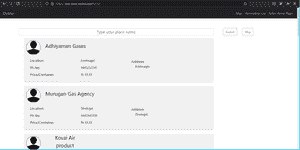
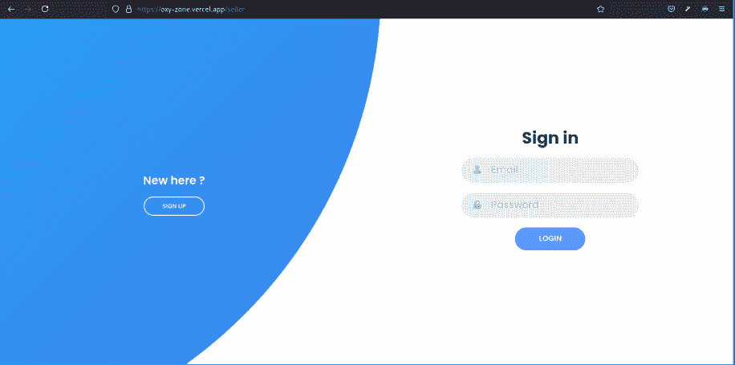
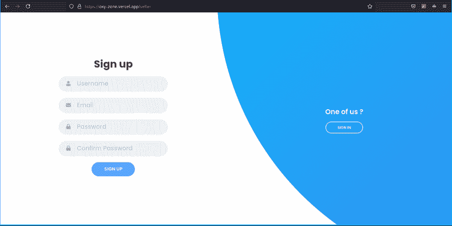
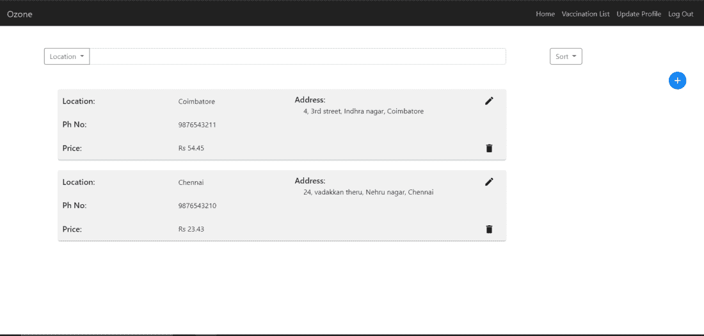
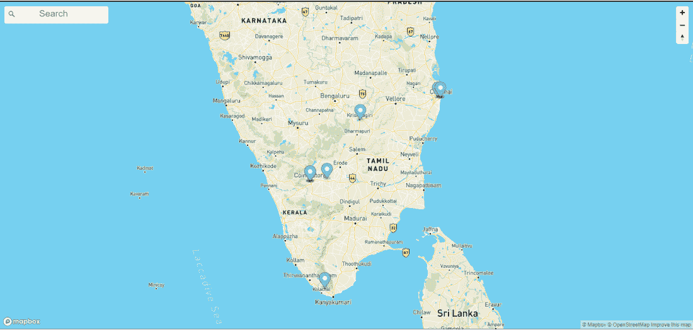
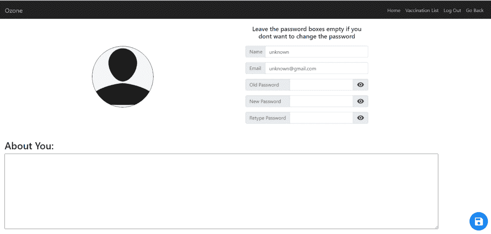
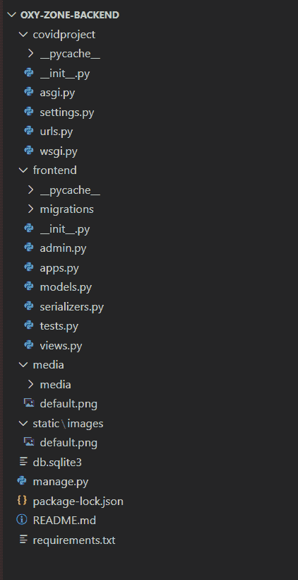
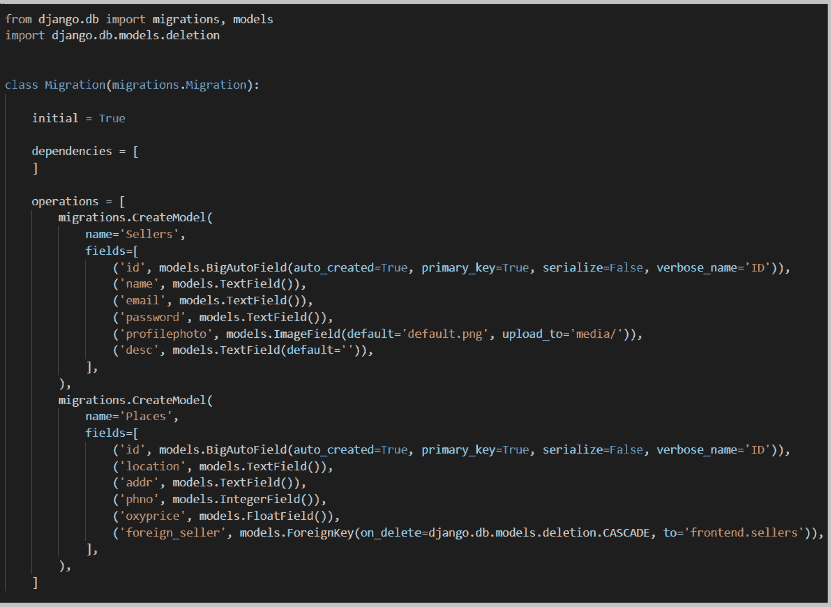
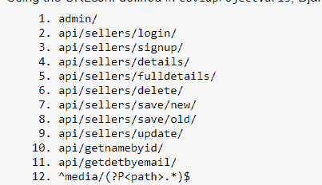
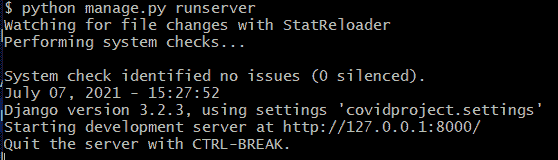

# 项目创意-充当氧气卖家和买家之间交易的网站

> Original: [https://www.geeksforgeeks.org/project-idea-a-website-acting-as-transaction-between-oxygen-sellers-and-buyers/](https://www.geeksforgeeks.org/project-idea-a-website-acting-as-transaction-between-oxygen-sellers-and-buyers/)

在目前的情况下，在一个地区找到氧气销售商已成为当务之急。 许多人因为找不到他们所在地区的氧气销售商而失去了生命。 我们已经想出了一个解决方案。 如果有一个网站，你只需要输入你的城市名称，它就会显示你附近所有可以买到氧气的地方，那会怎么样呢？ 一定会很棒的，对吧！ 这就是我们所做的。

**使用的工具：**

*   前端-↔反应
*   后端仓鼠-DEDjango 休息

**React：**React 是一个 javascript 框架，用于制作 UI 组件和构建用户界面。 要了解更多信息，请查看此处的文档：https://reactjs.org

**Django rest：**Django 是一个基于 Python 的 Web 框架，遵循模型-模板-视图架构模式。 Django rest 框架是一个用于构建 WebAPI 的工具包。

**项目的逐步实现：**要使该项目在您自己的本地系统上运行，请确保您安装了 node.js 和 Django。

1.  **从 Github 克隆存储库：**Github 链接为“https://github.com/LordofUniverse/oxy-zone-frontend”.。 将存储库克隆到本地服务器上的合适位置。 让您安装最新的稳定节点和 NPM。 要安装节点和 npm，请访问此链接“https://docs.npmjs.com/downloading-and-installing-node-js-and-npm”.
2.  **在****本地服务器上运行：**在终端/命令提示符中，导航到终端/命令提示符中的 oxy-zone-front end/目录。 然后运行以下命令：

```html
$ npm install
```

这是为了安装运行应用程序所需的所有节点模块。

```html
$ npm start
```

这是为了启动开发服务器

我们将解释我们在上面克隆的项目的代码。 由于代码较长，并且在此处添加时看起来并不美观，我们决定通过 GitHub 添加指向代码的链接。

项目组件：

我们将首先启动前端(反应)：

**1.创建项目结构如下：**


**2.我们将在 App.js**中为**网站创建链接代码**

**反应代码：**

## JavaScript

```html
import { React, useState } from 'react'

import Header from '../Start/Header'

import Sellerlogin from '../Seller/sellerlogin'
import SellerHome from '../Seller/SellerHome'

import BuyerHome from '../Buyer/BuyerHome'
import Sellerdetails from '../Buyer/Sellerdetails'

import Update from '../UpdateProfile/Update'

import Vaccinationlisting from '../Vaccination/vaccinationlist';

import Maptry from '../Map/react_map'

import { Redirect } from 'react-router'

import 'bootstrap/dist/css/bootstrap.min.css';

import {
  BrowserRouter as Router,
  Switch,
  Route,
} from "react-router-dom";

const App = () => {

  const val = localStorage.getItem("gid")

  return (
    <Router>
      <Switch>
        <Route exact path="/">
          <Header />
        </Route>

        <Route exact path="/map"> 
          <Maptry />
        </Route>

        <Route exact path="/home"> 
          <BuyerHome />
        </Route>

        <Route exact path="/home/:seller"> 
          <Sellerdetails />
        </Route>

        <Route exact path="/vaccinationlist">
          <Vaccinationlisting />
        </Route>

        <Route exact path="/seller">

          {val === null ? <Sellerlogin /> : <SellerHome />}

        </Route>

        <Route exact path="/seller/update">

          {val === null ? <Redirect to="/seller" /> : <Update />}

        </Route>

      </Switch>
    </Router>
  )
}

export default App
```

[https：//github.com/LordofUniverse/oxy-zone-frontend/blob/master/src/App/App.js](https://github.com/LordofUniverse/oxy-zone-frontend/blob/master/src/App/App.js)

**首页：**设计简单的页面，显示卖家销售的氧气瓶列表，并提供搜索栏供用户输入城市名称。 对于氧气销售商，他们可以选择在网站上注册，并提供地址和价格/氧气瓶等详细信息。



**反应代码：**[https://github.com/LordofUniverse/oxy-zone-frontend/blob/master/src/Buyer/BuyerHome.js](https://github.com/LordofUniverse/oxy-zone-frontend/blob/master/src/Buyer/BuyerHome.js)

**卖家登录：**供氧气卖家注册的卖家登录页面。 数据存储在 SQLite 数据库中。

登录图像：



注册图像：



**反应代码：**[https://github.com/LordofUniverse/oxy-zone-frontend/blob/master/src/Seller/sellerlogin.js](https://github.com/LordofUniverse/oxy-zone-frontend/blob/master/src/Seller/sellerlogin.js)

**5.卖家页面：**卖家可以创建氧气瓶列表以及价格和电话号码。 要显示的数据通过使用 Django rest 框架的定制 API 从数据库获取。 基于与搜索者的接近程度来显示数据。



**反应代码：**[https://github.com/LordofUniverse/oxy-zone-frontend/blob/master/src/Seller/SellerHome.js](https://github.com/LordofUniverse/oxy-zone-frontend/blob/master/src/Seller/SellerHome.js)

**6.我们还增加了地图功能，以显示氧气瓶销售地点的标记**



**反应代码：**[https://github.com/LordofUniverse/oxy-zone-frontend/blob/master/src/Map/react_map.js](https://github.com/LordofUniverse/oxy-zone-frontend/blob/master/src/Map/react_map.js)

**7.更新个人资料页面：**销售商可以在此页面上更改他们的个人资料照片或更改他们的电子邮件和密码。 他们可以添加或更改对自己的描述。



**反应代码：**[https://github.com/LordofUniverse/oxy-zone-frontend/blob/master/src/UpdateProfile/Update.js](https://github.com/LordofUniverse/oxy-zone-frontend/blob/master/src/UpdateProfile/Update.js)

**后端(Django)现在：**

**要克隆项目**[https://github.com/LordofUniverse/oxy-zone-backend](https://github.com/LordofUniverse/oxy-zone-backend)，请导航到此目录并执行命令‘python-m pip Freeze>Requirements.txt’以安装此项目所需的模块。

**我们需要安装 python，下面列出了一些模块**：**：**

1.  姜戈
2.  Djangorest 框架
3.  Django-CORS-标题
4.  姜戈-赫罗
5.  加密

**1.我们的项目结构如下：**



**2.为 Reaction APP 构建 API：**在 covidproject 的前端 APP 中，我们在**Models.py 和**中创建了 2 个模型，分别是**Sellers**和**Places**



Migrations.py 的视图

接下来，我们在**views.py(**[**api**](https://github.com/LordofUniverse/oxy-zone-backend/blob/master/frontend/views.py)**)**中创建 https://github.com/LordofUniverse/oxy-zone-backend/blob/master/frontend/views.py 端点。 对于 API 端点，必要的序列化程序在**seralizers.py 中定义。**



创建的 API 端点

**3.运行 Django 服务器：**完成代码部分后，运行 Django 服务器：

打开终端并导航到包含**manage.py**脚本的正确目录，然后运行命令：

```html
$ python manage.py runserver
```

成功执行后，您将获得：



因此，通过执行以下步骤，您将能够在您自己的本地服务器上运行该网站的副本

**APP 视频演示：**

<video class="wp-video-shortcode" id="video-656329-1" width="640" height="360" preload="metadata" controls=""><source type="video/mp4" src="https://media.geeksforgeeks.org/wp-content/uploads/20210707155002/OXY-ZONE.mp4?_=1">[https://media.geeksforgeeks.org/wp-content/uploads/20210707155002/OXY-ZONE.mp4](https://media.geeksforgeeks.org/wp-content/uploads/20210707155002/OXY-ZONE.mp4)</video>

**结论：**在氧气危机时期，人们越来越需要了解氧气销售商，这款应用可以帮助人们。 这个 App 的成功取决于注册和使用它的人。 呆在家里，注意安全，接种疫苗！

**作者：**

1.  ==同步，由 Elderman 更正==@ELDER_MAN
2.  ==同步，由 Elderman 更正==@ELDER_MAN