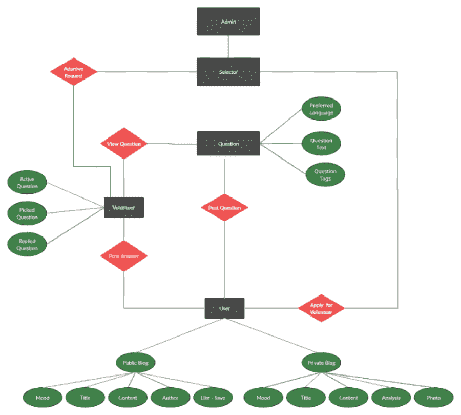

# 项目创意|缓解

> Original: [https://www.geeksforgeeks.org/project-idea-allay/](https://www.geeksforgeeks.org/project-idea-allay/)

**目的/目标：**本应用程序的主要目的是卸下用户的情感包袱，并为沉思提供另一种视角。

**重要链接：**

*   **网站：**[HTTPS：//allay-convo.web.app](https://allay-convo.web.app)
*   **应用：**[https://drive.google.com/file/d/1RWS9tombZTRbRUi15oY5ePn0NBUCtWJS/view?usp=sharing](https://drive.google.com/file/d/1RWS9tombZTRbRUi15oY5ePn0NBUCtWJS/view?usp=sharing)
*   **视频：**[HTTPS：//drive.google.com/file/d/1JUCA434JeE3u_O2-krAGr1NZ1FuFWHjb/view？usp=Sharing](https://drive.google.com/file/d/1JUcA434JeE3u_o2-krAGr1NZ1FuFWHjb/view?usp=sharing)

**功能：**它具有以下功能-

*   FireBase 身份验证(使用带验证的电子邮件和密码或 Google 登录)
*   用户的个人资料和简历。
*   公共博客。
*   为公共博客点赞并存钱。
*   编辑和删除公共博客。
*   作者简介、个人简介和博客。
*   报道一个公共博客。
*   私人博客。
*   分析私人博客。
*   根据用户选择的心情对公共博客和私人博客进行排序。
*   搜索公共和私人博客。
*   用户可以在私人博客上添加照片。
*   志愿者模式(合适的用户可以申请)。
*   基于情商的志愿者问卷调查。
*   用户可以发布问题。
*   给问题贴上问题标签。
*   我的聊天和实时更新的问题状态。
*   志愿者将挑选用户提出的问题并进行回复。
*   志愿者可以将无关或越界的问题打上记号。
*   志愿者可以查看他选择的问题和回答。
*   评分志愿者的答案。
*   给问题打上不相干或越界的记号。
*   报告一名志愿者。
*   选择器模式(用于选择志愿者)
*   管理模式。
*   管理员将根据要求授予合格的选择者角色访问权限。
*   管理员有权对用户或志愿者提交的报告采取行动。

**此项目的帮助方式：**此应用程序在各种方面都有帮助-

*   它可以帮助人们更有效地理解和分析自己的心理状态。
*   它可以帮助你成为一个伴侣，最终让一个人对自己的心理健康感觉更好，并帮助他们逃离。
*   应用程序中的聊天选项将作为一个渠道，让他们卸下不想要的烦恼和烦恼。
*   我们的志愿者将深入分析每个人的问题，然后根据问题和情景提供他们的叙述。

**项目中使用的工具和技术：**

*   作为 Web 服务器和数据库的 FireBase
    *   云火恢复
    *   实时数据库
    *   云存储
    *   验证
    *   FireBase 云消息(用于通知)
*   网址
    *   作出反应 / 敌视 / 反对 / 产生不良心理反应
    *   Redux(用于状态管理)
    *   材料
    *   反应引导
*   移动应用
    *   振翼 / 飘动 / 激动不安 / 摆动
    *   达特 （人名）
*   感伤分析包，用于反应和颤动。

**构建项目所需的技能集：**

*   Web 开发
*   颤动应用程序开发
*   重火力点
*   使用 Redux(Web)和 Provider(App)的状态管理

**项目实施的循序渐进：**这次突如其来的全球新冠肺炎疫情以来，我们每个人都在很长一段时间里与亲人、朋友或家人保持着距离。 这种感情的封闭导致了隐居，导致了焦虑、压力、情绪失衡和孤立，不知何故导致了单调的生活。 当我们观察一切的时候，这引导我们去创造一个平台，在这个平台上，人们可以分享他们的想法和感受，而不需要担心被曝光或评判，因为在这里，用户的身份是保密的。 然后，我们掌握了构建这样一个平台所需的至关重要的熟练程度。 在制定了路线图之后，我们将开始艰难地工作。

我们首先提供了一个功能，用户可以像写日记一样写博客，然后再提供更多功能。 考虑到个人的保密性，发布博客是公开的还是私有的完全由用户决定。 在设计应用程序的同时，我们向前推进，引入了新功能。 首先，我们首先集成了一个情感分析模型，它将分析用户写的博客，或者简单地总结一下用户的所有感受。 在这一部分中，用户还可以通过选择最终容易搜索或排序博客的情绪来指定博客。 此外，它还可以选择添加图片，但只能使用私人博客。提供此选项是为了让用户更容易、更舒适地表达，因为有时文字并不足以说明所有事情。 所以这个图片选项可以直接把他跟这个事件联系起来。 然后我们更进一步，只为公共博客引入了 Like，Save 和 Share 功能，这样作者如果写了一些其他用户称赞的东西，并根据博客可能与之相关的不同情绪或情况添加了标签，就可以得到赏识。

我们还与一些熟练的心理学学生(选择者)进行了讨论，他们在指导我们迎接即将到来的挑战方面发挥了重要作用。 这些选择器帮助我们选择志愿者(志愿者是分析用户情况并给出问题答案的人)。 他们准备了一份基于情绪智力(EI)的调查问卷，并根据他们的回答判断他们是否有资格或有能力发挥如此重要的作用。 现在，志愿者有责任在经过适当分析后，为用户提供符合场景的叙述，并回答用户的问题。 该问题可以是任何类型的，并且询问问题的用户的身份不被公布，即该用户将是匿名的。 志愿者可以根据自己的方便和知识选择问题。 用户可以根据他的满意度对答案进行评级，他将获得与问题相关的适当更新，如用户发布问题后将被标记，志愿者选择该问题时分配，志愿者回复时最终回复。 这样，如果用户不喜欢招待，他也有权举报志愿者，如果是这样，志愿者也可以标记不相关的问题，稍后将被转移到管理员进行审查和公正的判断。 还有一件事增加了用户的舒适感，那就是用户可以用他喜欢的印度语言提问，以防他对英语感到不舒服，然后志愿者会相应地选择一个已知语言的问题。

**测试用例：**

*   测试用例 1：
    *   关闭 Internet 连接以防止系统向服务器请求权限。
    *   预期结果：闪屏。
*   测试用例 2：
    *   将用户电子邮件和密码字段留空。
    *   预期结果：请填写登录凭据
*   测试用例 3：
    *   该网站在 Chrome、Safari、Firefox、Microsoft Edge 等各种网络浏览器上开通。
    *   预期结果：工作成功
*   测试用例 4：
    *   应用程序和网站的用户界面(UI)被一致地检查，在各种屏幕尺寸上都是可见和可访问的。
    *   预期结果：工作成功
*   测试用例 5：
    *   用户尝试在未验证电子邮件的情况下登录。
    *   预期结果：登录失败
*   测试用例 6：
    *   必填字段按要求工作。
    *   预期结果：工作成功
*   测试用例 7：
    *   在应用程序和网站的各个模块之间导航。
    *   预期结果：按预期工作
*   测试用例 8：
    *   在不同页面测试的页面滚动场景。
    *   预期结果：工作成功

**ER 图：**

**未来范围：**此应用程序在设计时考虑到了未来可能添加的许多功能-

*   我们将与一些医疗专业人员合作，提供适当的指导和咨询。
*   我们将引入一个在用户和专业人员之间直接聊天(视频通话)的选项。
*   专业人士可以设定他的诊疗费，使用者可以根据这一点选择他的其中一个选择。

**志愿者凭证：**

*   <u>电子邮件：</u>allayalog@gmail.com
*   密码：allay@志愿军

**团队详情：11-13**

*   尤夫拉杰·辛格·托马尔
*   萨塔克·萨克塞纳
*   迪维扬什·辛格(Divyanshi Singh)