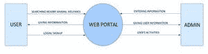
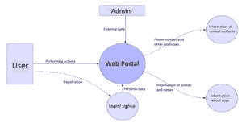
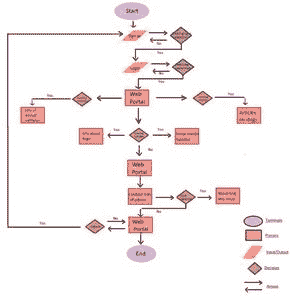

# 项目创意|动物福利和福利网络应用程序

> Original: [https://www.geeksforgeeks.org/project-idea-animal-welfare-and-wellness-web-application/](https://www.geeksforgeeks.org/project-idea-animal-welfare-and-wellness-web-application/)

**摘要-**从社交网站对我们日常生活和网络应用程序的影响中得出这样的想法，即通过使用原生网络应用程序开发的概念来开发改进宠物的网络应用程序。

当前正在工作的模块可以在 URL-*loyalFriend.biz*上看到

LoyalFriend 是一个基于网络的应用程序，其中照顾宠物动物的福利。 这是一个流浪、走失、遗弃或投降的宠物被带到并被切断的地方。 每只宠物都需要特别的照顾和关注，这一点在组织中得到了履行。 这个应用程序允许用户收养一只宠物，向宠物志愿服务，购买与宠物相关的产品，并向组织捐赠所需的金额。 由于此应用程序是为非营利性组织开发的，因此捐赠的金额将用于宠物的福利。 该应用程序的用户可以作为志愿者为宠物工作，他/她也可以从该应用程序中领养该宠物。 该应用程序包含宠物的相关产品，如食品、美容产品等供购买。 购买产品可以使用信用卡、借记卡或货到付款。 该应用程序还向用户提供了关于宠物的健康护理、如何培育宠物以及在被收养后如何照顾它们的指南。 使用 HTML5、CSS3 和 JavaScript 来开发应用程序。 应用程序的后端使用 NodeJS 包管理器，如 NPM 和 YAR，NodeJS 还提供了创建易于部署的开发服务器的功能，这些服务器相对容易调试。

**目的-**本项目项目的主要目的是通过为被遗弃的宠物提供一个更好的栖身之所，并以亲切的感情为它们提供照顾和照顾，来实现服务于所有被遗弃的宠物的福利服务的整个过程的自动化。(T0)**本项目的主要目的是通过为被遗弃的宠物提供一个更好的栖身之处，以及对它们的关爱和照顾，来实现这一过程的自动化。 该项目的范围仅限于暂时部署内联网设备，因为它目前还不能完全部署在任何其他手持终端设备上。这一项目的范围有限，只能暂时部署到内联网设备上，因为它不能完全部署在任何其他手持终端设备上。 为被遗弃的、流浪的、丢失的或交出的宠物的福利提供便利。 它不仅节省了时间，而且文书工作更少，更容易检索记录，自动化了记录系统，减少了收取佣金的中年人的工作流程。**

****简介-**目前的宠物梳理系统是人工完成的，非常耗时。 *维护记录很困难，可能放错了地方，这导致了很多混乱或大惊小怪。 这个项目的主要想法是提供一个用户友好的界面，通过给被遗弃的宠物一个庇护所，并用爱心照顾它们，来自动化为宠物的福利服务的过程。 该应用程序还提供了照顾宠物的指导原则、宠物的领养程序以及对宠物的志愿服务。**

**用户可以通过应用程序进行采用过程，因为如果手动完成此过程将非常耗时。 该应用程序为用户提供了向组织捐赠任意金额的选项。 捐款可以用现金、信用卡来完成。 用户可以通过应用程序将他们注册到组织，并选择他们感兴趣的领域，如做志愿者、领养宠物或购买与宠物相关的产品。 对于领养和志愿服务，用户可以选择组织中的宠物，查看它们的详细信息，如果他们愿意，可以继续领养或志愿服务的过程。**

****目标和范围-**该项目的主要目标是通过给被遗弃的宠物一个庇护所，用爱心照顾它们，使服务于宠物福利的过程自动化。 该项目的范围目前仅限于内部网，不能在任何手持设备上部署。 为被遗弃的、流浪的、丢失的或交出的宠物的福利提供便利。 它节省了时间，减少了文书工作，而且便于记录的检索，系统的自动化减少了中间人收取佣金的过程。**

****要求-****

****1.硬件要求****

*   ****处理器：**英特尔(R)和奔腾(R)或以上**
*   ****CPU 硬盘 OECDISK：**DE500 GB DEHDD**
*   ****RAM：****

****2.软件需求****

*   ****操作系统：**、Windows 7 及以上**
*   ****正面 OECEnd：**30-HTML 5，httCSS 3，JavaScript**
*   ****后端：**javascript、Node.js、MongoDB、Pug、Mongoose**

****模块说明-**项目分为不同的模块：**

*   ****登录页面/注册-**在此页面上，用户可以创建新的配置文件或使用用户名和密码登录到他们的配置文件。 在个人资料页面上，用户可以查看他们的个人资料、他们发布或共享的内容。**
*   ****图片馈送-**这将是新闻馈送页面，用户可以在这里看到组织共享的帖子和包含可供收养的收养中心和宠物的所有必要详细信息的推荐页面。**
*   ****SOS 项目-**在这个页面上，人们可以发布关于被遗弃动物的信息，并帮助他们找到一个家/庇护所。**
*   ****关于我们-**此页面将显示有关开发人员团队的详细信息。**

**访问帮助框-如果用户不愿意共享联系电话，可信的用户将可以直接在网页上使用帮助框功能与收养中心聊天。**

****<u>功能</u>-****

*   **登录/注册模块**
*   **实时预览**
*   **全屏模式**
*   **跨平台的**
*   **密码散列**
*   **交互式用户界面**

****本地运行-****

*   **克隆项目**

```html
git clone https://github.com/anshulhub/LoyalFriend.git
```

*   **转到项目目录**

```html
cd LoyalFriend
```

*   **安装依赖项**

```html
npm install
```

*   **启动服务器**

```html
npm run start
```

****数据流程图-****

****0 级-ρ****

****

****级别 1-****

****

****<u>流程图-</u>****

****

****未来范围-**该项目旨在构建一个宠物友好型 Web 应用程序，用户可以在其中连接、分享宠物的照片，还可以分享他们遇到的一些被遗弃动物的照片，通过这些照片可以搜索收容所寻找可怜的动物。 该项目还展示了用户可以购买的物品，用于宠物的营养和护理。 该项目的未来实施是，稍后将在该地点添加 GPS 定位，通过该位置可以很容易地到达被遗弃动物的位置和它们的庇护所。 其他功能，比如创造性的狗狗表情符号和页面 CSS 的变化，都将被实现。 由于该项目是一个宠物友好型网站，更多的宠物友好型产品将被添加到网站的购买框架中。**

****结论-**本系统采用 HTML 设计，使用 JavaScript 开发。 该项目的后端是使用 NodeJS 开发的，用于处理纱线和 NPM 包。 该项目是一个 Web 应用程序，它具有与桌面软件应用程序或移动应用程序类似的功能。 该项目旨在推出一个宠物友好型网络应用程序，为被遗弃的动物找到庇护所，其信息由这里连接的用户上传到网站上，从而提高人们对流浪动物困境的认识，以及我们每个人如何确保这些动物有一个更好、更安全的环境。**