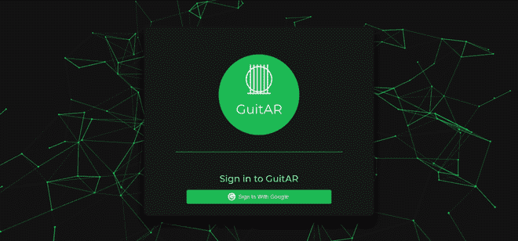
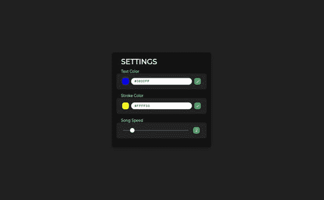
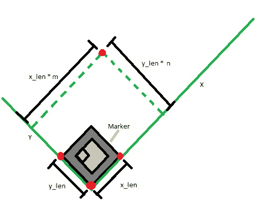
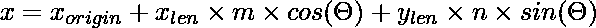
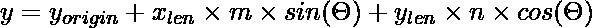
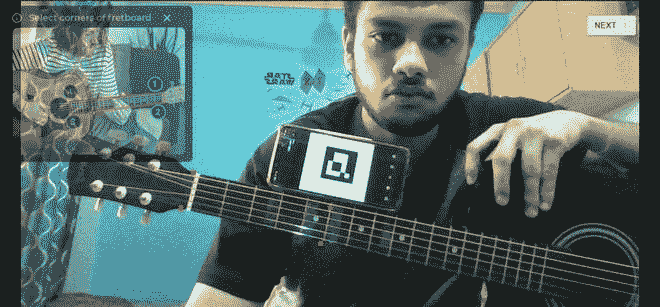
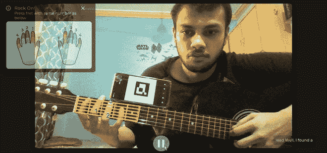

# 项目创意|利用 MERN 协议栈

搭建基于 AR 的音乐学习平台

> Original: [https://www.geeksforgeeks.org/project-idea-build-an-ar-based-music-learning-platform-using-the-mern-stack/](https://www.geeksforgeeks.org/project-idea-build-an-ar-based-music-learning-platform-using-the-mern-stack/)

在本文中，我们将构建一个基于 AR 的 Web 应用程序，名为吉他。 它通过将吉他上弹奏的琴弦投射到用户的摄像头上来教用户学习吉他。 现在，用户所要做的就是取出突出显示的字符串来播放一首特定的歌曲。 为了更好地理解，这里有一张示例图像。


最终结果。 附注：我们这里用的是手机，但打印的记号笔效果会更好。

我们将使用用于前端的 Reaction JS、用于后端的 NodeJS 上运行的 ExpressJS 和用于数据库的 MongoDB 来构建此项目。 我们还将使用 Selenium、BeautifulSoup4、Pymango 来构建我们的歌曲数据库，以及 ArucoJS，这是一个流行的 JavaScript 简历库。 我们还将使用 Firebase 身份验证将 Google 登录集成到应用程序中。 最后，我们将使用 Github 操作在 Heroku 上部署项目！

本文假设您了解 MERN 堆栈、腹板报废以及一些三角和坐标几何。 我们不会深入讨论基本的前端和后端代码的细节，因为已经有很多很棒的文章介绍了它，因此我们将主要关注该项目的 AR 部分。 您可以在 Github Repos 中查看完整的代码。

### 左：

*   **试用：**[https://globalguitar.herokuapp.com/](https://globalguitar.herokuapp.com/)
*   **抓取：**[https://github.com/prathameshbhalekar/GuitAR-scrapping](https://github.com/prathameshbhalekar/GuitAR-scrapping)
*   **前端：**[HTTPS：//github.com/Prathameshbhalekar/吉他-前端](https://github.com/prathameshbhalekar/GuitAR-frontend)
*   **后端：**[HTTPS：//github.com/Prathameshbhalekar/吉他后端](https://github.com/prathameshbhalekar/GuitAR-Backend)

**注：**在开始学习技术知识之前，让我们先熟悉一些吉他术语。

*   吉他表通常被称为“TAB”，是一种记录音乐的方法，使初学吉他的人能够快速而轻松地学习歌曲。 吉他标签与乐谱符号有相似之处，它向您显示要演奏什么音符、演奏多长时间以及使用什么技巧。 这些标签会在一首歌中不断变化。 我们将被要求维护这些标签的变化与数据库中歌词的关系。
*   指板(也称为微动乐器上的指板)是大多数弦乐器的重要组成部分。 它是一条细长的材料，通常是木头，压在乐器颈部的前面。 琴弦穿过指板，在螺母和琴桥之间。 要演奏这种乐器，音乐家需要将琴弦压到指板上以改变振动长度，从而改变音高。 这称为停止字符串。

**第一步：构建数据库-首先**，我们将在 MongoDB atlas 上创建一个数据库。 该数据库将包含前面提到的歌词和选项卡以及用户设置。 登录 MongoDB，创建集群，创建数据库。 我们将取消 https://www.ultimate-guitar.com/，但您可以选择任何其他方法。 蜘蛛的脚本可以在链接部分找到。 完成报废后，使用以下代码将数据保存到数据库中：

## 蟒蛇 3

```html
import os
import pymongo
from dotenv import load_dotenv
load_dotenv()

class Mongo:
    MONGODB_PASSWORD = os.environ.get("MONGODB_PASSWORD")

    # Replace this with your connection url from mongodb
    connection_url = "mongodb+srv://admin:" 
        + MONGODB_PASSWORD + 
        "@cluster0.jx3fl.mongodb.net/guitarappdb?retryWrites=true&w=majority"
    print(connection_url)

    client = pymongo.MongoClient(connection_url)

    songs = db["songsv2"]

    def __getSchema(self, title, artist, info1, info2, info3, data):
        return {
            "title": title,
            "artist": artist,
            "info1": info1,
            "info2": info2,
            "info3": info3,
            "data": data
        }

    def addSong(self, title, artist, info1, info2, info3, data):
        id = self.songs.insert_one(self.__getSchema(
            title, artist, info1, info2, info3, data
        ))
```

在它的末尾，数据库应该如下所示，其中<tag>包含选项卡：</tag>

```html
_id:ObjectId("604c6b18ab0d440efde7ae4f")
title:"Drivers License"
artist:"Olivia Rodrigo"
info1:""
info2:"Difficulty: novice"
info3:""
data:"[Verse 1]
      <tag>G</tag>  I got my driver’s license last week
       Just lik..."
```

**第二步：构建后端**

**1.设置-**创建一个文件夹并在其中运行**npm init**。 完成设置后，编辑**Package.json**使其如下所示：

```html
// package.json

{
  "name": "guitar-app-backend",
  "version": "1.0.0",
  "description": "",
  "main": "server.js",
  "type": "module",
  "scripts": {
    "test": "echo \"Error: no test specified\" && exit 1",
    "start": "node server.js"
  },
  "author": "<YOUR_NAME>",
  "license": "ISC",
}
```

这将允许在我们的应用程序中使用 ES6 语法。 现在使用 NPM 或纱线安装 EXPRESS、MOGOSE、DOTENV、CORS 和 NODEMON。

**2.创建模式-**我们将首先创建模式，以访问之前添加到数据库中的歌曲。

## JavaScript

```html
// dbSongs.js
import mongoose from 'mongoose'

const songsSchema = mongoose.Schema({
    title : String,
    artist : String,
    info1 : String,
    info2 : String,
    info3 : String,
    data : String
})

export default mongoose.model('songsv2', songsSchema)
```

现在，我们可以创建用户架构来保存用户设置。 由于我们没有存储任何敏感信息，如密码或财务数据，我们可以在没有任何安全措施(如加密)的情况下凑合使用。 我们将在构建前端时讨论“textColors”和“Gitar”等字段。

## JavaScript

```html
// dbUser.js
import mongoose from 'mongoose'

const userSchema = mongoose.Schema({
    email : String,
    displayName : {type : String, default : "User"},
    photoUrl : 
        {type : String, default : "<DEFAULT_PROFILE_PICTURE_URL>"},
    speed : {type : Number, default : 1},
    strokeColor : {type : String, default : "red"},
    textColor : {type : String, default : "black"},
    guitar : {
        m_ratio1 : {type : Number, default : 0},
        n_ratio1 : {type : Number, default : 0},
        m_ratio2 : {type : Number, default : 0},
        n_ratio2 : {type : Number, default : 0},
        m_ratio3 : {type : Number, default : 0},
        n_ratio3 : {type : Number, default : 0},
        m_ratio4 : {type : Number, default : 0},
        n_ratio4 : {type : Number, default : 0},
    }
})

export default mongoose.model('userInfo', userSchema)
```

**3.创建端点-**现在我们将编写 API 的端点。 端点的完整代码可以在链接部分的后端 repo 中找到。 一旦后端完成，就可以进行测试了。 运行**nodemon server.js**并使用 Postman 测试 API。 确保在运行之前设置.env 文件或将 MongoDB 连接 URL 更改为您自己的 URL(如果您计划公开代码，则不推荐这样做)。

**4.设置 CI/CD-**使用 GIT 将代码推送到存储库中的 GitHub。 创建 Heroku 应用程序，并在 GitHub 机密中添加 Heroku API 密钥和 MongoDB 密码。 另外，在 Heroku 环境下添加 MongoDB 密码。 现在，转到存储库，转到操作，并按如下方式设置新工作流：

```html
name: Build And Deploy

on:
  push:
    branches: [ master ]
  pull_request:
    branches: [ master ]

jobs:
  build:

    name : Build
    runs-on: ubuntu-latest

    strategy:
      matrix:
        node-version: [14.x, 15.x]
    env:
      MONGODB_PASSWORD: ${{secrets.MONGODB_PASSWORD}}

    steps:
    - uses: actions/checkout@v2
    - name: Install Node.js ${{ matrix.node-version }}
      uses: actions/setup-node@v2
      with:
        node-version: ${{ matrix.node-version }}

    - name: Install NPM Package
      run: npm ci

    - name: Build project
      run: npm run build --if-present
      env:
        CI: false

  deploy:
    runs-on: ubuntu-latest

    steps:
      - uses: actions/checkout@v2
      - name: Push to Heroku
        uses: akhileshns/heroku-deploy@v3.4.6
        with:
          heroku_api_key: ${{secrets.HEROKU_API_KEY}}
          heroku_app_name: "<YOUR_HEROKU_APP_NAME_HERE>"
          heroku_email: "<YOUR_HEROKU_EMAILID_HERE>"

      - name: Run a one-line script
        run: echo successfully run
```

**注意：**如果您计划添加 CI/CD，请确保使用.env 文件作为 MongoDB 连接 URL。

**第三步：设置前端**

**1.创建 Reaction 应用程序-**使用**npx create-reaction-app**创建 Reaction 应用程序。 清除默认应用程序并使用 NPM 或纱线安装以下依赖项：

<figure class="table">

| **dependency** | **function** |
| Aruco JS | Computer vision |
| 反应 GSAP | 。。。 ” | 阿西奥斯 | 联网 |
| 重火力点 | Google certification |
| 材质 UI 核心 | 用户界面 |
| 材质 UI 图标 | 用户界面 |
| 反应。 |
| React router | Routin |
| React player | Embed Vimeo video |
| Reaction webcam | Access to the webcam |
| Three JS | 3D graphics. ] | Animation background |

</figure>

**2.构建登录页面-**此页面将使用 Firebase 向用户显示 Google 登录弹出窗口。 获取 Google 账户数据后，如果用户已经存在，请使用**/api/v1/users/findbyemail**和**/api/v1/Users/Create**来创建新用户或获取用户设置。 从数据库获得用户数据后，将其存储到 redux 中，以便可以从任何位置访问它。 您可以从链接部分的前端 repo 获得完整的代码。 结果应该如下所示：



登录页

**3.构建歌曲页面-**此页面将包含用户可以播放的各种歌曲的列表。 这可以通过消费**/api/v1/Song/get**来构建。 该端点将分页、限制和查询作为请求查询，这将有助于分页和搜索功能。 它还应该包含导航到不同页面的导航栏。 您可以从链接部分的前端 repo 获得完整的代码。 页面应该是这样的：


所有歌曲页面

**4.添加设置页面-**此页面将允许用户设置 AR 投影的颜色和存储在数据库用户模式中的歌曲的速度。 可以从我们存储在 REDUX 中的用户数据访问当前值。 我们可以使用**/api/v1/Users/updateStrokeColor**、**/api/v1/Users/updateSpeed**和**/api/v1/Users/updateTextColor 来更新这些设置。** 完成后应如下所示：



设置

**步骤 4：构建 AR 帮助器函数**

现在，我们来看看这个项目中最艰难但最有趣的部分。 在开始之前，让我们先了解一下我们解决 AR 问题的方法。 在寻求解决方案之前，让我们先考虑一下我们对这个问题所做的一些假设，以获得更简单的解决方案。

#### 结论：

*   设置程序完成后，吉他上的标记位置不变。 这允许我们在设置期间存储位置数据，并在以后用于绘图。 如果位置改变，用户必须重新进行设置。
*   吉他与照相机平行。 这将问题简化为 2D 问题，更容易求解，也减少了计算量。 与解决它所需的额外设置和计算相比，计算第三维并不会增加太多功能。 我们可以通过确保标记的所有边都是相同的长度来检查这种情况，因为标记是正方形的。
*   我们相信用户可以在设置过程中精确地选择指导板的四个角。

现在，为了定位指点，我们将标记的三个角视为一个坐标系，使得中心角位于原点上，其余两个角位于 x 和 y 轴上。 现在我们有了轴，我们必须担心这些轴上的映射点。 我们不是存储 x 和 y 坐标的实际长度，而是将它们的比率与标记的大小一起存储，这使得我们可以根据标记离相机的距离来缩放距离。



映射点 WRT 标记

现在我们已经将点 WRT 映射到标记上，我们需要将它们 WRT 转换为画布坐标。 我们可以通过一些基本的三角学很容易地做到这一点。





现在我们可以用 JavaScript 编写相同的代码：

## JavaScript

```html
export default function Map  (origin_x, origin_y , x_axis_x, 
                               x_axis_y, m_ratio, n_ratio) {

    // Offset prevent division by 0
    const theta =  Math.atan((x_axis_y - origin_y) / 
        (x_axis_x - origin_x + 0.000000001))

    const m = Math.sqrt(Math.pow((origin_x - x_axis_x), 2)
        + Math.pow((origin_y - x_axis_y), 2)) * m_ratio

    const n = Math.sqrt(Math.pow((origin_x - x_axis_x), 2) 
        + Math.pow((origin_y - x_axis_y), 2)) * n_ratio

    var x_val = origin_x + m * Math.cos(theta) + n * Math.sin(theta)

    if(origin_x - x_axis_x > 0){
        x_val = origin_x - m * Math.cos(theta) - n * Math.sin(theta)
    }

    var y_val = origin_y + m * Math.sin(theta) - n * Math.cos(theta)

    if(origin_x - x_axis_x > 0){
        y_val = origin_y - m * Math.sin(theta) + n * Math.cos(theta)
    }

    return {
        x : x_val,
        y : y_val
    }
}
```

现在我们有了四个角，我们需要得到线条在黑板上的位置。 我们可以很容易地通过将矩形分割成相等的部分来做到这一点。 这可以通过以下功能实现：

## JavaScript

```html
const SplitLine =  (pt1, pt2, n) => {
    var ans = []
    n--;
    for(var i = 0; i <= n; i ++){
        var x = (pt1.x * (n - i)  + pt2.x * i) / n
        var y = (pt1.y * (n - i)  + pt2.y * i) / n
        ans.push({
            x : x,
            y : y
        })
    }
    return ans
}

export default SplitLine
```

现在我们有了这些点，我们所要做的就是把相反的点连接在一起来画线。 但在开始绘图之前，我们需要找到两个字符串的交点，以突出显示要按下的字符串。 我们可以使用以下使用基本几何体的函数来完成此操作：

## JavaScript

```html
const FindIntersection = (A, B, C, D) => {
    var a1 = B.y - A.y;
    var b1 = A.x - B.x;
    var c1 = a1*(A.x) + b1*(A.y);

    var a2 = D.y - C.y;
    var b2 = C.x - D.x;
    var c2 = a2*(C.x)+ b2*(C.y);

    var determinant = a1*b2 - a2*b1;

    if (determinant === 0)
    {
        return {x: -1, y: -1}
    }
    else
    {
        var x = (b2 * c1 - b1 * c2) / determinant;
        var y = (a1 * c2 - a2 * c1) / determinant;
        return {x: x, y: y};
    }
}

export default FindIntersection
```

现在我们有了在画布上绘制所需的一切。 这可以使用下面的代码来完成，该代码将画布、视频源、标记的当前位置、要突出显示的点的列表以及一些设置作为其参数：

## JavaScript

```html
import FindIntersection from "../Utils/FindIntersection";
import SplitLine from "../Utils/SplitLine";
import Map from "../Utils/Map";
const AR = require("js-aruco").AR;

const draw = (canvas, video, ptr, list, textColor, strokeColor) => {

  // list is the list of points to be highlighted
  var ctx = canvas.getContext("2d", { alpha: false });

  canvas.width = video.video.videoWidth;

  canvas.height = video.video.videoHeight;

  ctx.translate(canvas.width, 0);
  ctx.scale(-1, 1);
  ctx.drawImage(video.video, 0, 0, canvas.width, canvas.height);
  ctx.scale(-1, 1);
  ctx.translate(-canvas.width, 0);
  ctx.lineWidth = 5;
  const detector = new AR.Detector();
  var markers = detector.detect(ctx.getImageData(0, 0, 1280, 720));

  if (markers.length > 0) {
    const corners = markers[0].corners;
    let pt1, pt2, pt3, pt4;
    pt1 = Map(
      corners[1].x,
      corners[1].y,
      corners[0].x,
      corners[0].y,
      ptr.m_ratio1,
      ptr.n_ratio1
    );
    pt2 = Map(
      corners[1].x,
      corners[1].y,
      corners[0].x,
      corners[0].y,
      ptr.m_ratio2,
      ptr.n_ratio2
    );
    pt3 = Map(
      corners[1].x,
      corners[1].y,
      corners[0].x,
      corners[0].y,
      ptr.m_ratio3,
      ptr.n_ratio3
    );
    pt4 = Map(
      corners[1].x,
      corners[1].y,
      corners[0].x,
      corners[0].y,
      ptr.m_ratio4,
      ptr.n_ratio4
    );

    ctx.strokeStyle = `#${strokeColor}`;

    ctx.beginPath();
    ctx.moveTo(pt1.x, pt1.y);
    ctx.lineTo(pt2.x, pt2.y);
    ctx.lineTo(pt3.x, pt3.y);
    ctx.lineTo(pt4.x, pt4.y);
    ctx.lineTo(pt1.x, pt1.y);
    ctx.stroke();

    var top = SplitLine(pt1, pt2, 6);
    var bottom = SplitLine(pt4, pt3, 6);

    var i;

    for (i = 0; i < top.length; i++) {
      ctx.beginPath();
      ctx.moveTo(top[i].x, top[i].y);
      ctx.lineTo(bottom[i].x, bottom[i].y);
      ctx.stroke();
    }

    var right = SplitLine(pt3, pt2, 6);
    var left = SplitLine(pt4, pt1, 6);
    right.reverse();
    left.reverse();

    for (i = 0; i < right.length; i++) {
      ctx.beginPath();
      ctx.moveTo(right[i].x, right[i].y);
      ctx.lineTo(left[i].x, left[i].y);
      ctx.stroke();
    }

    if (list) {
      for (var pos = 0; pos < list.length; pos++) {
        ctx.font = "30px Arial";
        ctx.fillStyle = `#${textColor}`;
        var res = FindIntersection(
          top[list[pos].x - 1],
          bottom[list[pos].x - 1],
          {
            x: (left[list[pos].y - 1].x + left[list[pos].y].x) / 2,
            y: (left[list[pos].y - 1].y + left[list[pos].y].y) / 2,
          },
          {
            x: (right[list[pos].y - 1].x + right[list[pos].y].x) / 2,
            y: (right[list[pos].y - 1].y + right[list[pos].y].y) / 2,
          }
        );
        ctx.fillText(`${list[pos].fing}`, res.x, res.y + 5);
      }
    } else {
      console.error("Tab Not Found");
    }
  }

  ctx.stroke();
};

export default draw;
```

现在我们已经有了项目 AR 部分所需的代码，剩下的就是在设置过程中从用户单击中获得 m 和 n_ratio 了。(=。 这可以通过反转映射函数来实现。

## JavaScript

```html
const Plot = (origin_x, origin_y , x_axis_x, 
                 x_axis_y, x_val, y_val) => {

    const theta =  Math.atan((x_axis_y - origin_y) 
            / (x_axis_x - origin_x + 0.000000001))

    let a , b;
    if(origin_x - x_axis_x > 0){
        a = origin_x - x_val
        b = origin_y - y_val        
    } else {
        a = x_val - origin_x
        b = y_val - origin_y
    }

    const sin = Math.sin(theta)
    const cos = Math.cos(theta)

    const m = a * cos - b * sin
    const n = a * sin - b * cos

    const len =Math.sqrt(
        (Math.pow((origin_x - x_axis_x), 2) + 
        Math.pow((origin_y - x_axis_y), 2)))

    return {
        m_ratio : m / len,
        n_ratio : n / len
    }
}

export default Plot
```

**步骤 5：构建 AR 组件-**最后，我们准备好了构建 AR 组件所需的所有帮助器函数。 现在，我们可以通过调用 Draw 函数将它们与视图集成。

**1.构建设置页面-**此页面允许用户选择其吉他指板的四个角。 我们将使用前面构建的 Plot 函数将每个角的坐标转换为 m 和 n。 一旦我们有了所有四个角落的配额，我们就可以使用/api/v1/user/updateGuitar 将这些更新保存到我们的数据库中。 完成后，页面应如下所示：



**2.存储歌曲-**在制作练习页面之前，我们需要一种方法来处理从后台获取的歌曲并进行存储。 这可以通过以下功能实现：

## JavaScript

```html
const Song = (s) => {
    const LYRICS = 'LYRICS'
    const TAB = 'TAB'

    const list = []

    const getNext = (pos) => {
        pos += 5;
        var tab = ""
        var n = s.length;
        while(pos < n){
            if(s.charAt(pos) === '<')
                break;
            tab += s.charAt(pos)
            pos++;
        }
        return {
            pos : pos + 5,
            tab : tab
        }
    }

    var text = ""
    for (var i = 0; i < s.length; i++) {
        var c = s.charAt(i);
        if(c === '<'){
            if(text !=="")
                list.push({
                    data: text,
                    type: LYRICS
                })
            var tab;
            var res = getNext(i);
            tab = res.tab
            i = res.pos
            text = ""
            list.push({
                type: TAB,
                data: tab
            })
        } else
            text += s.charAt(i)
    }

    if(text !== '')
        list.push({
            type:LYRICS,
            data:text
        })
    return list

}

export default Song
```

**3.构建歌曲页面-**现在我们终于准备好构建用户将实际练习吉他的页面了。 首先，在加载时，我们将从查询中加载歌曲。 我们还将有称为位置，标签和文本的状态，这将是我们在歌曲列表中的位置，当前标签和歌词将分别显示。 在每个速度间隔之后(例如，如果速度为 2，则在 2 秒之后)，我们会将这些变量更新为歌曲中的下一个变量。 最后，我们将调用 requestAnimationFrame 内的 Draw 函数来高效地更新画布。 完整的代码可以在下面找到：

## JavaScript

```html
import React, { useState, useRef, useEffect } from "react";
import Webcam from "react-webcam";
import axios from "../../Utils/axios";
import "./PlaySong.css";
import { useSelector } from "react-redux";
import Song from "./../../Utils/Song";
import tabs from "./../../Utils/Tabs";
import Promt from "./../../components/Promt/Promt";
import Image from "./../../images/finger_coding.jpg";
import Draw from "../../hooks/Draw";
import RotateDevice from 
    "./../../animations/RotateDevice/RotateDevice";

export default function PlaySong(props) {
  const User = useSelector((state) => state.isLoggedIn).user;

  const webcamRef = useRef(null);
  const canvasRef = useRef(null);
  const points = useRef(null);
  const song = useRef(null);
  const pos = useRef(0);
  const tab = useRef(null);
  const getNextTimerId = useRef(null);
  const playButton = useRef(null);
  const strokeColor = useRef("Red");
  const textColor = useRef("Red");
  const speed = useRef(2);

  const [Text, setText] = useState("");
  const [IsPaused, setIsPaused] = useState(true);
  const [IsLanscape, setIsLanscape] = useState(
    window.matchMedia("(orientation: landscape)").matches
  );

  var supportsOrientationChange = "onorientationchange" in window,
    orientationEvent = supportsOrientationChange
      ? "orientationchange"
      : "resize";
  window.addEventListener(
    orientationEvent,
    function () {
      setIsLanscape(window.matchMedia(
          "(orientation: landscape)").matches);
    },
    false
  );

  function getNext() {
    console.log(pos.current);
    const LYRICS = "LYRICS";
    if (song.current) {
      if (pos.current < song.current.length) {
        if (song.current[pos.current].type === LYRICS) {
          setText(song.current[pos.current].data);
          pos.current = pos.current + 1;
        }
      }
      if (pos.current < song.current.length) {
        tab.current = song.current[pos.current].data;
        pos.current = pos.current + 1;
      }
      if (pos.current >= song.current.length) {
        if (playButton.current) 
            playButton.current.classList.toggle("pause");
        setIsPaused(true);
        pos.current = 0;
        setText("");
        tab.current = null;
        return;
      }
    }

    getNextTimerId.current = 
        setTimeout(getNext, speed.current * 1000);
  }

  const getAnimation = () => {
    const video = webcamRef.current;
    const canvas = canvasRef.current;
    const ptr = points.current;
    if (video && canvas) {
      var list = tabs.get(tab.current);
      Draw(canvas, video, ptr, list, 
          textColor.current, strokeColor.current);
      window.requestAnimationFrame(() => {
        return getAnimation();
      });
    }
  };

  useEffect(() => {
    var Query = new URLSearchParams(props.location.search);
    const getSongUrl = "/api/v1/songs/getFromTitle?title=" 
                + Query.get("title");
    axios.get(getSongUrl).then((res, err) => {
      if (err) alert(err);
      else {
        song.current = Song(res.data.data);
        console.log(song.current);
      }
    });

    const getAccountUrl = 
        "/api/v1/users/findbyemail?email=" + User.email;
    axios.get(getAccountUrl).then((res, err) => {
      if (err) alert(err);
      else {
        points.current = res.data.guitar;
        speed.current = res.data.speed;
        textColor.current = res.data.textColor
        strokeColor.current = res.data.strokeColor
      }
    });

    window.requestAnimationFrame(getAnimation);
  }, []);

  const videoConstraints = {
    width: 1280,
    height: 720,
    facingMode: "user",
  };

  const playPause = (e) => {
    e.target.classList.toggle("pause");
    if (IsPaused) getNext();
    else if (getNextTimerId.current) 
        clearTimeout(getNextTimerId.current);

    setIsPaused(!IsPaused);
  };

  return (
    <>
      {!IsLanscape ? (
        <RotateDevice />
      ) : (
        <div className="playsong__container">
          <canvas ref={canvasRef} className="playsong__canvas" />
          <div className="play__pause__button__container">
            <div
              class="play play__pause__button"
              onClick={playPause}
              ref={playButton}
            />
          </div>
          {Text === "" ? null : <p className="lyrics">{Text}</p>
}
          <div className="playsong__promt_area">
            <Promt
              text="Rock On!"
              description="Press fret with same number as below "
              img={Image}
            />
          </div>
          <Webcam
            className="playsong__cam"
            audio={false}
            ref={webcamRef}
            style={{ width: "0%", height: "0%" }}
            videoConstraints={videoConstraints}
          />
        </div>
      )}
    </>
  );
}
```

最后，该页面应该如下所示：



**4.设置 CI/CD-**使用 GIT 将代码推送到存储库中的 Github。 创建你的 Heroku 应用程序，并在 GitHub 机密中添加 Heroku API 密钥。 现在，转到存储库，转到操作，并按如下方式设置新工作流：

```html
name: Build And Deploy

on:
  push:
    branches: [ main ]
  pull_request:
    branches: [ main ]

jobs:
  build:

    name : Build
    runs-on: ubuntu-latest

    strategy:
      matrix:
        node-version: [14.x, 15.x]
        # See supported Node.js release schedule 
        # at https://nodejs.org/en/about/releases/

    steps:
    - uses: actions/checkout@v2
    - name: Install Node.js ${{ matrix.node-version }}
      uses: actions/setup-node@v2
      with:
        node-version: ${{ matrix.node-version }}

    - name: Install NPM Package
      run: npm ci

    - name: Build project
      run: npm run build
      env:
        CI: false

  deploy:
    runs-on: ubuntu-latest

    steps:
      - uses: actions/checkout@v2
      - name: Push to Heroku
        uses: akhileshns/heroku-deploy@v3.4.6
        with:
          heroku_api_key: ${{secrets.HEROKU_API_KEY}}
          heroku_app_name: "<HEROKU_APP_NAME_HERE>"
          heroku_email: "<YOUR_HEROKU_EMAIL_HERE>"

      - name: Run a one-line script
        run: echo successfully run
```

**输出：**现在我们可以试用已部署的应用程序，它应该如下所示：

<video class="wp-video-shortcode" id="video-642737-1" width="640" height="360" preload="metadata" controls=""><source type="video/mp4" src="https://media.geeksforgeeks.org/wp-content/uploads/20210525215707/final-video.mp4?_=1">[https://media.geeksforgeeks.org/wp-content/uploads/20210525215707/final-video.mp4](https://media.geeksforgeeks.org/wp-content/uploads/20210525215707/final-video.mp4)</video>

**应用程序：**

*   Guit.ar 将学习速度提高了约 40%。 它通过向用户提供实时视觉反馈来帮助建立肌肉记忆。 视觉反馈(VfB)已被证明可以促进运动学习的习得和保持阶段，这与学习吉他等可达任务的训练有关。
*   对于音乐机构和大学来说，Guit.ar 是一个很好的补充。 这对远程学习很有帮助，特别是在封锁期间。
*   学吉他伴随着在你弹奏任何歌曲之前学了很多多余的东西。 从第一天开始，Guit.ar 就可以帮助你清理杂乱，开始播放有趣的音乐。
*   用户可以使用 Guit.ar 将吉他变成音乐游戏。 它把吉他变成了街机游戏，目标是在特定的时间内敲击突出显示的琴弦。

**队友：**[https://auth.geeksforgeeks.org/user/ayushpandya517/](https://auth.geeksforgeeks.org/user/ayushpandya517/)