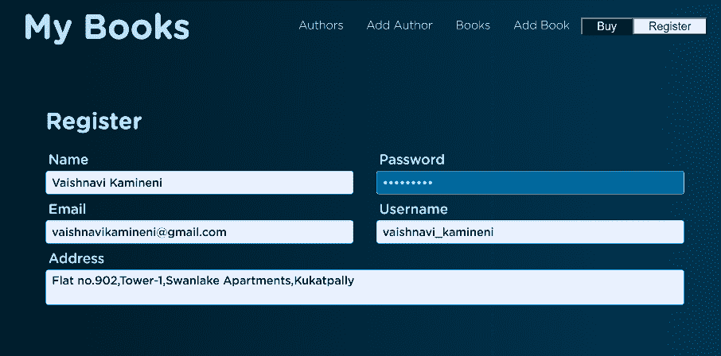
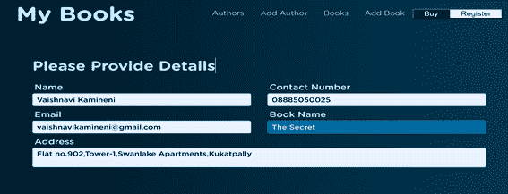
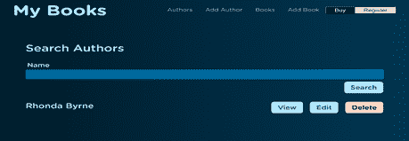
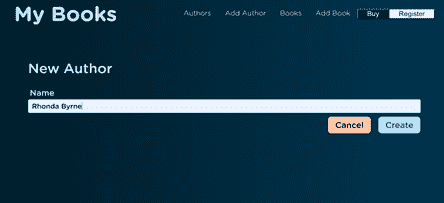
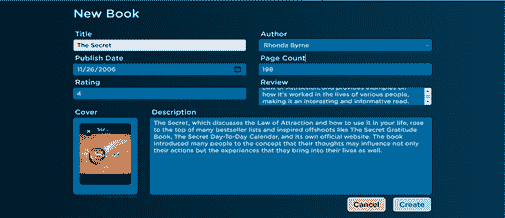
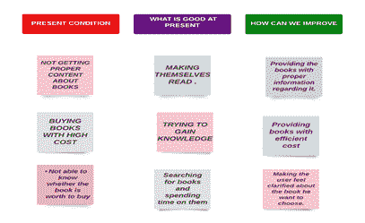
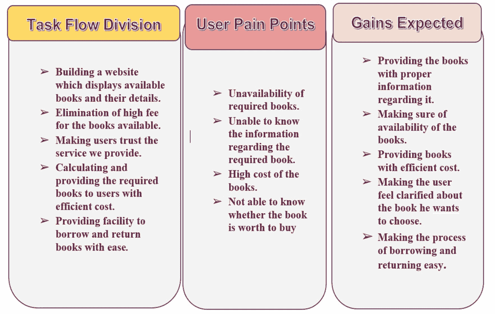
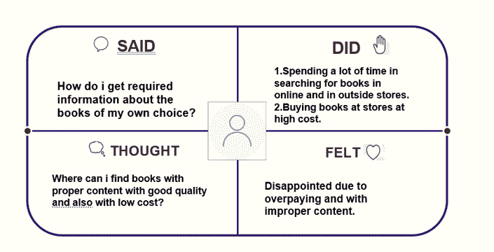

# 项目创意|会议厅

> Original: [https://www.geeksforgeeks.org/project-idea-chamber/](https://www.geeksforgeeks.org/project-idea-chamber/)

大多数对读书感兴趣的人找不到关于市场上最新书籍的适当信息和评论。 这里出现的问题是，读者数量可能会下降，也会让初学者读者望而却步，这对阅读没有好处，因为阅读发展了许多技能，这是个性发展的一种创造。 商会是一个网站，旨在提供与特定领域相关的各种图书的基本信息。 人们可以发表关于新书的评论，这样每个人都可以找到关于市场上的书籍的信息和评论。 这个门户网站被证明是提供书评的有效手段。

**会议厅：**会议厅是一个可以在任何设备上运行的宜人网站。 注册后，用户将能够找到他们选择的从旧书到新书的所有书籍。 用户可以选择借书，甚至可以低价购买，因为纸质书和电子书都可以买到。 用户可以根据自己选择的作者搜索不同类别的图书。

用户可以联系他们提出的任何问题。 我们提供了反馈会议，以便我们可以在此基础上更好地改进我们的服务。

**用法和特点：**首先，用户可以在网站上注册以访问他们选择的图书。 用户可以有自己的帐户来保存他们已经读过的书或他们想要读的书的集合。 用户将拥有关于他们搜索或阅读的书籍的所有细节。

在这里，用户将注册要提供的图书。

图书根据用户的选择进行显示。

如果用户希望购买这本书，那么用户可以在这里以非常低的价格购买即将上市的电子书。

用户可以搜索他们最喜欢的作者(如果有的话)，甚至可以通过单击查看选项将信息或图书列表添加到列表中，并在以后编辑甚至查看它们。 用户可以在删除选项的帮助下删除他们在列表中添加的任何不需要的信息或书籍。

用户可以在创建按钮的帮助下将作者添加到他们选择的列表中，也可以在取消按钮的帮助下取消。

当用户将他们最喜欢的书添加到网站时。 将显示与其相关的图书信息。

**创意-头脑风暴：**

对我们的解决方案进行了深思熟虑。 被认可的主要技术是集思广益。 阐述了目前的现状、目前的优势所在，以及如何改进这一现状。

**服务体验周期：**

**图表：**

**用于构建此项目的工具和技术：**

*   超文本标记语言
*   CSS
*   引导条纹
*   JavaScript
*   MongoDB

**可交付工作的范围(或范围内)：**

*   **可视化-**读者可以在阅读书籍时通过可视化人物来提高他们的可视化程度。
*   **同理心-**读者可以提高他们的同理心
*   **非营利性-**由于我们的网站不是营利性网站，读者无需任何订阅即可阅读评论。
*   **决策-**读者可以通过阅读书籍、阅读书籍和经历不同的场景来提高决策技能，这可以帮助我们在现实世界中做出决策。 无法交付(超出范围)

**未来升级：**这些是我们计划构建的一些即将推出的功能。

*   图书评级将提供，因为用户可以给 5 星和评级图书。
*   用户将把他们自己的创意故事添加到网站上，并能够在网站上创建他们自己创作的创意小说专辑。
*   用户将能够在没有任何限制和支付的情况下发布它们。
*   每月完成超过 6 本书的阅读。 根据用户的选择，用户将获得免费的电子书，因为用户可以选择将哪种图书送到他们的地址。
*   用户将能够以较低的费用出售或在网站上免费赠送他们的旧书或未使用的书籍。

这些变化将正在进行中，并将增强和激励用户对阅读书籍更感兴趣。 阅读的力量会放松你的身心，带你到另一个层面的幸福。