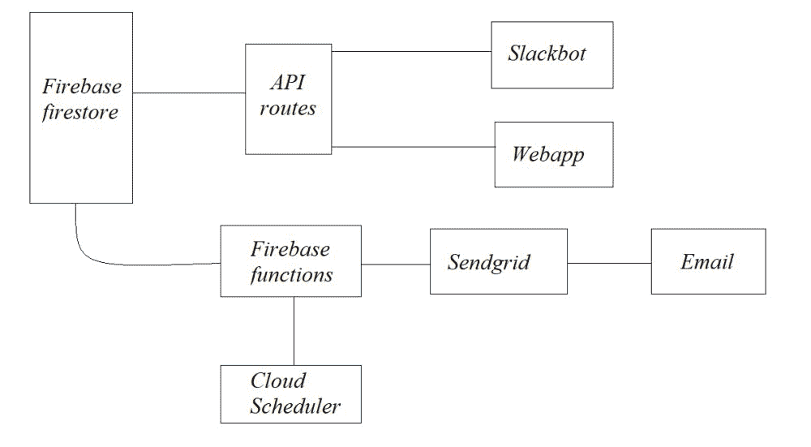

# 项目创意|FILEit-在线申报系统

> Original: [https://www.geeksforgeeks.org/project-idea-fileit-an-online-filing-system/](https://www.geeksforgeeks.org/project-idea-fileit-an-online-filing-system/)

FILEit 是一个在线申报系统，用户可以在其中保留其购买和随之而来的额外津贴的记录。 这是一款网络应用程序，旨在缓解用户对产品的售后体验。 它不仅可以帮助用户节省时间，还可以节省金钱。

**目标：**让我们举个真实的例子，假设你购买了冰箱以外的产品，一段时间后你遇到了一些问题，比方说门灯停止工作。 所以你显然要求保修。 但大多数情况下，你会忘记要求保修，因为投诉是件麻烦事。 首先，您必须找到您的收据，然后查找保修期，然后致电客服并提供各种序列号。 和细节，这真的是一项漫长而痛苦的任务。 由于懒惰，通常会发生的情况是，我们忘记了及时要求产品保修，然后不得不支付巨额维修费。

FILEit 是一款专为解决这一问题而设计的网络应用程序。 首先，FILEit 将您所有的账单、保险单等存储在一个地方。 它还会向您发送提醒，提醒您保修即将过期，以便您可以申请保修。 不仅如此，您还可以直接将所有产品详细信息直接发送到公司邮件，并轻松安排与技术人员的预约，从而节省您的金钱和时间。

**使用的工具：**

*   **框架：**
    *   重火力点
    *   快递
    *   作出反应 / 敌视 / 反对 / 产生不良心理反应
    *   节点 JS
    *   GCP 工具
*   **开发：**
    *   码头工人
    *   赫罗库

**必备技能集：**您应该很好地掌握 ReactJS、CSS 等 Web 技术，以及 Firebase 等数据库。

**实施：**

1.  首先，我们创建 API 路由以将数据存储在 Firebase 中。
2.  然后，我们创建通过 SendGrid 发送邮件的 API 路由。
3.  然后，我们需要将这些路由自动化，以便自己向用户发送邮件，这样就可以获得有关其产品保修的提醒。 为此，我们使用了一个具有 Firebase 功能的云调度器，该调度器每天自动运行代码。
4.  然后在 Reaction 中对网站的前端进行了设计。
5.  然后我们使用 docker 创建了一个图像。
6.  并最终将其部署在 Heroku 上。

**项目申请：**

1.  该项目将帮助用户将他们所有的产品收据保存在一个地方，因此他们将更容易获得这些收据，而不是在活页夹和文件夹中查找收据。
2.  它还将允许用户只需单击一个按钮即可进行投诉，从而省去了拨打客户关怀电话的麻烦。 在他们烦人的排队等候，然后给他们产品序列号。 以及所有的细节。
3.  它还会发送提醒，告诉用户产品保修期即将到期，这样如果产品出现问题，他就可以及时申请保修期，免去了保修期过后必须支付的费用。

**愿景：**为了创建一个集中的归档系统，以便轻松汇总您所有的采购，并定期提醒您保修或保修过期，我们希望优化计费并提供多模式支持。 例如，扫描钞票以制作手写文档的软拷贝，支持以多种语言编译的钞票。 我们还致力于将客户和客户联系起来，澄清用户可能遇到的任何问题。 我们看到的未来是，每个供应商、家庭和企业都使用 FILEit 来编制他们的账单，并且不断地被提醒产品附带的服务。

**团队成员：**

1.  亚什·班萨尔
2.  卡兰·夏尔马
3.  贾耶什·瓦苏德娃

**项目演示：**

<video class="wp-video-shortcode" id="video-655638-1" width="640" height="360" preload="metadata" controls=""><source type="video/mp4" src="https://media.geeksforgeeks.org/wp-content/uploads/20210611235921/FILEit-pitch.mp4?_=1">[https://media.geeksforgeeks.org/wp-content/uploads/20210611235921/FILEit-pitch.mp4](https://media.geeksforgeeks.org/wp-content/uploads/20210611235921/FILEit-pitch.mp4)</video>