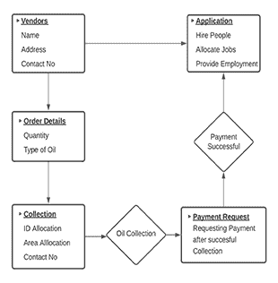
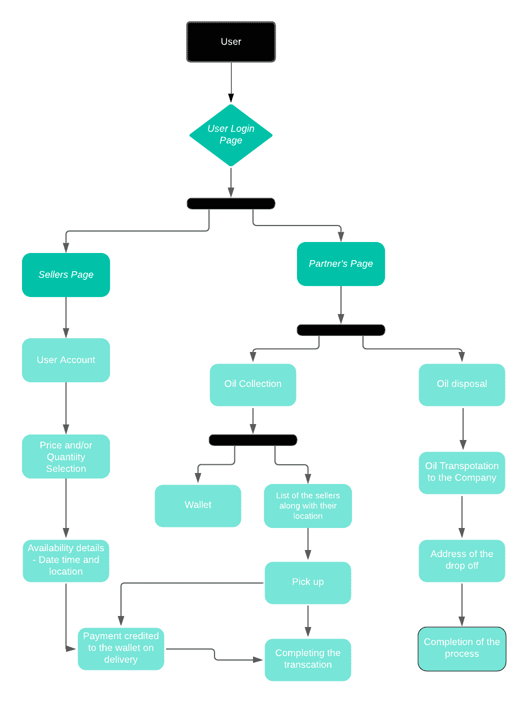

# 项目创意|燃料平衡

> Original: [https://www.geeksforgeeks.org/project-idea-fuel-balance/](https://www.geeksforgeeks.org/project-idea-fuel-balance/)

这个想法是为了制作一款应用程序，帮助纠正废旧食用油回收(UCO)方面的供需缺口。 UCO 的无人监督释放已经成为一个环境安全问题，是小商贩失去的一个机会，他们可以利用它来赚取收入，将其提供给大公司进行回收利用。 我们的目标是创建一个平台，既能以最优雅的方式处理这两个问题，又能为就业和创收让路。 对于小商贩/商店来说，通过废品赚钱的想法并不常见。 这是因为缺乏信息流，无法满足所需的需求。 通过这款 APP，我们将为卖家(卖家)带来额外的收入，并满足买家(公司)对再循环的大量需求。

**二手食用油危机：**二手食用油是指在食品加工业、餐馆、快餐和家庭消费层面用于烹饪或油炸的油和脂肪。 欧洲废物目录(EWC)将其归类为城市废物(家庭废物和类似的商业、工业和机构废物)，包括单独收集的部分。

UCO 之所以成为环境的一个突出问题，是因为它会造成毁灭性的物理影响，比如在动植物身上涂上石油，使它们因氧气耗尽而窒息。 涂有动物脂肪或植物油的水禽和其他鸟类、哺乳动物和鱼类可能会死于体温过低、脱水、腹泻或饥饿。 它是有毒的，并形成在环境中滞留多年的有毒产品。 UCO 还会破坏未来和现有的食物供应、繁殖动物和栖息地。 它会产生腐臭的气味，肮脏的海岸线，堵塞水处理厂，并在有点火源的情况下着火。

**实施的有效方法：**UCO 也是餐厅老板和其他企业在处置方面面临的最大麻烦之一。 处理 UCO 的有效方法是回收利用它。 政府沿线的许多大公司，如*SpillFix Ltd，Sequence，Prajwala BioEnergy，AADHUNIK global Energ*Y，都在全球层面上致力于这一项目。

回收使用过的食用油不仅对环境有利，而且对你的财务也是明智之举。 全球二手食用油市场正在快速增长，*联合市场研究报告*预测，到 2026 年，市场规模将增长到惊人的 88.9 亿美元。 2019 年，印度生产燃料生物柴油用食用油的进料量为 5 万吨。 用过的食用油主要来自食品加工业、餐馆、酒店和食品经营者。

**目标：**将有剩馀食用油的小卖家(卖家)与可以从中提取生物燃料的企业(买家)联系起来，以最大限度地减少资源浪费和污染。

**简介：**我们的目标是把这个主动权带到它无法触及的地方。 小商贩/食肆(卖家)没有大量使用食用油，因此无法满足公司(买家)的需求。 他们也缺乏回收 UCO 的意识。 UCO 的不当处置不仅破坏了栖息地，还失去了赚取额外收入的机会。 回收废油的公司(买家)向供应商支付提供材料的费用。 我们的动机是把这些小型企业集中起来，收集所需数量的材料，然后卖给买家，买家再循环使用。 通过这种方式，居住在较小地区的人们可以赚更多的钱，对这种冒险的认识也会传播开来。 我们的客户、供应商(卖家)和组织(买家)都将从参与这一行动中获益。

**使用的工具：**

*   反应本原
*   该框架的后端是在 Python3 的 Django 框架中编写的。
*   AmazonWeb 服务

**概念：**

卖方将被要求将他们的信息提供给我们以供定位，并将他们包括在我们的合资企业中。 他们的联系人将被我们的后勤人员用来识别和定位他们，而他们的账户信息将被用来进行货币交易。 卖家将被给予他们可以参与的选择权。 在他们达到标准之前，他们可以进行的交易数量将没有限制。 一旦收款过程完成，付款将通过闭合钱包的方式完成，这使其成为一个亲力亲为的过程。 这一过程的第二部分将是与买家的交换。 石油将被送到提供最好价格和数量的公司，他们将把材料带到哪里，它会通过核对清单(核实石油的质量)，并完成交易。

这种交换循环将帮助我们创造就业机会，提供清洁的栖息地，并创造更多的资金来源。

**应用布局：**

**登录：**应用程序将在用户可以访问其帐户的登录页面上打开。 这款应用程序将有两个方面，一个是针对卖家(供应商)的，他们将成为材料供应商，并将获得服务的报酬；另一个是合作伙伴的页面，在那里将进行从卖家那里收集石油并将石油存放给买家的管理。

**销售商页面：**此站点将包含与供应商相关的所有详细信息。 商贩可以从他们能提供的石油数量到每升石油能赚多少钱中进行选择。 他们的活动和付款历史将被记录下来，并可在以后由他们查看和编辑。

**合作伙伴页面：**本网站将有两个页面用于收集和处置石油。 收取石油的员工将在 APP 上的钱包中获得固定金额的钱，他将通过钱包当场完成与卖家的交易。 他还将得到卖家的名单以及他们的位置。 将石油运输到公司(买方)的员工将被告知交接地点。 这一系列事件将同时发生，完成整个过程。

**团队成员：**

*   高里·冈瓦尔(Gauri Gangwar)
*   普拉纳夫·泰亚吉
*   Madhup Juneja
*   萨玛斯·萨利姆