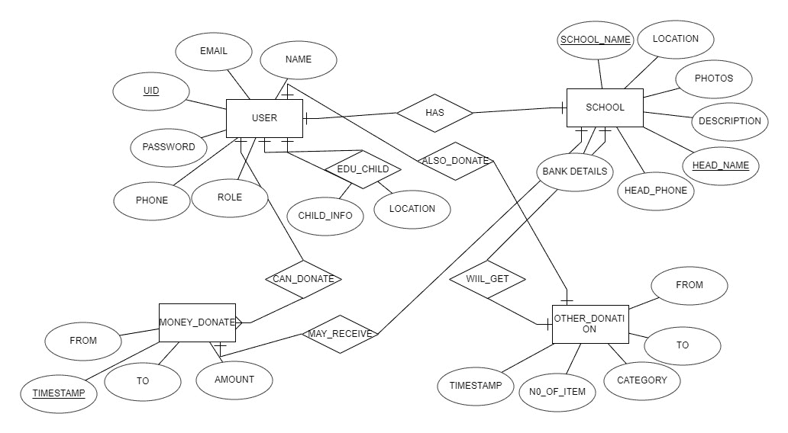

# 项目创意|官立学校福利平台

> Original: [https://www.geeksforgeeks.org/project-idea-government-school-welfare-platform/](https://www.geeksforgeeks.org/project-idea-government-school-welfare-platform/)

印度是一个多元化的国家，有来自社会各个阶层的人。 有些人负担得起为孩子提供优质教育，但有些人就没那么幸运了。 大多数贫困和脆弱的学生在公立学校免费学习，直到 14 岁。但公立学校正在慢慢消失。

尽管公立学校提供免费教育，但家长们仍然不愿让他们的孩子进入公立学校，更愿意在私立学校花费 1 万卢比。 公立学校失败的最大原因之一是没有适当的基础设施，主要是因为这些公立学校的入学条件很差。

**目的：**这款应用程序的目的是帮助印度的公立学校，这样即使是最贫穷的人也能得到高质量的教育。

**实施：**我们的想法主要是通过提供众包平台来改善公立学校的现状。 来自这些官立学校的外来者、教师或校长都可以利用我们的平台分享他们的困难和需求。 愿意提供帮助的人可以捐款(直接进入政府学校的银行账户)，也可以通过提供书写板、书桌、长凳等直接帮助学生。

还有多个其他功能，如提供告示板功能，人们将收到政府或私人机构提供的任何奖学金或计划的通知。 门户上发布的所有内容都将发布在我们所有的社交网络上，以便许多人了解这一问题。

公立学校的教师还有额外的工作要做，要确保当地贫困和脆弱的学生上学。 但在村子或地方四处寻找没有上学的孩子会变得忙碌起来。 所以我们增加了一个部分，人们可以直接通知当地学校的老师或校长关于这些孩子的情况。

**特性**：以下是我们应用程序上的屏幕

*   **首页：**首页将列出学校新增的所有帖子。 用户可以点击个人卡片了解更多关于学校及其需求的信息。
*   **通知页面：**这里将列出所有学生的成绩、新的奖学金。
*   **社交媒体：此处列出了来自其他用户的帖子或来自社交媒体的无人参与帖子。**
*   **捐款页面：**用户可以直接向学校捐款或捐赠物资。
*   **简档页面：**此页面将包含交易和其他用户数据的所有详细信息。 人们可以添加自由漫游或童工的照片。 校长，教师在他们的个人简介部分得到通知。
*   **搜索栏：**人们可以搜索他们喜欢的学校并进行相应的捐赠。 搜索基于 PIN 代码、学校名称或位置。
*   **登录和注册页面：**这些是常用的登录和注册页面。 教师和教授的角色是通过与当地政府官员复核(使用 DFS)来分配的。

**项目是做什么的？**

我们的应用程序将偏远和落后的学校与可以通过任何方式帮助他们的人联系起来。 随着功能的进一步增加，这款应用还旨在帮助孩子们从愿意教学的人那里学习新技能。

**使用的工具和技术：**

*   反应本原
*   节点 JS
*   Mongo DB 数据库
*   用于社交媒体集成、位置和支付网关的 API

**构建项目所需的技能集：**

1.  Reaction Native for Android 应用程序开发
2.  UI 和 UX 设计
3.  后端开发
4.  数据库设计、开发和管理

**ER 图：**

**应用程序**：

1.  我们的平台主要致力于改善印度公立学校的基础设施条件，以便即使是最贫穷的人也能接受优质教育。
2.  所有与政府和私人计划和奖学金相关的信息都发布在这个平台上，这样很多学生就可以从中受益。
3.  通过让附近的人能够通知自由漫游的孩子和童工，减少了公立学校教师要做的工作量。
4.  社交媒体整合有助于将学校带到成千上万人的聚光灯下。

**团队成员：**

*   瓦伦
*   Manjukrishna