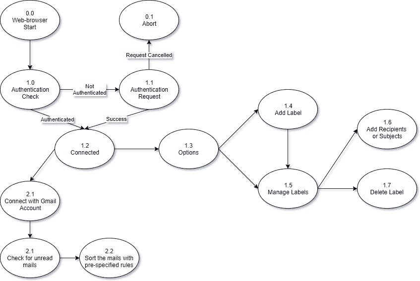
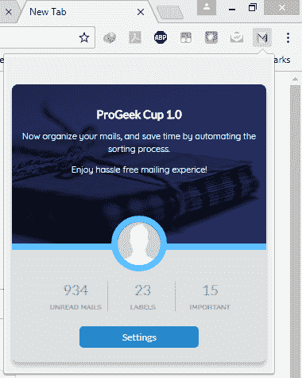
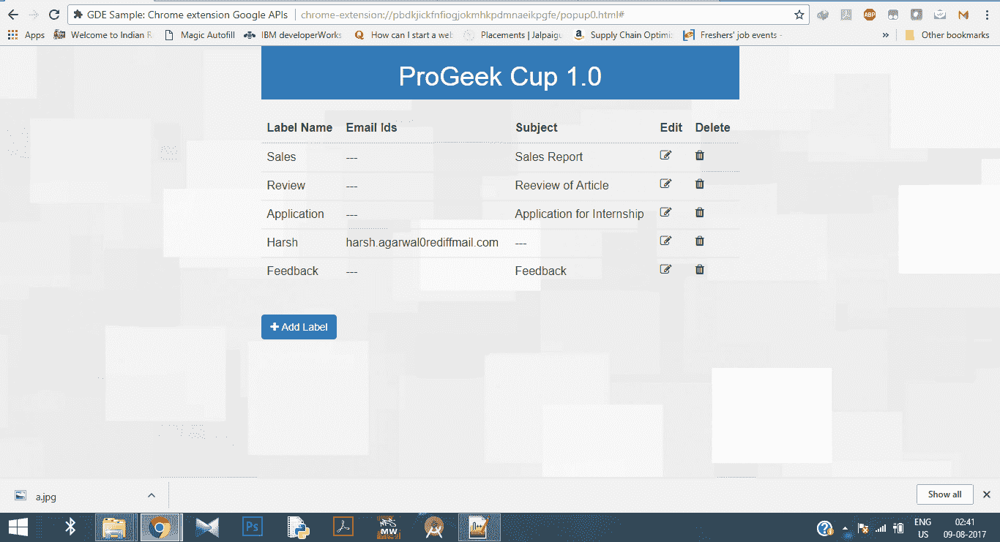

# 项目创意|创新电邮

> Original: [https://www.geeksforgeeks.org/project-idea-innovate-email/](https://www.geeksforgeeks.org/project-idea-innovate-email/)

**项目标题：创新电子邮件**

**简介：**在当今时代，互联网在沟通或与人保持联系方面发挥着重要作用，无论是与你的大学朋友，还是与你的校长或项目导师等。所有这些对话的不同之处在于沟通的媒介，就像你可以使用 Facebook 或任何其他社交媒体网站与你的朋友联系一样，但同时当你想要向你的校长发送休假申请时，你必须使用电子邮件。 该项目旨在使通过电子邮件进行的对话更加方便。 电子邮件主要用作组织内部的沟通方式。 组织中职位较高的人每天都会收到来自组织中其他人的大量邮件，他们还必须跟踪这些电子邮件，并定期回复这些电子邮件。 但是，如果你每天收到大约 100 封来自特定人或根据特定主题的电子邮件，而你想稍后处理其中的一些电子邮件，那该怎么办呢？ 你很难记下这些邮件的来龙去脉。 您可以手动将这些邮件移动到特定标签下，以跟踪未处理的电子邮件。
因此，我们开发了这个项目，以便轻松跟踪电子邮件。 在这个项目中，我们为 Gmail 开发了一个 Chrome 扩展。 您只需向此扩展提供标签名称和电子邮件地址或主题行(电子邮件主题)。 现在，每当您收到来自指定电子邮件或主题行的电子邮件时，您的电子邮件都会自动移动到指定标签下。
现在假设您是一家公司的销售经理，有 10 名其他员工在您的手下工作。 现在，你肯定每天都会收到这 10 个人发来的大量电子邮件。 有时可能会发生您想要稍后处理一些电子邮件的情况。 因此，您可以使用人名创建 10 个不同的标签，并在扩展中提供这些标签的名称和这些人的电子邮件 ID。 现在，无论您何时收到这些人发来的电子邮件，邮件都会自动移到特定标签下。 现在，由于这些标签下的电子邮件比你的收件箱少得多，而且在特定标签下有标签名称的未读电子邮件的计数，所以你将更容易跟踪收到的电子邮件。

**流程图**

**实施**

上面的流程图完整地说明了该扩展的工作原理。 当用户第一次在 Chrome 浏览器中安装该扩展时，该扩展将显示一条弹出消息，要求对 Gmail 帐户进行身份验证。 按下 YES 后，将引导用户完成授权过程。 一旦用户成功授权，然后单击工具栏中的扩展图标，他们将看到如下所示的弹出屏幕：

如您所见，此弹出窗口将显示用户的个人资料图像、未读邮件数量和其他重要信息。 这些信息是使用[Gmail API](https://developers.google.com/gmail/api/)从用户的 Gmail 帐户获取的。 在授权时，用户必须给予修改标签的许可。 用户可以使用底部的设置按钮来映射电子邮件或使两者都符合特定标签。 一旦用户单击设置按钮，他将被重定向到一个新页面，如下所示：

单击“Add New”按钮后，将使用 Ajax 显示一个新表单。 此表单将包含标签名称、电子邮件或主题等字段，如上面的屏幕截图所示。 一旦用户提供了该信息，将在用户的收件箱中搜索来自该电子邮件 ID 或具有该特定主题段的邮件，然后该标签将被给定标签修改。 用户可以使用提供的编辑或删除按钮来管理标签。

**使用的工具：**Gmail API、Bootstrap 框架。

**应用：**这个扩展解决的问题主要是在组织中工作的人或在一些正式工作中遇到的问题。

**未来展望：**这个项目旨在解决数百万人面临的共同问题。 这是一个完全创新的想法，目前 Chrome 商店还没有这样的扩展。 这一扩展目前正在开发中，不久将在 Chrome 商店推出，但在此之前，我们正试图在这一扩展中添加一些新功能，并使现有功能更高效。 在未来，我们将尝试添加更多功能，如下所示：

*   我们可能会为根据特定主题行接收的邮件提供自动回复功能。 假设您收到的邮件主题为“暑期实习申请”，在申请期限结束后，任何带有此主题行的邮件将自动回复为“申请期限已结束”。
*   我们可能包括类似于上面的自动删除功能，在该功能中，从列入黑名单的电子邮件 ID 接收的邮件将被自动删除。 这将为用户节省大量时间。

我们可能会包括上面列出的更多功能。 该产品将为组织电子邮件提供新的视野。

加入时间：清华大学 2007 年 01 月 25 日下午 3：33

*   [https：//developers.google.com/gmail/api/](https://developers.google.com/gmail/api/)
*   [https：//developer.chrome.com/extensions/getstarted](https://developer.chrome.com/extensions/getstarted)

**团队成员**：

1.  Pronab Mukherjee[**[Pronab Mukherjee[T2\]T3]**](https://www.facebook.com/profile.php?id=100008242264696)
2.  #T0##Hash Agarwal#T2#

**注**：这个扩展很快就会在 Chrome 商店正式发布。 我们在评论中强烈鼓励您提出改进意见。