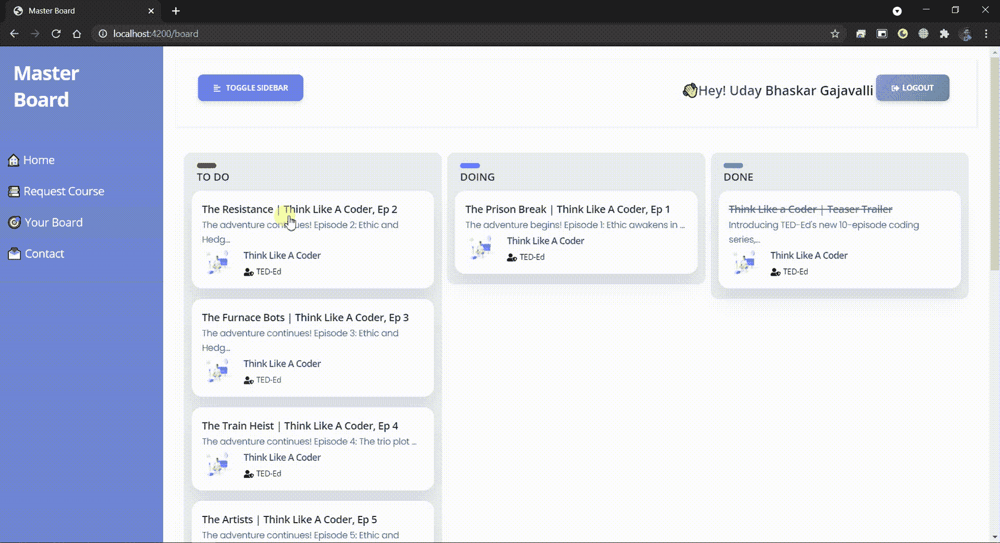
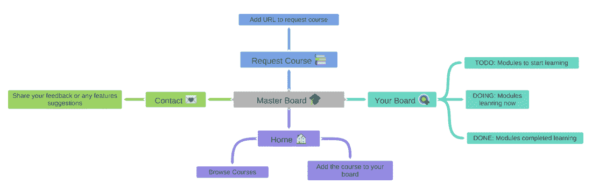
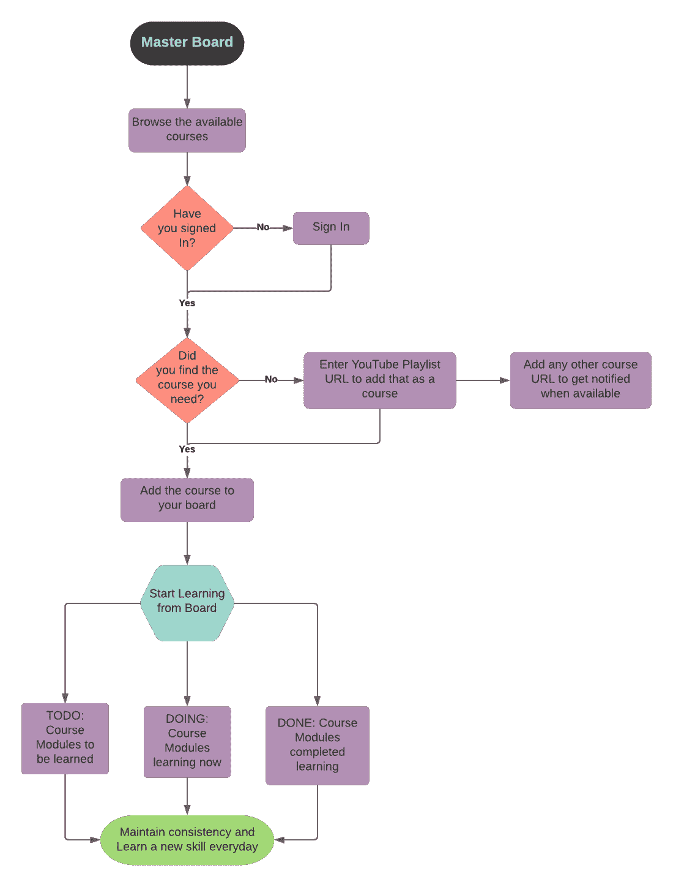

# 项目创意|主板-使用生产力工具提升您的学习曲线

> Original: [https://www.geeksforgeeks.org/project-idea-master-board-boost-your-learning-curve-with-productivity-tool/](https://www.geeksforgeeks.org/project-idea-master-board-boost-your-learning-curve-with-productivity-tool/)

**简介：***您是学生吗？ 在网上找不到最好的电子学习资源？ 无法跟踪您的学习进度？ 这场流行病是否影响了你的学习曲线？*

**Master Board-**Web 应用程序，它实际上是一种提高学习效率的工具，您可以在其中搜索在线提供的最佳推荐课程，并通过我们的**看板方式学习**开始学习，以跟踪您的学习进度。 所有这些都离你的 Chrome 新标签只有一键之遥。 是的，你没听错，你可以把它添加为你的***Chrome 扩展*****。** 这还不是全部，您可以添加您最喜欢的 YouTube 播放列表作为课程，通过我们的看板学习有效地保持进度。

如前所述，Web 应用可以通过 URL 访问，也可以通过添加 Chrome 扩展来访问。 用户可以通过他们的 Google 账户进行认证，然后开始学习。

主页和课程概述

**拖放-**您只需将课程模块拖放到待办事项部分。 要开始并跟踪进度，请将模块拖放到 Do 部分并继续。 完成后，在“完成”部分中拖放。

用户学习板

**申请课程-**当您在我们的应用程序上找不到所需课程时，您可以通过申请课程选项在此处获取。 如果其他人已经添加了该课程，您可以立即获得该课程，或者很快就可以使用该课程，并且会收到通知。 此功能旨在为活跃的学生提供交互式学习。 它帮助学生找到他们想要的课程。 此外，通过输入您最喜欢的内容创建者的任何 YouTube Playlist URL，即可立即将其设置为课程，并将其添加到用户面板中。

所有这些都可以通过 Web 应用程序链接访问，也可以在我们公开发布应用程序后添加 Chrome 扩展来访问。

以上功能操作非常友好，每个学生都愿意在自学的同时进行维护。 看板学习方式正在被学生们习以为常，保持自我笔记和自我学习将帮助他们更容易地获得知识。 学生现在可以依靠自己获得技术知识。 就像社交媒体一样，未知的人如何成为朋友和聊天，所有的学习者都会进行交流，交换信息，获得知识。

**思维导图：**

思维导图

**流程图：**

流程图

**用于构建此项目的工具和技术：**

*   AngularJS(前端框架)
*   用于身份验证和数据库的 FireBase(后端即服务)

**未来的增强功能：**这些是我们计划构建的一些即将推出的功能，其中一些功能已经处于开发阶段。

*   经批准的内容创建者可以通过 Admin Dashboard 添加他们的课程。
*   用户可以直接在 Web 应用程序中开始学习，而不是重定向到课程来源。
*   课程的学习模块将带有时间戳，用户只有在完成当天之前的学习模块后才能访问这些模块。
*   只有当天或以前的积压学习模块才会显示在船上。
*   开发并发布整个 Web 应用程序作为 Chrome 扩展。

**项目演示视频：**

<video class="wp-video-shortcode" id="video-649590-1" width="640" height="360" preload="metadata" controls=""><source type="video/mp4" src="https://media.geeksforgeeks.org/wp-content/uploads/20210520201803/Progeek-with-audio.mp4?_=1">[https://media.geeksforgeeks.org/wp-content/uploads/20210520201803/Progeek-with-audio.mp4](https://media.geeksforgeeks.org/wp-content/uploads/20210520201803/Progeek-with-audio.mp4)</video>

#### **团队成员：**

*   **Uday Bhaskar GAJAVALLI**
*   **Dhanu SRI VALLARAPU**
*   **网纹夜蛾**
*   **桑杰·米塔帕利**