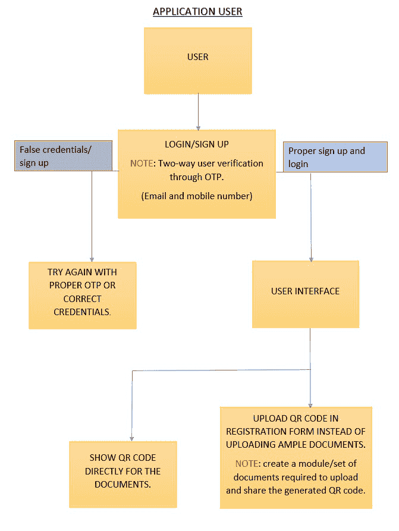
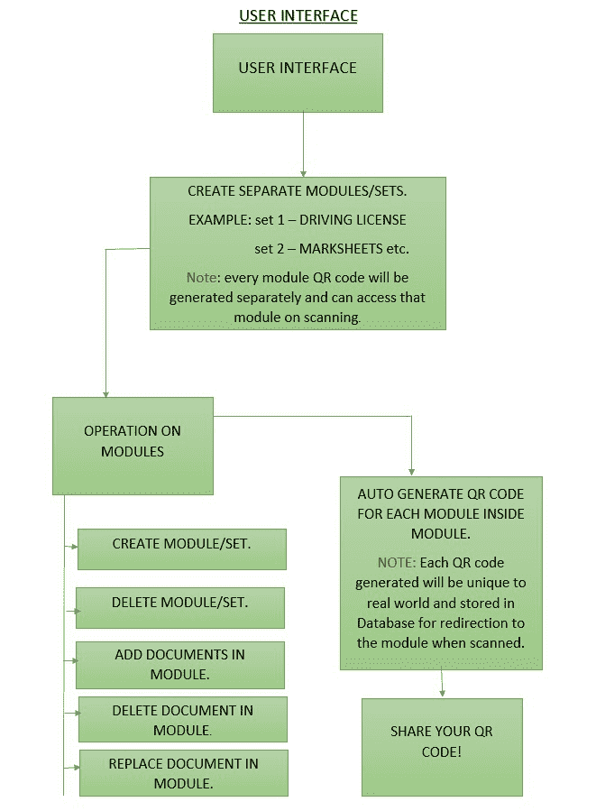
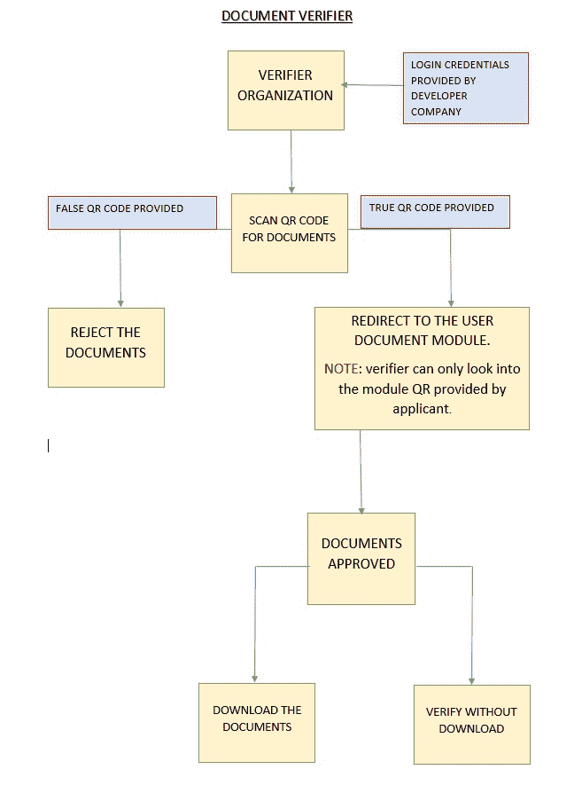

# 项目创意|袖珍宪章

> Original: [https://www.geeksforgeeks.org/project-idea-pocket-charter/](https://www.geeksforgeeks.org/project-idea-pocket-charter/)

文件是对思想的书写、绘制、展示或记忆，通常是非虚构内容和虚构内容的表现形式。 单据是指以字母、数字或标记等方式在实体上表达或描述的任何事项。

继续这个话题，身份证件是任何可以用来证明一个人的身份的文件。

其中一些是-

*   Aadhar 卡(生物识别、数字/物理身份系统)
*   印度护照和海外护照
*   驾驶执照
*   PAN 卡片
*   配给卡
*   出生证明等。

**重要性：**在身份证明已成为获取商品和服务的必备条件的世界里。 通过几条重要的个人信息，黑客可以突然冒充我们的身份，通过欺诈性的信用卡、贷款和购买来破坏我们的信用记录和声誉。

为此，在发展中国家，拥有政府颁发的身份证或其他身份证明可以帮助公民保护自己免受此类黑客的攻击。

**目的：**文件验证是验证文件真实性的过程。 官方发布的文件，如身份证、驾照、银行对账单或其他州/联邦文件，通常都是经过核实的。

该过程检查个人数据的有效性，包括姓名、年龄、地址以及邮票、水印等文档特征。

如今，由于全球化，客户不再愿意亲临现场。 顾客只需上传一张照片和政府颁发的身份证即可。

**特点：**本项目的重点是：

*   它将文档身份验证提高到一个级别。
*   节省时间。
*   降低文档丢失或被盗的可能性。
*   所有的验证过程都要经过一个经过验证的组织。

**根据用户选择使用的工具和技术：**

**第一个前端部件**

*   HTML、CSS 和 JavaScript
*   响应本机、BBootstrap

**第二个后端部件**

*   Python(Django)
*   PHP
*   Node.js

**3.数据库部分**

*   MySQL
*   Oracle SQL
*   PostgreSQL
*   Microsoft SQL Server
*   重火力点

**4.外部接口**

*   Twilio(用于通过手机短信发送动态口令)
*   SMTP(用于通过电子邮件发送 OTP)

**构建项目所需的技能集：**

*   对网络开发及其图书馆有适当的了解。
*   需要在前端和后端具有良好的响应能力。
*   在开发应用程序之前，可以将不同模块的工作全部联系在一起。

**项目工作：**本项目主要由以下两个不同的模块组成：

*   应用程序用户(文档持有者)
*   文档验证器

**应用程序用户(Document Holder)：**第一次打开应用程序时会遇到的用户界面。

*   用户将被要求登录，如果没有注册，则会被要求注册。
*   对于身份验证，用户需要填写所有可信的详细信息，以便创建用户的帐户。 (对于身份验证，动态口令将通过电子邮件和电话号码发送)。
*   用户成功登录后，重定向到用户界面。
*   在这里，用户需要根据自己的需要创建各种细分市场，并在细分市场中添加丰富的相关文档。 例如：
    *   **驾驶-**包括所有车辆相关文档。
    *   **标记页-**由所有重要的标记页组成。
    *   **身份证明文件-**由 ADHARCARD、PAN 组成。 等。
*   还向用户提供了在段中修改的功能。
*   完成分段后，会生成一个具有唯一引用的自动二维码，可以与其他人共享，这样他们就可以直接登陆到分段页面中，而不能访问任何其他分段。
*   二维码可以向任何政府官员出示进行验证，也可以上传到注册表中，而不是许多文件，这直接或间接地节省了大量内存和时间。

应用程序用户流程图

用户界面详细流程图

**文件验证员：**本项目为第二阶段，将负责通过扫描申请人提交的二维码或用户出示的方式对文件进行验证。

这一阶段的工作如下：

*   对于任何类型的验证，验证机构都必须联系开发公司，以生成员工的认证登录凭据。
*   成功登录后，文档可以在扫描二维码后进行验证，因此，如果二维码是欺诈性的，表格可以被拒绝。
*   如果提供的二维码是肯定的，并且重定向到文档，则验证者可以批准文档。
*   出于将来的偏好，验证者可以选择下载文档。
*   每一个验证过程都是通过一个政策签约组织进行的。

**文件校验器的工作原理流程图如下：**

文档验证器流程图

**实际应用：**

*   我们知道，在今天的世界里，每个人都很匆忙，很多时候，他们忘记携带日常生活中需要的重要文件，如身份验证证等。但人们永远不会忘记随身携带手机，通过这款应用程序，人们可以随身携带所有的文件，以防警察检查是否有人被困在警察检查站，他们可以使用这款应用程序，警方可以通过二维码来检查他们的证件是不是真的。在这种情况下，如果有人被困在警察检查站，他们可以使用这款应用程序，警方可以通过二维码来检查他们的证件是否真实，如果有人被困在警察检查站，他们就可以使用这款应用程序，警方可以通过二维码来检查他们的证件是否真实。
*   由于这是一个完全经过验证的申请，人们不需要携带文件的硬拷贝，他们只需要连接互联网。
*   像这样，这款应用的日常应用还有很多。

**项目未来更新：**该项目可以进一步完全转换为 Android 和 iOS 应用。 不过，也可以将该网站转换为 Android 应用程序，以便更快、更轻松地进行开发和部署。

**团队成员：**

*   Ipshita Das
*   V 阿克希德