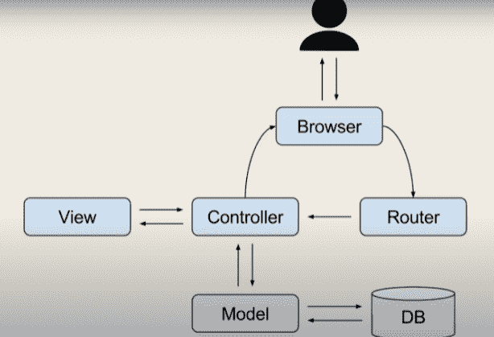

# 项目创意|心理护理

> Original: [https://www.geeksforgeeks.org/project-idea-psy-care/](https://www.geeksforgeeks.org/project-idea-psy-care/)

印度占世界自杀总数的 36.6%。 每天平均有 381 人自杀，超过 83%的人因精神健康问题而苦恼。 尽管如此，我们国家的大多数人还是觉得与医疗专业人员交谈很不舒服，因为他们贫穷或害怕社会。 这个国家持续存在的刻板印象让人们相信精神疾病实际上是一种疾病，而不是一种疾病。 近些年来，科学技术有了许多进步，几乎可以治愈任何疾病。 然而，当我们谈论一个人的心理健康时，我们的国家却落后了。

不仅人们不愿寻求任何帮助，而且该国缺乏心理学家和心理治疗师，在正确的时间向正确的人提供帮助，这使得人们，特别是年轻人的心理健康不断恶化的问题难以抗争。 在整个大流行期间，情况变得令人毛骨悚然，而且还在继续恶化。 因此，为了避免这个问题，我们决定设计**‘psy-care**’。

**使用的工具和技术：**

*   ***HTML：***超文本标记语言或 HTML 是设计用于在 Web 浏览器中显示的文档的标准标记语言。
*   ***CSS：***层叠样式表(Cascading Style Sheet，CSS)是一种样式表语言，用于描述以 HTML 等标记语言编写的文档的表示。
*   ***JavaScript：***JavaScript 是一种脚本/编程语言，允许您在网页上实现复杂的功能。 每次网页做一些不是静态的事情，比如显示及时的内容更新、交互式地图、动画 2D/3D 图形、滚动视频点唱机等，你可以打赌可能涉及到 JavaScript。 虽然我们不会直接实现 JavaScript。 为了实现 JavaScript，我们将使用 React.js，这是一个 JavaScript 库，因为当我们必须创建系统时，它更理想。
*   ***React.js：***React 是用于构建用户界面的 JavaScript 库。 它帮助我们构建管理自己状态的封装组件，然后将它们组合成复杂的 UI。 因为组件逻辑是用 JavaScript 编写的，所以您可以轻松地通过应用程序传递丰富的数据，并将状态保留在 DOM 之外。 此外，Reaction 还可以通过 Reaction Native 为 Web 应用提供支持。
*   ***Reaction Native：***Reaction Native 帮助我们创建本机应用。 将 Reaction Native 用于我们的 Web 应用程序主要有两个原因：
*   Reaction Native 为我们提供了跨平台的应用程序，即 Android 和 iOS。
*   我们的网站将使用 Reaction 创建，因此通过 Reaction Native 将其模型化为应用程序将为我们节省大量时间。
*   ***Node.js：***Node.js 是一个开源、跨平台的后端 JavaScript 运行时环境，它在 V8 引擎上运行，并在 Web 浏览器之外执行 JavaScript 代码。 Js 帮助我们在 JavaScript 的帮助下进行服务器端脚本编写，这使得创建 Web 应用程序变得很容易，因为你不需要学习任何其他脚本语言。 就像 Reaction 一样，我们将使用库 Express.js 来创建我们的服务器，因为它使我们的任务变得简单。
*   ***Express.js：***Express 是 Node.js 的后端 Web 应用程序框架，旨在构建 Web 应用程序和 API。
*   ***MySQL：***MySQL 是一个关系数据库管理系统，它使用 SQL 以表格形式(称为实体)组织数据，还有助于在这些实体之间创建关系。

**web-app 的架构：**我们要创建的应用程序将基于 MVC 模型，即模型-视图-控制器。 在深入研究我们的应用程序之前，让我们先谈谈两件事：什么是 MVC 模型？ 我们将如何在我们的应用程序中实现它呢？ 正如我们所看到的，MVC 由三个不同的词 Model、View 和 Controller 组成，在我们的应用程序中，这三个词在软件设计模式中都有其各自的意义。 让我们从我们的应用程序的角度分别对它们进行更多的讨论。

*   **模型：**模型表示应用程序中与数据相关的逻辑部分。 我们模型的主要功能是执行 CRUD 应用程序，创建数据库，并与控制器通信。 这里，将使用 MySQL 创建我们的应用程序的模型。
*   **视图：**视图代表应用程序的用户界面(UI)部分。 我们的视图的主要功能是向最终用户提供美观和用户友好的 UI，与控制器进行通信，并将用户添加的动态价值传递给控制器。 这里，Reaction 和 Reaction Native 将用于创建应用程序的视图。
*   **控制器：**控制器代表我们应用程序的大脑。 我们的控制器的主要功能是从浏览器接收请求和输入(在我们的例子中，通过输入位置，即该位置的所有精神科医生等等)来获取请求，并要求模型对数据执行所需的请求，然后借助视图将该数据传递给浏览器(以使其可表示)。 这里，Express.js 将用于创建我们应用程序的控制器。

**MVC 模型工作原理简介：**

**实施：**Psy-care 是一款心理安宁网络应用程序，面向的是患有精神健康问题的人、试图在印度有所建树的心理学家和攻读心理学学位的大学毕业生**。 PSY-CARE 旨在为医疗专业人员和需要帮助的人之间日益扩大的差距提供一站式解决方案。**

*   我们的目标是将这一咨询心理学家的过程从线下模式转变为在线模式。 当用户打开应用程序时，他/她将被提供一个选择是保持匿名还是显示自己的身份。 将为每个用户指派一名心理学家/治疗师/医学专业人员，并向用户提出一些问题，根据这些问题来决定他/她的精神状态。
*   如果是第一阶段，则可以分配给训练有素的志愿者，否则将由专业人员接手。 这些志愿者可以是攻读心理学或相关学科的大学毕业生。 这样，我们将消除该国现有治疗师的缺乏，并为即将到来的专业人员提供机会。
*   将有一个位置过滤器，一个人可以根据这个过滤器选择他们所在位置的治疗师，以防他/她希望亲自联系他们。
*   患者的进展将保持不变，与治疗师的每一次互动都将保密。
*   该应用程序的另一个功能将是每日动机部分，其中将包括平静练习、冥想课程等。

**未来展望：**我们的目标是尽快建立一个完整的工作应用程序，联系来自全国各地的治疗师和医疗专业人员，从我们的学院开始。 我们将进一步扩大我们的项目，与各精神卫生社区和教育机构合作，让更多的人从中受益。

还可以实现一个机器学习模型，该模型可以根据提供的问卷识别人们的精神状态。

**团队成员：**

*   尼塔亚·卡拉(Nityaa Kalra)
*   阿尤什·阿格拉瓦尔
*   舒尔雅·奇拉尼亚