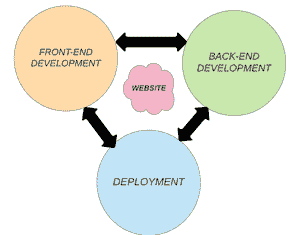

# 项目创意|ShoppingLane 网上购物网站

> Original: [https://www.geeksforgeeks.org/project-idea-shoppinglane-online-shopping-website/](https://www.geeksforgeeks.org/project-idea-shoppinglane-online-shopping-website/)

这个项目是关于一个非常简单的想法，但却很重要，对社会很有帮助。 在这里，我们计划建设一个电子商务(网上购物)网站。 该网站的名称将是***“ShoppingLane”。*** 我们都知道，产品商务的企业对消费者方面是万维网最明显的商业用途。 电子商务网站的主要目标是在线销售商品。 在这个快节奏和瞬息万变的世界里，网购已经成为最蓬勃发展的行业中心之一。

它正在帮助世界各地的无数人。 现在，我们只能在家里舒适地获得各种产品和服务。 在当今世界，我们人们没有足够的时间在熙熙攘攘的市场中漫步，寻找特定的产品。 如果我们看一看今天的艰难形势-舒适时期，电子商务提供了购买各种商品和服务的最安全和最相关的平台之一。 如今，当我们所有人都被锁在家里的时候，使用这些网站的次数最多。

**目的：*****“ShoppingLane”***项目正是基于上述思路。 这是一个项目，以发展一个基本的网站，其中消费者提供了众多的产品选择。 他们可以根据自己的方便来选择。 他们可以在家门口买到所有这些东西。 我认为，在这个艰难的时期，这将是对我们整个社会最重要、最有帮助的项目之一。 我还考虑把*Amazon、Flipkart*、*等热门网站的功能与*OLX、Quikr*等其他网站的功能结合起来，让消费者可以根据自己的方便购买新产品和二手产品。*

***使用的工具和技术：**对于前端开发，我们使用 HTML、CSS 和 JS。 但是，这个项目需要全栈 Web 开发。 因此，我们正在并肩学习。 使用的一些基本工具和技术包括：*

*   *Visual Studio(或任何其他文本编辑器)*
*   *超文本标记语言*
*   *CSS*
*   *引导条纹*
*   *jQuery*
*   *JavaScript*

*我们将用更多的技术更新网站。*

*

不同领域的网站开发* 

***功能：***

*   ***导航栏：**使用 HTML、CSS 和 Javascript 创建了电子商务网站的导航栏，以便在单击其图标时显示搜索栏、登录和注册框。 在导航的左侧有网站的徽标。 菜单位于导航的中心，一些用于显示搜索和登录的图标位于右侧。 当我们向下滚动页面时，此导航已与窗口一起修复。*
*   ***搜索栏：**每当有人单击搜索图标时，都会从底部弹出一个搜索栏。 用户可以在此处键入以搜索任何内容。*
*   ***登录/注册表单：**如果用户点击表单上的“创建帐户”，则注册表单将打开。 如果他/她再次单击“已有帐户？”，则会再次弹出“登录表单”。*
*   ***旋转木马：**这里，创建一个包含本赛季所有重要亮点的旋转木马。*
*   ***特色商品：**在这里，我们将在网站上展示所有令人惊叹的新产品。*
*   ***产品列表：**我们将制作许多产品列表。 但是，在示例中，我们只列出了两个列表。 在这里，我们将展示各种产品。 我们还将添加“添加到购物车”选项。 每种产品都将以卡片的形式出现，其中包含产品的形象、价格和名称。*
*   ***销售箱：**在这里，我们将展示各种带有图片的商品，当然还有销售标签。*
*   ***销售横幅：**这是为了让用户了解整个网站的整体折扣。*
*   ***服务：**在页面底部，我们将显示任何在线购物网站的所有必要详细信息-发货政策和返现政策。*
*   ***页脚：**在本节中，我们将提供联系信息。*

*那么这样的话，整个网站就发展起来了。 我们还将使用后端和部署技术来进一步推进我的网站。 数据库应该在那里，这样网站将存储用户的详细信息，如果他们曾经购买或出售什么东西。 所有产品的数据都将得到维护。 我们会定期更新。 但是，在这里，我只使用了 HTML、CSS、JS 和 Bootstrap 来准备站点。*

***应用：**我们计划做的项目确实对人民有很大的帮助。 这个网站将帮助人们买卖一切--小玩意儿、电子产品、厨房用品、餐馆、药品、衣服等等。 所以，这就是为什么这个网站在现实生活中有很多应用的原因。*