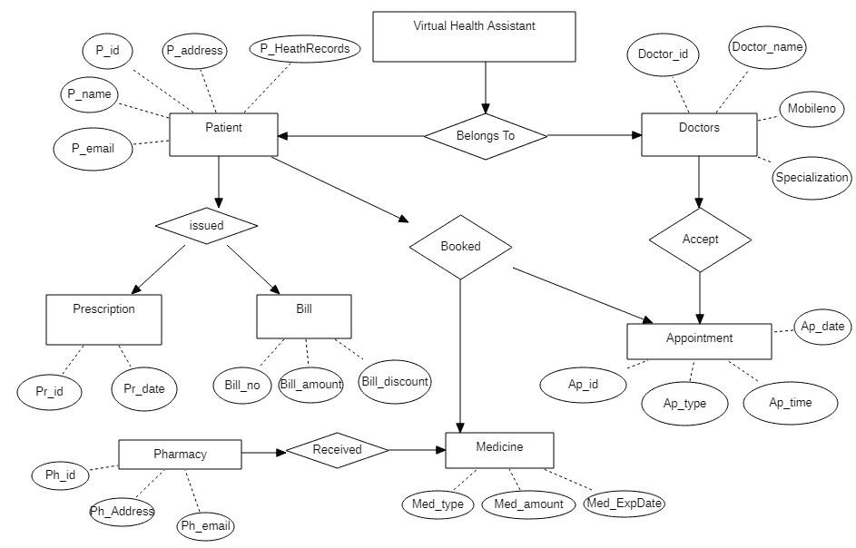
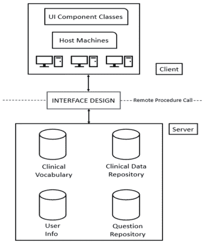
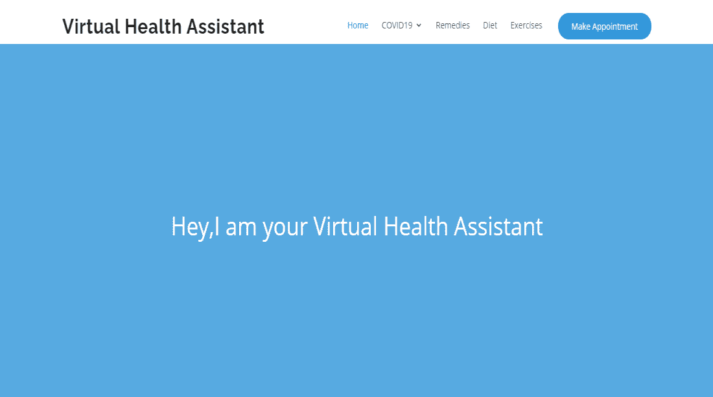
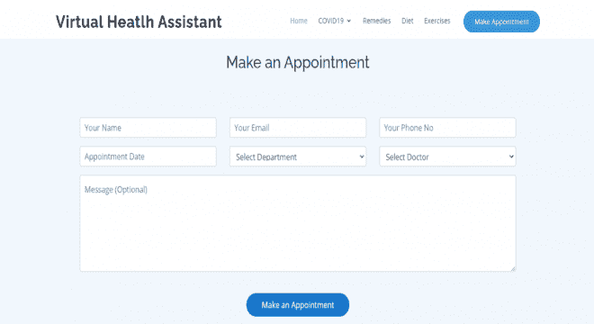

# 项目创意|虚拟健康助手

> Original: [https://www.geeksforgeeks.org/project-idea-virtual-health-assistant/](https://www.geeksforgeeks.org/project-idea-virtual-health-assistant/)

****今天人们面临的最普遍的问题之一是缺乏疾病知识，缺乏及时的急救咨询。 正因为如此，许多人在试图找出他们病情的原因时，可能会遭受身体和精神上的压力。 在某些情况下，他们甚至失去了生命，常见的疾病变得危及生命。 现在，虚拟健康助手开始发挥作用。 这是一种网络服务，在这种服务中，拟议的系统试图通过让用户以一种高度互动的方式访问中央临床存储库，从而消除他们了解自己疾病的需要。 用户还可以询问有关他们的疾病的问题，甚至在线上和线下预约医生。****

**我们的 Web 服务将用户的健康记录存储在远程服务器上。 用户可以输入症状或疾病，我们的系统试图找出它，并给出用户可以立即采取的行动，可能是一些家庭补救措施或一些紧急药物。 最后，生成一个精确的处方。 此 Web 服务不能确保服务达到的健康状况的准确性，因此在这种情况下，必须联系医生。 考虑到这种情况，还有一项功能，那就是紧急情况下的在线视频预约，用户还可以在自己所在地附近预订线下预约。**

**我们的网络服务是由注册医生和医生进行验证和认证的，这使得它不同于现有的系统。 它有一个用户友好的界面，而且比现有的系统更准确，在向用户/患者推荐处方时，会考虑个人过敏因素。 它还包括在线送药和家门口的医疗测试。**

**在我们的网络服务中，有一个专门针对 COVID19 的部分，用户可以在其中预订疫苗接种时段和 COVID 检测，具体取决于他们所在的位置。 此外，用户可以在家中由有资质的医生进行全面的治疗。 它还包括 COVID 资源部分，用户可以在那里获得紧急药物和其他资源，如附近的氧气供应。**

****目标：****

*   **立即给予适当的药物，这样任何有互联网设施的人都可以获得它，而不管他们的时间和地点。**
*   **通过在线视频设施缩小用户和医生之间的差距。**
*   **帮助用户保持健康的生活方式。**
*   **以减少文书工作并使现有系统自动化。**

****功能：****

****1.正确和精确的用药：**我们的网络服务将患者的健康记录保存在远程服务器上，并由经过认证的医生进行验证。 在这种情况下，当向用户/患者推荐处方时，个人过敏被考虑在内。**

****2.COVID19：**在我们的网络服务中有一个专门针对 COVID19 的专区，用户可以在那里预订附近的疫苗接种时段。 它还为轻微的 COVID 症状提供家庭治疗。 还有一个 COVID 资源区，你可以从那里获得氧气瓶和紧急药物。**

****3.线上和线下预约：**我们网络服务的另一个功能是在线预约，用户可以在其中预约与医生的视频通话。 他们还可以在线下预约就近就诊的医生。**

****在线送药：**在线送药功能与少数药店合作，用户可以直接在家门口订购处方药。**

****5.全天候支持：**我们的 web 服务为用户提供全天候支持。 他们可以随时随地使用它。**

****使用的工具和技术：****

*   **超文本标记语言**
*   **CSS**
*   **JavaScript**
*   **jQuery**
*   **MySQL**
*   **PHP**
*   **应用程序界面 / 精确位置指示器 / 美国石油学会 / 自动发音教学机**
*   **机器学习**
*   **WordPress**
*   **Photoshop**
*   **Go/Gob**

****构建项目所需的技能集：****

*   **对全栈 Web 开发有深入的了解**
*   **机器学习的基础知识**
*   **中等水平的照片编辑/视频编辑知识**
*   **Git/GitHub 知识**
*   **具备适当的网络架构知识**

****Webservice 配置文件：****

****患者：**患者可以查看他们的健康记录、过去的评估以及新的症状评估。 患者还可以预约和订购药物。**

****医生：**医生可以访问他们的病人健康记录，还可以查看他们的预约。**

****3.药店：**如果患者想在网上订购药品，各种药店都可以获得患者的处方。 这些药店把处方药物送到病人家门口。**

****模块数：**下面给出的是我们的 Web 服务中存在的模块**

*   **登录（电脑系统）**
*   **报名**
*   **主页**
*   **饮食页面**
*   **页面练习**
*   **运行状况-详细信息**
*   **新症状评估**
*   **评估历史记录**
*   **新冠肺炎**
*   **处方 / 权威推荐 / 规定**
*   **送药服务**
*   **邮件报告**
*   **预约-页面**

****实施项目的循序渐进过程：**这里我们不打算编写此项目的代码。 我们只是给出实施该项目的一般方法。**

*   **第一步是设计项目的用户界面，这意味着项目在现实中看起来是什么样子。**
*   **第二步是使用 HTML/CSS/JavaScript/jQuery 对 Web 服务的前端进行编码。**
*   **第三步是对网站的后端部分进行编码。 我们可以使用 PHP 编写后端代码。**
*   **然后，我们将 Web 服务连接到数据库。 我们可以使用 MySQL 为我们的 Web 服务创建一个数据库。**
*   **最后一步是在 Web 服务器上托管我们的 Web 服务。**

****UML 图：****

****1.实体关系图：****

**

我们的 Web 服务的 ER 图** 

****2.系统架构设计：****

****

****输出图像：****

****

****在现实生活中的应用：**很多时候，人们身患疾病，却不知道必须直接做些什么。 相反，他们往往会抓狂，并立即试图联系医院。 因此，他们不知道急救的标准程序。 我们的 Web 服务将通过提供循序渐进的过程来消除此问题。**

**就像现在一样，我们国家正面临这场大流行(COVID19)。 我们的网络服务包含在线视频预约，用户可以从我们的专科医生和内科医生那里获得处方。 不仅如此，这些用户还可以在家门口获得在线送药服务。**

**在任何紧急情况下，我们的网络服务将为您提供附近医疗机构的位置和联系电话。 这项网络服务使用最新技术和机器学习算法来处理用户提供的数据，并生成帮助用户保持健康生活方式的饮食和锻炼图表。**

****视频说明：**[https://youtu.be/E-rpSQbTZ20](https://youtu.be/E-rpSQbTZ20)**