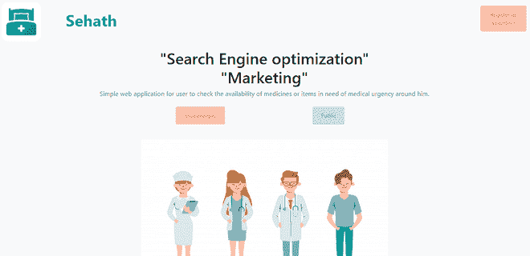
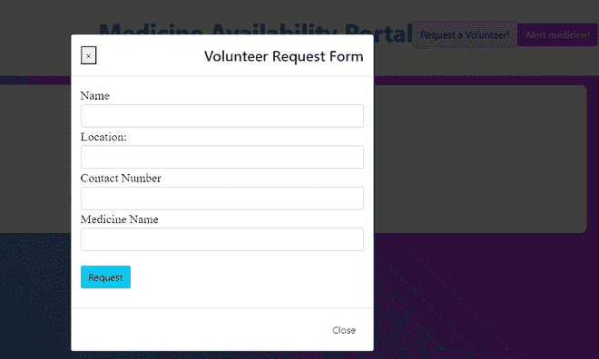
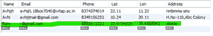
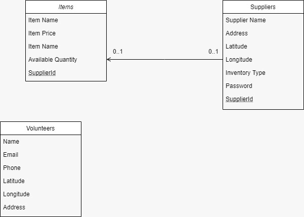
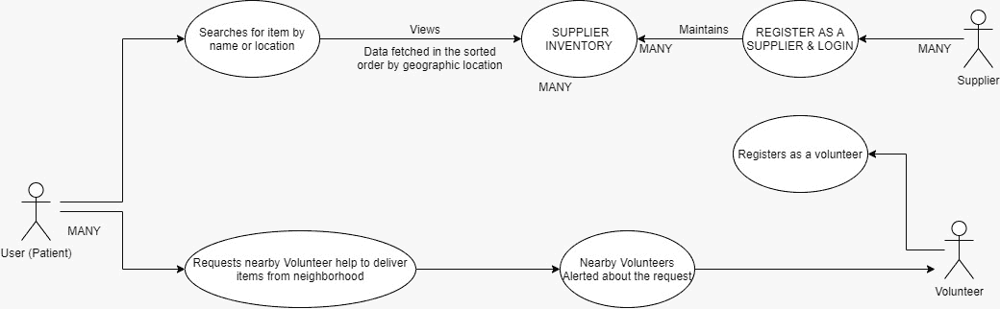

# Project IDEA|便于在附近药房轻松发现关键药物的 Web 应用程序

> Original: [https://www.geeksforgeeks.org/project-idea-web-app-that-facilitates-easy-discovery-of-crucial-medicines-in-nearby-pharmacy/](https://www.geeksforgeeks.org/project-idea-web-app-that-facilitates-easy-discovery-of-crucial-medicines-in-nearby-pharmacy/)

**项目名称：**Sehath

**简介：**

*   **域：**医疗保健
*   **用途：**

1.  Sehath 是一款网络应用程序，一旦上市，它就会帮助人们在附近的药店找到关键的救命药物，比如 Remdesivir。 我们是在印度第二波令人恶心的流行病中产生这个想法的，当时大多数受影响的人都在努力寻找抗病毒药物和医用氧气瓶。 因此，我们开发了一个网络界面，为人们提供附近药店是否有 Covid 和非 Covid 药物的单点信息。
2.  这款应用还允许人们注册为志愿者，帮助那些由于隔离等原因无法搬出家的人购买毒品。
3.  这款应用程序还服务于增加当地药店的业务，使它们能够迎合周围用户群的需求。

**当前状态：**项目已部分实施。

**已实施组件的详细工作：**

**首页：**当用户访问网站的公共 URL 时，会被定向到如下所示的首页-

主页

如上所述，主页有三个入口：<u>公共页面</u>、<u>店主页面</u>和<u>志愿者页面。</u>

**a)公共页面：**这是 Public.php 页面的入口点，用户可以在这里根据药品名称和居住地搜索药品。 它的工作原理如下-

<video class="wp-video-shortcode" id="video-638911-1" width="640" height="360" preload="metadata" controls=""><source type="video/mp4" src="https://media.geeksforgeeks.org/wp-content/uploads/20210512233423/Public-page-demo.mp4?_=1">[https://media.geeksforgeeks.org/wp-content/uploads/20210512233423/Public-page-demo.mp4](https://media.geeksforgeeks.org/wp-content/uploads/20210512233423/Public-page-demo.mp4)</video>

在此页面中，用户还可以请求志愿者。 单击按钮*‘Request Volunteer’后，*个用户将获得嵌入到模式中的表单。 在填写完详细信息后，将向在网站上注册的志愿者发送电子邮件。 下图描述了表单-

志愿者申请表

**b)店主页面：**这是进入店主登录页面的入口点。 在这里，当地的药店老板可以注册一个账户，并可以列出和管理他们的库存。 店主仪表板将显示所有可用的产品，以及编辑现有项目和添加新项目的选项。 它的工作原理如下-

<video class="wp-video-shortcode" id="video-638911-2" width="640" height="360" preload="metadata" controls=""><source type="video/mp4" src="https://media.geeksforgeeks.org/wp-content/uploads/20210512234219/Shopkeeper-page.mp4?_=2">[https://media.geeksforgeeks.org/wp-content/uploads/20210512234219/Shopkeeper-page.mp4](https://media.geeksforgeeks.org/wp-content/uploads/20210512234219/Shopkeeper-page.mp4)</video>

注册页面如下所示-

店主注册页面

**c)志愿者页面：**志愿者页面将引导用户进入志愿者注册页面，在那里人们可以为其他因检疫、健康状况不佳等原因而无法获得自己的药品的人注册志愿服务。流程如下所示-

<video class="wp-video-shortcode" id="video-638911-3" width="640" height="360" preload="metadata" controls=""><source type="video/mp4" src="https://media.geeksforgeeks.org/wp-content/uploads/20210512235243/Volunteer-Page.mp4?_=3">[https://media.geeksforgeeks.org/wp-content/uploads/20210512235243/Volunteer-Page.mp4](https://media.geeksforgeeks.org/wp-content/uploads/20210512235243/Volunteer-Page.mp4)</video>

数据库更新如下：

快照数据库数据库

**未来将合并的组件：**

*   **公共页面：**将实现按钮*‘提醒药物’*的功能，以便当用户单击此按钮时，他们可以请求接收有关特定药物可用性的通知。 例如，每当店主的库存更新至少 10 次时，如果所做的更改与用户所请求的药品有关，则会向用户发送通知。
*   **店主页面：***将实现 Mozilla 的条形码扫描器 API*，为店主提供自动化库存管理系统，他们可以使用该系统快速更新库存数据库。 他们还可以选择上传其产品的电子表格，以便轻松填充其库存数据库。 之所以想到这一点，是因为印度的大多数药店都有一个 Excel 表格来进行产品管理，而不是专门的数据库。

**使用的技术：**

*   HTML/CSS
*   PHP
*   JavaScript
*   PHP 邮件程序
*   MySQL
*   引导 5
*   任何免费托管服务

**截止日期：**部分实现的网站可通过此[链接](https://sehath.000webhostapp.com/)查看详细的技术说明。

**注意：**一旦发布更多更改，项目的 GitHub 存储库将很快在此提供。

包括的组件包括：

*   **Homepage.html 和 Homepage.css-**这包含三个入口点按钮以及主页的一般样式。
*   **STOSHOWER_registration.php 和相应的 CSS 文件-**此页面包含店主注册表单的布局，在成功注册后，它将重定向到 STOTHOWER_Login.php 页面。
*   **SHOTHOWER_LOGIN.php 和相应的 CSS 文件-**此页面包含登录页面的布局和功能。 成功登录后，用户会被重定向到 STOTHOWER_main.php 页面。
*   **shop Keeper_main.php 和相应的 CSS 文件-**此页面连接到 MySQL 数据库，以提取、添加、删除或修改店主的库存。
*   **vololer_registration.php 和相应的 CSS 文件-**连接 MySQL 数据库，存储志愿者注册成功后的注册信息。 该数据库将用于 Public.php 页面，用于在用户提出用药请求时向志愿者发送请求。
*   **PUBLIC.php 和相应的 CSS 文件-**在此页面上，实现了按名称和位置搜索药物的功能。 向 MySQL 数据库中的 Items 表发出 Ajax 请求以检索药物。 药品按距离递增的顺序陈列。 因此，该页面还包含用 JavaScript 实现的*距离算法*。 该页面还实现了“请求志愿者”和“提醒医疗”按钮的功能。 当点击“Request Volunteer”按钮时，将显示一个嵌入 Bootstrap5 模式的表单，表单详细信息将使用 PHP Mailer 模块通过 Gmail 的 SMTP 服务器以电子邮件的形式发送给志愿者。

**UML 图：**

对象图

执行元关系图

**团队成员：**

*   阿夫希吉特·奈尔
*   塔哈·朱奈德