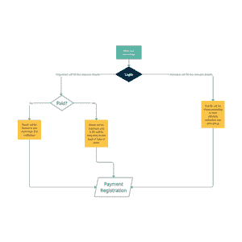

# 项目创意|网站

> Original: [https://www.geeksforgeeks.org/project-idea-webents/](https://www.geeksforgeeks.org/project-idea-webents/)

在科技日新月异的世界里，人们可以在舒适的家里学到任何东西。 一名大学生每天都会收到成百上千条关于研讨会、网络研讨会等的信息。 然而，当谈到在正确的时间找到正确的学习资源时，人们不禁感到不知所措。

Webents 的主要思想是在一个地方向学生、专业人员和学习者提供有关网络研讨会、活动和研讨会的信息。 这样，一个人就可以根据自己的兴趣和爱好来确定合适的学习资源。

**功能和设计：**网站关注组织者和参与者。 登录页面将包含一个注册选项。 注册既可以作为组织者完成，也可以作为参与者完成。 注册人员后，可以使用以下功能集：

***器官：***

*   他们可以列出可以提供给与会者的网络研讨会、活动和研讨会的详细信息。
*   他们可以决定是否想要他们学院的观众。
*   如果事件已付费，则为支付网关。

***与会者：***

*   他们可以根据什么选择自己的兴趣，展示各种各样的事件。
*   他们还可以设置位置过滤器，以防事件不是远程的。
*   将根据他们的选择提供定期更新。

**工具和技术：**

**前端：**

*   [**HTML5**](https://www.geeksforgeeks.org/html-tutorials/)**：**HTML5 是一种用于在万维网上构建和表示内容的标记语言。
*   [**CSS3**](https://www.geeksforgeeks.org/css-tutorials/)**：**级联样式表(CSS)是一种样式表语言，用于描述用标记语言编写的文档的外观和格式。CSS3 是 CSS 的最新标准。
*   [**JavaScript**](https://www.geeksforgeeks.org/javascript-tutorial/)**：***JavaScript 是一种成熟的动态编程语言，当应用于 HTML 文档时，可以在网站上提供动态交互性。*
*   *[**query**](https://www.geeksforgeeks.org/jquery-tutorials/)**：**JQuery 是一个跨平台的 JavaScript 库，旨在简化 HTML 的客户端脚本编写。 JQuery 是当今使用的最流行的 JavaScript 库。*

***后端：***

*   *[**PHP**](https://www.geeksforgeeks.org/php-tutorials/)**：***PHP 是一种服务器脚本语言，是制作动态和交互式 Web 页面的强大工具。**
*   **[**MySQL**](https://www.geeksforgeeks.org/php-mysql-database-introduction/)**：***MySQL 是一个开源关系数据库管理系统(RDBMS)。 它非常快速、可靠，并且易于使用。***

*****结构：*****

******

*****未来展望：**Webents 的目标不仅是针对某一特定学院，还包括将其扩展到其他组织。 对于资金，我们计划组织校园大使项目，通过广告等方式筹集资金。***

*****团队：*****

*   ***尼塔亚·卡拉(Nityaa Kalra)***
*   ***蔡先生***
*   ***孙德沙***
*   ***阿克沙伊·乔杜里(Akshay Chaudhary)***