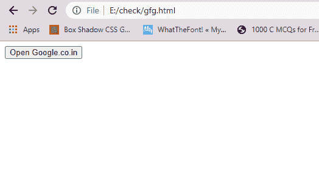

# 窗口对象

的属性

> Original: [https://www.geeksforgeeks.org/properties-of-window-object/](https://www.geeksforgeeks.org/properties-of-window-object/)

窗口对象是 DOM 层次结构的最顶层对象。 它表示显示网页内容的浏览器窗口或框架。 每当屏幕上出现显示文档内容的窗口时，都会创建窗口对象。 下表列出了窗口对象的常用属性和方法：

**窗口对象的属性**

<figure class="table">

| **attribute name** | 

**目的**

 |
| --- | --- |
| **关闭** | It holds a Boolean value indicating whether the window is closed. |
| **控制台** | It returns a reference to the Console object that provides access to the browser debugging console. |
| ==同步，由 Elderman 更正==@ELDER_MAN | It is used to define the default message that will be displayed in the status bar when the browser does not perform any activity. |
| **controller** | It returns the XUL controller object of the current Chrome window. |
| **自定义元素** | It returns a reference to a CustomElementRegistry object that can be used to register new custom elements and get information about registered custom elements. |
| **加密** | It returns the browser encrypted object. |
| **devicePixelRatio** | It returns the ratio of physical pixels to device-independent pixels in the current display. |
| **文件** | It returns a reference to the window's Document object. |
| **DOMMatrix** | It returns a reference to the DOMMatrix object, which represents a 4 × 4 matrix and is suitable for 2D and 3D operations. |
| **帧[]** | It represents an array of all frames for a given window. |
| **DOMPoint** | It returns a reference to a DOMPoint object that represents a 2D or 3D point in the coordinate system. |
| **History** | It provides information about the URL accessed in the current window. |
| **长度** | It represents the number of frames in the current window. |
| **文档** | It returns a reference to a DOMRect object that represents a rectangle. |
| **全屏** | This property indicates whether the window is displayed full screen. |
| **position** | It contains the URL of the current window. |
| **内侧高度** | It is used to get the height of the content area of the browser window. |
| **内部宽度** | It is used to get the width of the content area of the browser window. |
| **名称** | It contains the name of the reference window. |
| **开瓶器** | It contains a reference to the window that opens the current window. |
| **父项** | A collection of frames that contains the current frame. |
| **屏幕** | It references the Screen object |
| **自身** | It provides another way to reference the current window. |
| **状态** | It overrides the defaultStatus and places a message in the status bar. |
| **顶部** | If many windows are open, it returns a reference to the topmost window that contains the frame. |
| 加入时间：清华大学 2007 年 01 月 25 日下午 3：33 | It returns the current window or frame. |
| **导航器** | It returns a reference to the Navigator object. |
| **外部高度** | It will get the height outside the browser window. |
| **out width** | It will get the width of the outside of the browser window. |
| **Toolbar** | It generates a toolbar object whose visibility can be toggled in the window. |

</figure>

要访问窗口对象的属性，您需要指定对象名称，后跟句号(.)。 和属性名称。

**语法：**

```
window.property_name
```

**示例：**

## 超文本标记语言

```
<!DOCTYPE html>
<html>

<head>
    <script language="JavaScript">
        function winopen() {
            window.open("https://www.geeksforgeeks.org")
        }
        function showstatus() {
            window.status =
                "Opening GeeksforGeeks Home page";
        }
    </script>
</head>

<body onload="showstatus()">
    <input type="button" name="btn"
        value="Open GeeksforGeeks"
        onclick="winopen()">
</body>

</html>
```

发帖主题：Re：Колибри0.7.0

**在点击按钮之前：**



**点击按钮后：**

