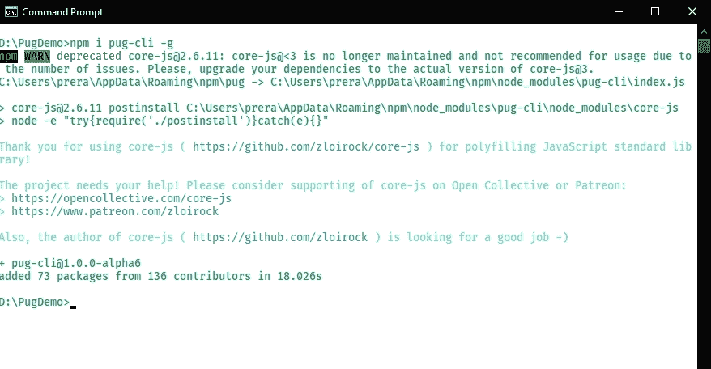
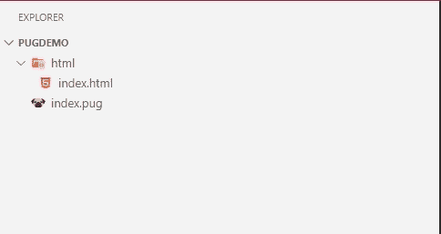
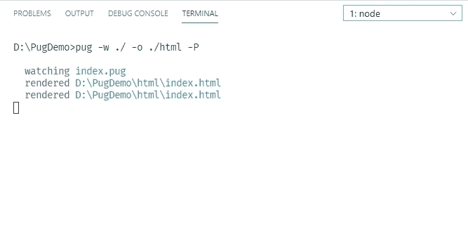

# PugJS 基本标签

> Original: [https://www.geeksforgeeks.org/pugjs-basic-tags/](https://www.geeksforgeeks.org/pugjs-basic-tags/)

在本文中，我们将学习 PUG Basic 标记，并了解如何将它们编译成 HTML 代码。

**项目设置：**

**步骤 1：**通过运行以下命令安装 PUG。 -g 用于全局安装，是可选的。

```html
npm install pug-cli -g
```



**第二步**：打开项目文件夹代码编辑器。 在根项目目录中创建一个 index.pug 文件和一个 index.html 文件。 在 html 中，创建一个 index.html 文件。 我们的目录结构现在如下所示：



项目结构

**步骤 3**：现在我们将在 index.pug 文件中编写 PUG 模板代码，并在 index.html 文件中查看它的 HTML 输出。 要在保存文件时自动将 PUG 模板代码重新编译为 HTML，请在终端运行以下命令：

```html
pug -w ./ -o ./html -P
```

“-w./”表示查看当前目录下 PUG 文件中的任何更改，“-o./html-P”表示将输出保存在当前目录下的 html 文件中并打印出来(格式正确)。 在运行该命令时，您应该会得到以下信息：



现在让我们了解一下 PugJS 中的**标记**，并查看相应的编译后的 HTML。

*   PUG 使用相同的一组 HTML 标记名称，但没有开始和结束标记。 它使用缩进来嵌套 HTML 标记。 样板 PUG 框架结构及其编译后的 HTML 将如下所示：

    ```html
    <!-- pug template code -->
    doctype html
    html
        head
            title
        body
            h1
            br/  <!-- self closing tag -->
            p

    <!-- compiled html code -->
    <!DOCTYPE html>
    <html>
        <head>
            <title></title>
        </head>
        <body>
            <h1></h1>
            <br />
            <p></p>
        </body>
    </html>
    ```

*   为了呈现 HTML 标记内的内容，我们给出一个空格字符并写入该标记的内容。 示例：

    ```html
    <!-- pug template code -->
    doctype html
    html
        head
            title GeeksForGeeks
        body
            h1 Welcome to GeeksForGeeks

    <!-- compiled html code -->
    <!DOCTYPE html>
    <html>
        <head>
            <title>GeeksForGeeks</title>
        </head>
        <body>
            <h1>Welcome to GeeksForGeeks</h1>
        </body>
    </html>
    ```

*   对于多行内容，请在段落标签后面添加“”。 (点)，然后在下一行上，用制表符空格缩进它。 这称为**标记插值。** 示例：

    ```html
    <!-- pug template code -->
    doctype html
    html
        head
            title GeeksForGeeks
        body
            p
                This is a paragraph which is
                spread across multiple lines

    <!-- compiled html code -->
    <!DOCTYPE html>
    <html>
        <head>
            <title>GeeksForGeeks</title>
        </head>
        <body>
            <p>
                This is a paragraph which is
                spread across multiple lines
            </p>
        </body>
    </html>
    ```

*   为了节省空间，PUG 为嵌套标记提供了内联语法。 它被称为**块扩展**。 示例：

    ```html
    <!-- pug template code -->
    doctype html
    html
        head
            title GeeksForGeeks
        body
            a: img

    <!-- compiled html code -->
    <!DOCTYPE html>
    <html>
        <head>
            <title>GeeksForGeeks</title>
        </head>
        <body>
            <a></a>
        </body>
    </html>
    ```