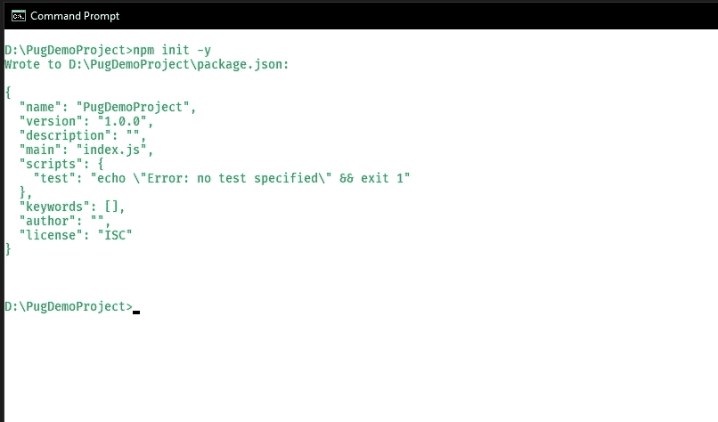
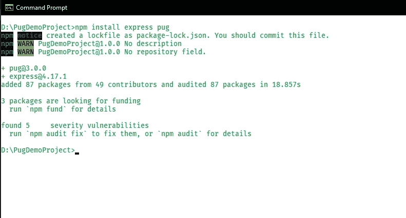
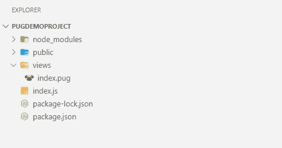
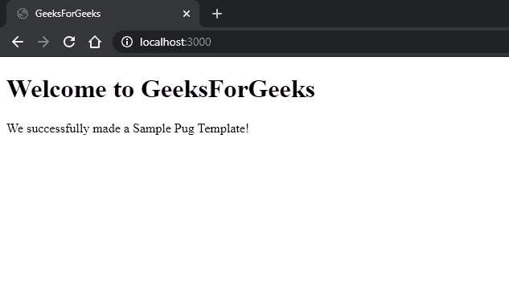

# PugJS 基础知识和安装

> Original: [https://www.geeksforgeeks.org/pugjs-basics-and-installation/](https://www.geeksforgeeks.org/pugjs-basics-and-installation/)

Js 是 Node.js 和浏览器呈现动态可重用内容的模板引擎。 在编译时，模板引擎将我们的 PUG 模板代码编译成 HTML。 我们可以像在 JavaScript 中一样在 PUG 中使用变量。 在运行时，模板引擎使用实际值注入或替换模板文件中的变量，并将模板转换为 HTML 文件，然后在客户端呈现该文件。

PUG 有许多强大的功能，比如条件、循环、包含、混合，我们可以使用这些功能根据用户输入或参考数据来呈现 HTML 代码。 PUG 本身也支持 JavaScript，因此使用 JavaScript 表达式，我们可以格式化 HTML 代码。 这种方法允许我们重用具有动态数据的静态网页。在 2015 年发布 2.0 版之前，Jade
PUG 的前身是 Jade。

让我们使用 exts.js 创建一个基本的 PUG 模板：

**前提条件：**必须具备快递的基本工作知识。

**步骤 1：**创建空项目文件夹。 在命令提示符/终端中，运行 npm init 初始化 Package.json 文件：

```
npm init -y
```

-y 标志用于 Package.json 中的默认设置。



**第二步：**安装 Express 和 PUG。 为了简单起见，我们将直接安装‘express’包，而不是使用‘express-Generator’生成我们的 express 应用程序。 您可以选择安装[nodemon 以便热重新加载](https://www.geeksforgeeks.org/nodejs-automatic-restart-nodejs-server-with-nodemon/)。

```
npm install express pug
```



**步骤 3：**创建一个空的 index.js 文件。 创建一个 views 文件夹，并在其中创建一个空的 index.pug 文件。 或者，您也可以为静态资产(如媒体文件和客户端 javascript)创建一个公共文件夹。

我们最终的目录结构如下所示：



最终目录结构

**第四步：**设置基本的 Express 应用程序。 在 Index.js 中：

## JavaScript

```
// Importing node modules
const express = require("express");
const pug = require("pug");
const path = require("path");

// Initializing express app
const app = express();

// Setting our view engine to pug
app.set("view engine", "pug");

// Setting our default views
app.set("views", __dirname + "/views");

// Serving public assets
app.use(express.static(
    path.join(__dirname + "/public")));

// Home page will render "index.pug"
// file. ".pug" extension is not
// required. Express takes care of
// it behind the scenes
app.get("/", (req, res) => {
    res.render("index");
});

// Listening our app on port 3000
app.listen(3000);
```

**第五步：index.pug 文件中的**：

## JavaScript

```
doctype html
html
    head
        title GeeksForGeeks
    body
        h1 Welcome to GeeksForGeeks
        p We successfully made a Sample Pug Template!
```

您可以在这里阅读 PUG 语法的基础知识。

**步骤 6：**终端启动应用。 如果我们之前已经安装了 nodemon 命令，则运行 nodemon 命令，或者直接使用 node。

```
node index.js or nodemon index.js
```

在 localhost 3000 端口的浏览器中，我们得到以下呈现的模板：

