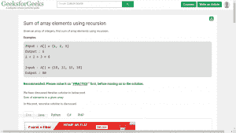

# 极客博客网页的读者视图

> 原文:[https://www . geeksforgeeks . org/readers-view-of-a-geeksforgeeks-网页/](https://www.geeksforgeeks.org/readers-view-of-a-geeksforgeeks-webpage/)

**读者视图:**读者视图是一项功能，它删除了网页中所有不必要的东西，如按钮、广告等，并改变了页面的布局，即文本大小、对比度等。为了更好的可读性。

**读者视图中的网页示例。**


**如何获取任一网页的 Reader 视图？**

以下是将网页视图更改为读者视图的脚本。

```
// Dynamically loading the Jquery Library
javascript: var fileref = document.createElement('script');
fileref.setAttribute("type", "text/javascript");
fileref.setAttribute("src", 
"https://ajax.googleapis.com/ajax/libs/jquery/1.12.0/jquery.min.js");
document.body.appendChild(fileref);

// Dynamically changing the CSS using Jquery 
// by removing the Left column, right column
// and widening the width of the center column
// and also increasing the font size of the div content
setTimeout(function() {
    jQuery("div.wrapper div.leftSideBarParent").hide();
    jQuery("div.wrapper div.widget-area").hide();
    jQuery("div.wrapper div.site-content").css({
        'width': '1150px',
        'margin-left': '105px',
        'margin-right': '45px'
    });
    jQuery("div.menu-iconic-container").hide();
    $("div").css('fontSize', '20px');
    $("pre").css('fontSize', '20px');

}, 2000);
setTimeout(function() {
    document.body.appendChild(fileref);
    $("#div-gpt-ad-1525180449717-0").hide();
    $(".col-sm-3").hide();
    $(".col-sm-9.normalScreen").css('width', '100%');
}, 500);

// Changing width to wide screen in case of 
// any problem encountered due to scrolling 
// of the page
var body = document.body,
    html = document.documentElement;
setInterval(function() {
    if (body.scrollHeight >= 5000) {
        setTimeout(function() {
            $("div.wrapper div.site-content").css({
                'width': '1150px',
                'margin-left': '105px',
                'margin-right': '45px'
            });
        }, 500);
    }
}, 2000);
```

**如何执行/运行这个脚本？**
打开任意 GeeksforGeeks 编辑页面，将脚本粘贴到开发者工具的控制台窗口中(按 F12)，然后按回车键。
您将获得编辑页面的全宽读者视角。