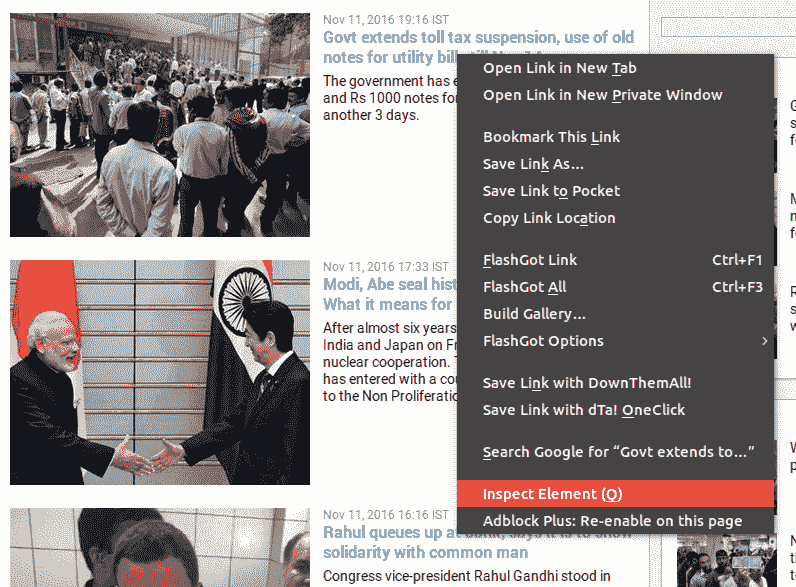
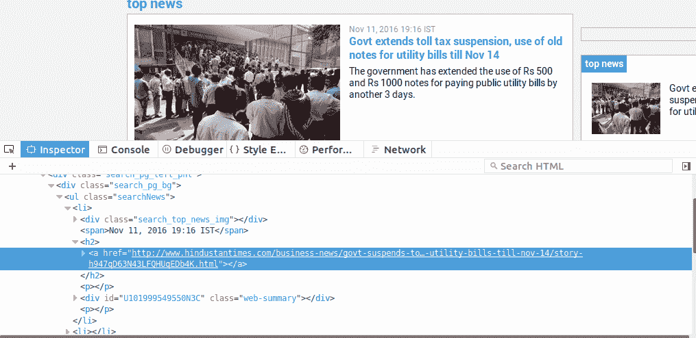
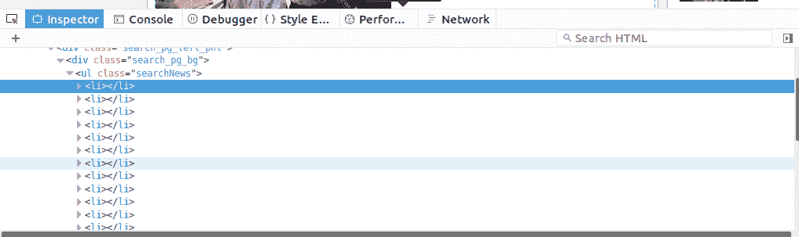

# 使用 Python 网页抓取读取选中的网页内容

> 原文:[https://www . geesforgeks . org/reading-selected-网页-内容-使用-python-web-scratch/](https://www.geeksforgeeks.org/reading-selected-webpage-content-using-python-web-scraping/)

先决条件:[用 Python 下载文件](https://www.geeksforgeeks.org/downloading-files-web-using-python/)、[用美图软件](https://www.geeksforgeeks.org/implementing-web-scraping-python-beautiful-soup/)进行网页抓取

我们都知道 Python 是一种非常简单的编程语言，但是让它变得酷的是为它编写的大量开源库。Requests 是应用最广泛的库之一。它允许我们打开任何 HTTP/HTTPS 网站，让我们做任何我们通常在网上做的事情，还可以保存会话，即 cookie。
众所周知，网页只是一段 HTML 代码，由 Web 服务器发送到我们的浏览器，浏览器再转换成漂亮的页面。现在，我们需要一种机制来获取 HTML 源代码，即使用一个名为“美丽组”的包找到一些特定的标签。
**安装:**

```
pip3 install requests

```

```
pip3 install beautifulsoup4

```

**我们通过阅读新闻网站[印度斯坦时报](http://www.hindustantimes.com/top-news)T3 来举个例子**

代码可以分为三个部分。

*   请求网页
*   检查标签
*   打印适当的内容

**步骤:**

1.  **请求网页:**首先我们看到右键点击新闻文字看到的源代码 [](https://media.geeksforgeeks.org/wp-content/uploads/124.png)
2.  **Inspecting the tags:** We need to figure in which body of the source code contains the news section we want to scrap. It is the under ul,i.e unordered list, “searchNews” which contains the news section.

    [](https://media.geeksforgeeks.org/wp-content/uploads/219.png)

    注意新闻文本出现在锚点标签文本部分。仔细观察会发现，所有的新闻都在无序标签的列表标签中。

    [](https://media.geeksforgeeks.org/wp-content/uploads/314.png)

3.  **Print the appropriate contents:** The content is printed with the help of code given below.

    ```
    import requests
    from bs4 import BeautifulSoup

    def news():
        # the target we want to open    
        url='http://www.hindustantimes.com/top-news'

        #open with GET method
        resp=requests.get(url)

        #http_respone 200 means OK status
        if resp.status_code==200:
            print("Successfully opened the web page")
            print("The news are as follow :-\n")

            # we need a parser,Python built-in HTML parser is enough .
            soup=BeautifulSoup(resp.text,'html.parser')    

            # l is the list which contains all the text i.e news 
            l=soup.find("ul",{"class":"searchNews"})

            #now we want to print only the text part of the anchor.
            #find all the elements of a, i.e anchor
            for i in l.findAll("a"):
                print(i.text)
        else:
            print("Error")

    news()
    ```

    **输出**

    ```
    Successfully opened the web page
    The news are as follow :-
    Govt extends toll tax suspension, use of old notes for utility bills extended till Nov 14
    Modi, Abe seal historic civil nuclear pact: What it means for India
    Rahul queues up at bank, says it is to show solidarity with common man
    IS kills over 60 in Mosul, victims dressed in orange and marked 'traitors'
    Rock On 2 review: Farhan Akhtar, Arjun Rampal's band hasn't lost its magic
    Rumours of shortage in salt supply spark panic among consumers in UP
    Worrying truth: India ranks first in pneumonia, diarrhoea deaths among kids
    To hell with romance, here's why being single is the coolest way to be
    India vs England: Cheteshwar Pujara, Murali Vijay make merry with tons in Rajkot
    Akshay-Bhumi, SRK-Alia, Ajay-Parineeti: Age difference doesn't matter anymore
    Currency ban: Only one-third have bank access; NE, backward regions worst hit
    Nepal's central bank halts transactions with Rs 500, Rs 1000 Indian notes
    Political upheaval in Punjab after SC tells it to share Sutlej water
    Let's not kid ourselves, with Trump, what we have seen is what we will get
    Want to colour your hair? Try rose gold, the hottest hair trend this winter

    ```

**参考文献**

*   [请求](http://docs.python-requests.org/en/master/user/quickstart/)
*   [美丽的脉冲星](https://www.crummy.com/software/BeautifulSoup/bs4/doc/)
*   [Http_status_codes](https://en.wikipedia.org/wiki/List_of_HTTP_status_codes)

本文由 **Shubham Choudhary** 供稿。如果你喜欢 GeeksforGeeks 并想投稿，你也可以使用[contribute.geeksforgeeks.org](http://contribute.geeksforgeeks.org)写一篇文章或者把你的文章邮寄到 contribute@geeksforgeeks.org。看到你的文章出现在极客博客主页上，帮助其他极客。

如果你发现任何不正确的地方，或者你想分享更多关于上面讨论的话题的信息，请写评论。